# Muxvo - Electron桌面应用 - PRD - V2.0

| 项目 | 内容 |
|------|------|
| 创建时间 | 2026-02-07 |
| 版本号 | V2.0 |
| 创建人 | RL |
| 修订记录 | V1.0 首版；V1.1 新增 Skills/Hooks 社区市场功能（N-Z）；V1.2 基于辩证分析优化：明确产品阶段、重建优先级、补充后端架构/安全模型/跨平台策略；V1.3 基于三人团队评审落地：产品定位通用化（支持任意 AI CLI 工具）、进程状态检测机制、cwd 切换修正、Esc 焦点规则、tile 双击聚焦、首次引导、缺省态、数据埋点、聊天导出；V1.4 新增富编辑器覆盖层（V1，用 Web 富编辑器替代终端原生输入，支持图片粘贴和自然文本编辑）、V2 商城策略调整为多源聚合+上下文推荐（不自建商城，聚合 Anthropic 官方/SkillsMP/GitHub 等已有生态）；V1.5 护城河策略重构（三层递进：匿名集体智慧→人际连接→AI 效果验证层）、V1 数据采集补充；V1.6 新增 Skill 宣传页功能（V2-P2，与 GitHub OAuth 同期上线）；V2.0 V2 策略大幅重构——删除三层护城河/数据飞轮/上下文推荐/需求悬赏板/个人技能主页，V2 聚焦 Skill Showcase（AI 评分 + 展示页 + 社区），三步走：Phase 1 AI 评分 MVP → Phase 2 完整展示页 → Phase 3 showcase.muxvo.com 社区平台 |
| 评审时间 | 待评审 |
| 评审结果 | 待评审 |

---

## 1、产品定位与目标

### 1.1 产品定位

> 一句话总结：Muxvo 是一个为 AI CLI 工具（Claude Code、Codex、Gemini CLI 等）重度用户打造的 Electron 桌面工作台，集成多项目终端管理、聊天历史搜索、文件浏览和配置可视化于一体。V1 深度集成 Claude Code，终端管理层完全通用。

### 1.2 目标用户与使用场景

**目标用户**：
- AI CLI 工具重度用户——每天使用 Claude Code / Codex / Gemini CLI 等工具，同时管理多个项目的开发者
- V1 重点服务 Claude Code 用户（聊天历史、配置管理等功能依赖 CC 数据格式）

**典型使用场景**：
- 开发者日常使用 AI CLI 工具工作时，打开 Muxvo 替代直接打开多个终端窗口
- 需要回顾某个项目之前的聊天记录时，在 Muxvo 内搜索历史（V1 支持 CC）
- CC 生成了新的 plan/markdown 文件后，直接在 Muxvo 内预览
- 想查看/管理 CC 的 skills、hooks、settings 等配置时，在 Muxvo 内浏览
- 在不同终端中运行不同的 AI CLI 工具（如一个跑 Claude Code，另一个跑 Codex）

### 1.3 用户核心痛点

| 编号 | 痛点 | 描述 | 解决阶段 |
|------|------|------|----------|
| 1 | 多终端管理混乱 | 同时跑多个项目需要开多个终端窗口，切换管理困难 | V1 |
| 2 | 聊天记录难以浏览和检索 | AI CLI 工具的对话记录散落在各个 session 文件中，缺乏统一的浏览和搜索入口 | V1 |
| 3 | 生成文件查看不便 | CC 在项目文件夹生成 plan/markdown 等文件，需切换到 VS Code 查看，工作流被打断 | V1 |
| 4 | 配置文件难以浏览 | CC 的 skills、hooks、plans、settings 等集中管理在 `~/.claude/`，人类无法直观浏览查看 | V1 |
| 5 | Skills 发现困难 | 目前 skills 只能通过口口相传或手动复制文件传播，没有统一的发现渠道 | V2 |
| 6 | 安装流程繁琐 | 手动下载文件、放到正确目录、配置正确格式，门槛高且容易出错 | V2 |
| 7 | 无法评估质量 | 没有评分、下载量等信号帮助用户判断 skill 的质量和可靠性 | V2 |
| 8 | 更新靠人工 | skill 作者更新后，用户无从知晓，也无法一键更新 | V2 |
| 9 | Hooks 有安全顾虑 | hooks 执行任意代码，用户需要在安装前能审查代码内容 | V2 |
| 10 | 终端输入体验差 | 终端原生输入不支持鼠标选中/点击定位、不能 Ctrl+V 粘贴图片、多行换行逻辑与普通编辑器不同，操作繁琐低效 | V1 |

### 1.4 产品价值

- **对用户**：把 AI CLI 工具的「使用」和「管理」合并到一个桌面应用，消除多工具切换的摩擦。富编辑器覆盖层让用户用现代编辑器体验操作 AI CLI 工具——像聊天应用一样自然地输入文字、粘贴图片、编辑多行内容
- **对社区用户**：降低发现和使用优质 skills/hooks 的门槛，聚合多个来源（Anthropic 官方、SkillsMP、GitHub 等），一个入口浏览所有生态
- **对 Skill 作者**：通过 Skill Showcase 功能，一键生成包含 AI 质量评分的精美展示页，分享到社交媒体/简历，每次分享都是 Muxvo 的免费获客
- **核心设计原则**：终端切换是第一优先级（主页面），文件/配置查看是按需下钻的二级操作。不是"IDE 里嵌终端"，而是"终端管理器 + 按需展开的项目详情"。Skill 发现是配置管理器的自然延伸——用户已经在这里浏览本地 skills，现在可以浏览聚合的 skills

### 1.5 战略价值与增长策略

**核心增长引擎：Skill Showcase 外部传播飞轮**

Muxvo 的增长策略围绕 Skill Showcase（AI 评分 + 展示页）构建外部传播闭环：

```
用户写了好用的 Skill
→ Muxvo AI 评分 + 生成展示页
→ 用户分享到 Twitter/LinkedIn/简历（虚荣心 + 求职需求）
→ 同行看到 → 好奇 → 访问展示页
→ 部分人下载 Muxvo → 写自己的 Skill → 生成展示页 → 循环
```

**飞轮动力分析：**
- **核心驱动力**：虚荣心（秀高分）+ 求职需求（简历素材）+ 好奇心（我的 Skill 能得多少分？）
- **传播载体**：每个展示页都是 Muxvo 的免费获客渠道，带品牌水印和下载 CTA
- **差异化**：市场上没有「AI 给 AI Skill 打分」的产品，Muxvo 定义这个品类

**可复制 vs 不可复制**：

| 可复制 | 不可复制 |
|--------|----------|
| UI 代码、聚合逻辑 | AI 评分标准的品类定义权（先发优势） |
| 展示页模板和生成逻辑 | showcase.muxvo.com 上积累的展示页网络和社区（迁移成本高） |
| 安装/发布逻辑 | 评分数据积累（百分位排名需要数据规模） |

**隐私合规：**
- V1 所有数据采集均为纯本地，不联网上报
- V2 Showcase 功能需要联网时，仅上传用户主动选择发布的展示页内容
- AI 评分在本地调用 Claude API 完成，SKILL.md 内容不经过 Muxvo 服务器

### 1.6 产品阶段定义

| 阶段 | 产品形态 | 核心命题 | 成功标准 |
|------|----------|----------|----------|
| V1 — 终端工作台 | 纯本地应用，无服务端 | 比直接用终端管理 AI CLI 工具更高效 | 日活用户留存率 > 40% |
| V2 — Skill Showcase 平台 | 本地为主，轻量联网 | 成为 AI Skill 展示与发现的首选平台（聚合浏览 + AI 评分 + 展示页） | 展示页周生成量 > 50 |

- V1 不包含任何联网功能，专注于终端管理、聊天历史、文件浏览、配置管理、富编辑器覆盖层五大本地场景
- V1 终端管理层完全通用（可运行任何 CLI 工具），聊天历史和配置管理深度集成 CC
- V1 新增富编辑器覆盖层：用 Web 富编辑器替代终端原生输入，支持图片粘贴、自然文本编辑，发送时自动转发到终端 PTY
- V2 不自建独立商城，聚合已有生态（Anthropic 官方仓库、SkillsMP、GitHub awesome-lists 等）做浏览和安装
- V2 核心差异化功能：Skill Showcase = AI 评分（Claude API 多维度打分）+ 精美展示页生成 + 社区平台
- V2 分三步走：Phase 1 AI 评分 MVP → Phase 2 完整展示页 → Phase 3 showcase.muxvo.com 社区
- 功能清单中的优先级按阶段区分：V1-P0/P1/P2 和 V2-P0/P1/P2/P3

---

## 2、功能清单与优先级

### V1 — 终端工作台（纯本地）

| 编号 | 功能 | 描述 | 优先级 | 解决痛点 |
|------|------|------|--------|----------|
| A | 全屏平铺式终端管理 | 所有终端平铺占满屏幕，智能 Grid 布局自适应数量（1=全屏，2=对半，4=四宫格...） | V1-P0 | 痛点1 |
| B | 聚焦模式 | 双击任一终端放大到左侧，其他终端缩小排列在右侧栏（最多显示3个，可滚动），Esc 返回平铺（焦点不在终端内时） | V1-P0 | 痛点1 |
| D | 聊天历史浏览器 | 读取 CC 的 session JSONL 文件，按项目/时间展示历史对话（V1 仅支持 CC 格式） | V1-P0 | 痛点2 |
| G | 内置 Markdown 预览 | 直接在应用内预览 CC 生成的 plan/markdown 文件 | V1-P0 | 痛点3 |
| I | 双段式命名 | 每个终端显示 cwd 路径（可点击切换目录，shell 态直接 cd，AI 工具运行中则退出后切换）+ 可选自定义名称，格式：`~/path · 名称` | V1-P0 | 痛点1 |
| C | 终端拖拽排序 + 边框调整大小 | 拖拽 tile header 排序终端位置；拖拽 tile 之间的边框调整大小比例 | V1-P1 | 痛点1 |
| E | 全文搜索 | 跨项目、跨会话搜索历史对话内容 | V1-P1 | 痛点2 |
| H | 文件浏览器 + 三栏临时视图 | 点击文件按钮滑出目录面板，点击文件进入三栏全屏视图（左：同目录终端 / 中：文件内容 / 右：文件目录） | V1-P1 | 痛点3 |
| J | ~/.claude/ 可视化浏览器 | 以可视化方式浏览 `~/.claude/` 目录下的所有资源 | V1-P1 | 痛点4 |
| M | 同目录终端自动归组 | 新建终端或切换目录后，自动将同目录终端排列在一起 | V1-P1 | 痛点1 |
| F | 会话时间线视图 | 按时间线展示所有项目的会话记录 | V1-P2 | 痛点2 |
| K | Plans/Skills/Hooks/Tasks 分类查看 | 按类型分类展示 CC 管理的各类资源，支持搜索和预览 | V1-P2 | 痛点4 |
| L | Settings/CLAUDE.md 查看与编辑 | 查看和编辑 CC 的全局设置和指令文件 | V1-P2 | 痛点4 |
| RE1 | 富编辑器覆盖层（基础） | 用 Web 富编辑器替代终端原生输入：contenteditable 编辑器、文本→PTY 转发、Claude Code 多行协议适配、图片粘贴→临时文件→路径插入、手动编辑器/终端模式切换 | V1-P1 | 痛点10 |
| RE2 | 富编辑器覆盖层（完善） | 自动模式检测（Alternate Screen Buffer + 进程名检测）、图片剪贴板模拟（CC 原生粘贴）、各 AI CLI 工具多行协议适配、所有 tile 模式支持 | V1-P2 | 痛点10 |

### V2 — Skill Showcase 平台（V1 PMF 验证后启动）

> **V2.0 策略说明**：V2 放弃上下文推荐和需求悬赏板等重型功能，聚焦 **Skill Showcase**（AI 评分 + 展示页 + 社区）作为核心差异化。市场上没有「AI 给 AI Skill 打分」的产品，Muxvo 率先定义这个品类。Skill 聚合浏览器保留但简化为基础浏览和安装能力。

| 编号 | 功能 | 描述 | 优先级 | 解决痛点 |
|------|------|------|--------|----------|
| N2 | Skill 聚合浏览器 | 聚合 Anthropic 官方仓库、SkillsMP、GitHub awesome-lists 等多个来源，统一浏览和搜索界面，来源标识清晰 | V2-P0 | 痛点5 |
| O | 一键安装 | 从任意聚合来源点击安装，自动下载并放置到 `~/.claude/skills/` 或 `~/.claude/hooks/` | V2-P0 | 痛点6 |
| U | Hook 安全审查 | 安装 hook 前展示完整源码和权限声明，用户确认后才安装 | V2-P0 | 痛点9 |
| T | 更新检测与推送 | 检查已安装包在聚合源中的更新，显示更新徽章，支持一键更新 | V2-P1 | 痛点8 |
| SR | AI Skill 评分 | 调用 Claude API 对 SKILL.md 进行多维度评分（实用性/工程质量/创新性/文档完善度/可复用性），生成雷达图评分卡 + 等级称号，支持保存为 PNG/复制分享 | V2-P1 | 痛点7 |
| RE3 | 富编辑器覆盖层（高级） | 斜杠命令自动补全（CC /clear /compact 等）、输入历史（上箭头召回）、文件拖拽、代码块语法高亮 | V2 | 痛点10 |
| SS | Skill Showcase 展示页 | 基于 AI 评分 + SKILL.md 自动生成精美展示页（评分卡 + Problem/Solution + 功能要点 + 效果演示），2-3 套模板，输出静态 HTML，支持 OG Card 社交分享 | V2-P2 | 痛点5 |
| P2 | Skill 发布/分享 | GitHub OAuth 登录 + 一键发布展示页到 GitHub Pages，生成可分享链接。用户可选择是否公开 Skill 代码 | V2-P2 | 痛点5 |
| SC | Showcase 社区平台 | showcase.muxvo.com 社区：展示页浏览/点赞/评论、评分排行榜（周榜/月榜）、百分位排名、个人主页（@username） | V2-P3 | 痛点5 |

---

## 3、核心策略

> 核心规则 1：终端永远是主角——用户打开应用后默认看到的是终端，所有其他功能都是「在终端旁边展开」而不是「切换到另一个页面」
>
> 核心规则 2：单一数据源 + 本地镜像保底——Muxvo 以 AI CLI 工具原始数据为主数据源，同时在 Muxvo 数据目录下维护增量镜像副本，防止上游数据清理导致历史丢失。读取优先级：CC 原始文件 → Muxvo 镜像副本。Muxvo 仅存储自身运行所需的状态（窗口布局、用户偏好、市场注册表、搜索索引）及聊天历史镜像
>
> 核心规则 3：Skill 发现是配置管理器的延伸——从「浏览本地 skills」自然过渡到「多源聚合浏览」，不是独立的页面
>
> 核心规则 4：安装零配置——一键安装后直接可用，无需手动修改任何配置文件（hooks 除外，需确认权限）
>
> 核心规则 5：富编辑器替代终端输入——用户通过 Web 富编辑器输入（支持图片粘贴、鼠标选中、自然换行），发送时自动转发到终端 PTY，对用户透明无感

### 3.1 终端管理策略

- 所有终端平铺在一个 CSS Grid 中，智能计算行列布局
- 每个终端 tile 显示：状态点（运行中/空闲） + cwd 路径 + 自定义名称 + 文件按钮
- 支持通过底部「+ 新建终端」按钮创建新终端，选择目录后打开 shell（用户自行决定运行什么命令）
- 关闭终端时，如果有前台进程正在运行，提示是否终止
- 支持拖拽排序、边框拖拽调整大小、同目录自动归组

**终端生命周期说明：**
- Muxvo 关闭时，所有子进程随之终止
- 重新打开 Muxvo 时，在记录的目录重新打开 shell（非恢复旧进程）
- 终端重启后是空白 shell，之前的输出和上下文不会恢复（xterm.js 状态不做序列化，原因：序列化复杂、恢复的旧输出易误导用户、AI CLI 工具本身也不支持 session 恢复）
- 用户可通过聊天历史浏览器回溯之前的对话内容

### 3.2 富编辑器覆盖层策略

用 Web 富编辑器完全替代终端原生输入体验，用户永远不直接操作 xterm.js 的原生输入。

**技术方案概述：**
- 每个终端 tile 底部放置富编辑器（contenteditable div，后续可升级到 CodeMirror 6）
- 上方 xterm.js 只负责渲染终端输出（断开键盘输入）
- 用户在富编辑器中编辑完成后按发送，程序提取纯文本，检测前台进程类型，按对应协议转换后通过 `pty.write()` 发送到终端
- 多行协议自动适配：Claude Code 用 `\x1b\r` 换行、bash/zsh 直接发送
- 图片处理：粘贴到编辑器后保存临时文件，发送时按前台工具适配（CC 模拟 Ctrl+V / 其他工具插入文件路径）
- 模式切换：监听 xterm.js Alternate Screen Buffer 信号（`\x1b[?1049h/l`），全屏 TUI 程序（vim/htop 等）运行时自动切换到原始终端模式，退出后恢复编辑器模式

**详见 8.16 节完整规格说明。**

### 3.3 数据读取策略

Muxvo 读取以下 CC 数据文件（只读）：

| 数据类型 | 文件位置 | 格式 |
|----------|----------|------|
| 全局聊天历史 | `~/.claude/history.jsonl` | JSONL |
| 项目会话详情 | `~/.claude/projects/{project-id}/{session-id}.jsonl` | JSONL |
| Plans | `~/.claude/plans/*.md` | Markdown |
| Tasks | `~/.claude/tasks/{id}/*.json` | JSON |
| Skills | `~/.claude/skills/*/` | 目录 + Markdown |
| Hooks | `~/.claude/hooks/` | Shell/JS |
| 全局设置 | `~/.claude/settings.json` | JSON |
| 全局指令 | `~/.claude/CLAUDE.md` | Markdown |
| 项目记忆 | `~/.claude/projects/{project-id}/memory/MEMORY.md` | Markdown |
| MCP 配置 | `~/.claude/mcp.json` | JSON |
| 插件配置 | `~/.claude/plugins/config.json` | JSON |

**格式兼容性策略：**
- Muxvo 在解析每种文件时，先检测格式版本/结构是否符合预期
- 遇到未知字段：忽略（向前兼容）

### 3.4 Muxvo 数据目录结构

Muxvo 在自身应用数据目录下维护聊天历史镜像及运行状态：

```
~/Library/Application Support/Muxvo/    # macOS
├── chat-history/
│   ├── sync-state.json                 # 同步状态（每个项目的最后同步时间、文件 mtime）
│   ├── projects/
│   │   └── {project-hash}/             # 项目路径的 SHA-256 hash（避免特殊字符）
│   │       ├── project-info.json       # 项目元数据（原始路径、名称、首次/末次同步时间）
│   │       └── sessions/
│   │           └── {session-id}.jsonl  # CC session 文件的完整镜像
│   └── history-index.jsonl             # CC history.jsonl 的镜像
├── config.json                        # 应用状态（终端列表、Grid 布局、onboarding 标记）
├── preferences.json                   # 用户偏好（主题、字体大小等）
├── search-index/                      # 全文搜索索引（持久化）
└── logs/                              # 运行日志
```

**目录用途：**
- `chat-history/`：CC 聊天记录的增量镜像，确保 CC 侧数据清理后仍可访问
- `sync-state.json`：记录每个项目的最后同步时间和文件 mtime，用于增量同步判断
- `{project-hash}/`：`SHA-256(项目绝对路径).substring(0, 16)`，取前 16 位 hex 字符作为目录名。`project-info.json` 中存储原始路径以支持反查
- 遇到缺失必要字段：该条记录跳过，不崩溃
- 遇到完全无法解析的格式：功能降级，显示提示，不影响其他功能

### 3.5 文件监听策略

- 使用 `fs.watch` / `chokidar` 监听关键文件变化
- chokidar 监听配置 `ignored: [/\.DS_Store$/, /\.swp$/, /~$/]`，过滤系统临时文件，减少无效事件触发
- 当 CC 创建新文件（如新的 plan）时，自动在文件浏览器中高亮标记 `NEW`
- 当 session JSONL 文件更新时，实时刷新聊天历史

### 3.6 Skill 发现入口策略

Skill 聚合浏览器有两个入口，体现「配置管理器延伸」的设计原则：

| 入口 | 位置 | 行为 |
|------|------|------|
| Skills 下拉列表顶部 | 配置管理器 → Skills 列表最上方 | 点击「浏览更多 Skills」→ 打开聚合浏览器面板 |
| 菜单栏独立按钮 | 顶部菜单栏，位于 [MCP] 按钮右侧 | 点击 [Skills] → 打开聚合浏览器面板 |

### 3.7 认证策略

- V2-P0（聚合浏览）不需要任何认证——所有数据来自公开的聚合源
- V2-P2（展示页发布）启动时才需要 GitHub OAuth + PKCE 登录
- 登录流程保留 PKCE 设计（见原 V1.3 PRD），但推迟到 V2-P2 实现

### 3.8 安装策略

**Skills 安装（来源：聚合源）：**
- 从聚合源（Anthropic 官方、SkillsMP、GitHub 等）获取下载链接 → 下载 → 解压到 `~/.claude/skills/{name}/` → 完成
- chokidar 监听目录变化，Skills 列表自动刷新，无需手动操作

**Hooks 安装（需额外安全确认）：**
- 下载 → 弹出安全审查对话框 → 用户查看源码和权限声明 → 用户确认 → 解压到 `~/.claude/hooks/{name}/` → 写入 `settings.json` 中的 hooks 配置 → 完成
- hooks 执行任意代码，必须让用户知情并确认

### 3.9 Skill Showcase 策略（V2 核心差异化）

> Skill Showcase 是 V2 的核心差异化功能，分三步走：AI 评分 → 展示页 → 社区平台。

**核心理念**：通过 AI 评分 + 精美展示页，让 Skill 作者有动力展示和分享自己的作品，每次分享都是 Muxvo 的免费获客渠道。

**第一步：AI 评分（V2-P1）**

调用 Claude API 对 SKILL.md 进行多维度评分：

| 维度 | 权重 | 说明 |
|------|------|------|
| 实用性 | 25% | 解决真实问题的程度，使用场景是否清晰 |
| 工程质量 | 25% | Prompt 结构、错误处理、边界条件覆盖 |
| 创新性 | 20% | 与已有 Skill 的差异度，是否有新颖的工具链组合 |
| 文档完善度 | 15% | 说明文档、使用示例、参数说明的完整性 |
| 可复用性 | 15% | 其他用户能否直接使用、参数化程度、通用性 |

- 等级制：Promising → Solid → Advanced → Expert → Masterwork
- 每个维度附具体评分理由和改进建议
- 评分一致性保障：temperature=0 + 内容 hash 缓存 + 等级制（±5 分不影响等级）
- 评分不可编辑，用户不满意只能修改 Skill 后重新评分
- 低分友好：最低等级为正向标签「Promising」，必须附改进建议

**第二步：展示页生成（V2-P2）**

基于 AI 评分 + SKILL.md 自动生成展示页，页面结构：

```
├── Hero（Skill 名称 + 描述 + 标签 + 安装按钮）
├── AI 评分卡（雷达图 + 总分 + 等级 + 称号 + 百分位排名）
├── Problem & Solution（用户填写：解决什么问题、怎么解决的）
├── 功能要点（自动提取 → 用户可编辑）
├── 效果演示（用户上传截图/GIF）
├── Skill 概况（文件数/行数/适用场景/兼容工具，自动生成）
├── 作者信息（GitHub 头像 + bio）
└── 底部品牌区（Built with Muxvo + 下载 CTA）
```

- 提供 2-3 套模板主题
- 输出静态 HTML，支持 OG Card（Twitter/LinkedIn 分享预览）
- 通过 GitHub OAuth + GitHub Pages 一键发布，URL 格式 `username.github.io/muxvo-skills/skill-name`

**第三步：社区平台（V2-P3）**

- showcase.muxvo.com 上线：展示页浏览 feed、点赞、评论
- 评分排行榜（周榜/月榜）
- 百分位排名功能（需要数据积累）
- 个人主页（`showcase.muxvo.com/@username`）
- 用户可选择公开 Skill 代码，他人可一键安装（`muxvo://install/...`）
- GitHub OAuth 登录

### 3.11 本地注册表

Muxvo 在本地记录包安装信息，详细数据结构定义见 7.5 节。

---

## 4、用户旅程地图

### 4.1 核心功能旅程

| 阶段 | 用户动作 | 系统反馈 | 关键目标 |
|------|----------|----------|----------|
| 启动 | 打开 Muxvo | 所有终端平铺显示在 Grid 中 | 快速进入工作状态 |
| 新建终端 | 点击底部「+ 新建终端」 | 弹出目录选择器，选择后新终端出现在 Grid 中 | 开始新的工作会话 |
| 聚焦终端 | 双击某个终端 tile | 该终端放大到左侧，其他缩小到右侧栏 | 专注单个项目 |
| 返回平铺 | 按 Esc（焦点不在终端内时）或点击「返回平铺」按钮 | 所有终端恢复平铺 Grid | 总览所有项目 |
| 查看文件 | 点击终端 tile 上的「文件」按钮 | 右侧滑出文件目录面板 | 浏览项目文件 |
| 预览文件 | 点击目录中的文件 | 进入三栏全屏临时视图（终端 + 内容 + 目录） | 查看文件内容 |
| 搜索历史 | 点击「历史聊天」按钮或 `⌘F` | 打开聊天历史视图，输入关键词搜索 | 找到之前的聊天内容 |
| 管理配置 | 点击「配置」按钮 | 展示 skills/hooks/settings 等分类 | 浏览和管理 CC 配置 |
| 调整布局 | 拖拽 tile header 或边框 | 终端重新排序或调整大小比例 | 自定义工作区 |

### 4.2 Skill 发现者旅程

| 阶段 | 用户动作 | 系统反馈 | 关键目标 |
|------|----------|----------|----------|
| 主动发现 | 点击菜单栏 [Skills] 或 Skills 列表的「浏览更多」 | 打开聚合浏览器，展示多源 skill（标注来源：Anthropic 官方/SkillsMP/GitHub） | 找到感兴趣的内容 |
| 搜索 | 在搜索框输入关键词 | 跨多源实时匹配结果 | 找到特定 skill/hook |
| 评估 | 查看包详情：来源标识 + README | 展示聚合信息帮助决策 | 判断是否值得安装 |
| 安装 | 点击 [安装] 按钮 | 从对应来源下载 → 解压 → 按钮变为「已安装 ✓」 | 获得可用的 skill/hook |
| 使用 | 在 Claude Code 中正常使用新 skill | skill 自动生效 | 提升工作效率 |
| 更新 | 看到更新徽章，点击更新 | 从原来源下载新版本 → 替换本地文件 | 获得最新功能 |

### 4.3 Skill 展示者旅程（V2-P1/P2）

| 阶段 | 用户动作 | 系统反馈 | 关键目标 |
|------|----------|----------|----------|
| AI 评分 | 在 Skills 列表中选择本地 skill，点击「AI 评分」 | 调用 Claude API 评分 → 显示雷达图 + 总分 + 等级称号 | 了解 Skill 质量 |
| 改进 | 查看各维度评分理由和改进建议，修改 SKILL.md | 重新评分，查看分数变化 | 提升 Skill 质量 |
| 生成展示页 | 点击「生成展示页」，填写 Problem/Solution，上传截图 | 自动生成精美展示页预览，可选择模板 | 美化展示 |
| 发布 | 点击 GitHub 登录 → 发布到 GitHub Pages | 生成可分享链接 | 对外展示 |
| 分享 | 复制链接，贴到 Twitter/LinkedIn/简历 | 展示页含 OG Card，社交媒体自动显示预览 | 传播获客 |

### 4.4 Showcase 浏览者旅程（V2-P2+）

> 外部用户通过社交媒体/简历中的展示页链接进入，是 Muxvo 免费获客的核心转化路径。

| 阶段 | 用户动作 | 系统反馈 | 关键目标 |
|------|----------|----------|----------|
| 发现 | 在社交媒体/简历中看到展示页链接或评分卡截图 | - | 触达潜在用户 |
| 浏览 | 点击链接打开展示页 | 展示 AI 评分卡 + 功能介绍 + 效果演示 + 作者信息 | 了解 Skill 价值 |
| 安装意向 | 点击「安装此 Skill」按钮 | 已安装 Muxvo → `muxvo://install/skill-name` deep link 跳转安装；未安装 → 显示手动安装命令 + Muxvo 下载引导 | 转化为安装/下载 |
| 探索 | 浏览页面底部 Muxvo 介绍 | 展示 Muxvo 品牌标识、下载链接 | 提升品牌认知 |

---

## 5、流程图

### 5.1 应用启动流程

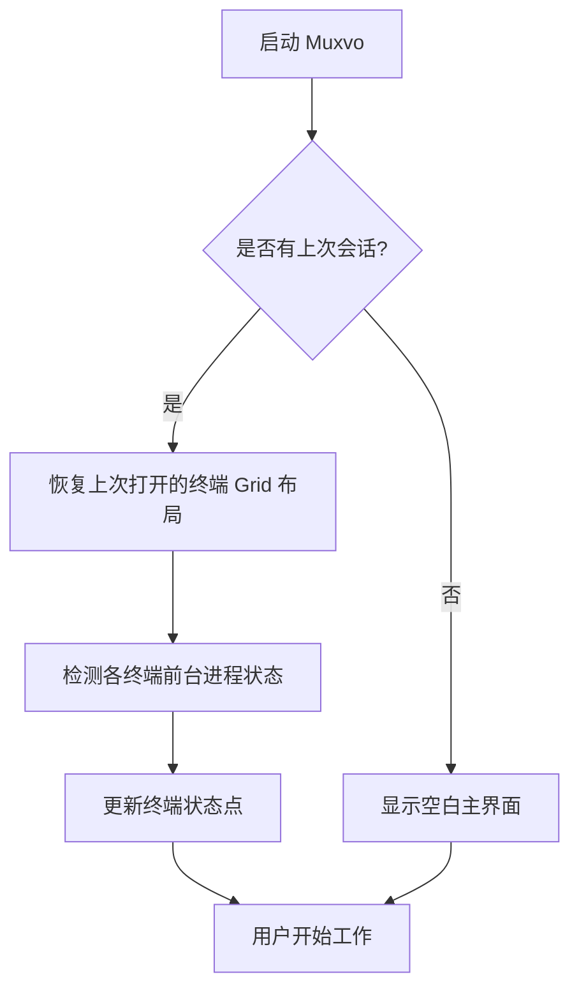
```mermaid
flowchart TD
    A[启动 Muxvo] --> B{是否有上次会话?}
    B -->|是| C[恢复上次打开的终端 Grid 布局]
    B -->|否| D[显示空白主界面]
    C --> E[检测各终端前台进程状态]
    E --> F[更新终端状态点]
    F --> G[用户开始工作]
    D --> G
```

### 5.2 新建终端流程

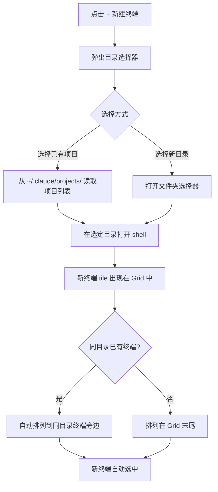
```mermaid
flowchart TD
    A[点击 + 新建终端] --> B[弹出目录选择器]
    B --> C{选择方式}
    C -->|选择已有项目| D[从 ~/.claude/projects/ 读取项目列表]
    C -->|选择新目录| E[打开文件夹选择器]
    D --> F[在选定目录打开 shell]
    E --> F
    F --> G[新终端 tile 出现在 Grid 中]
    G --> H{同目录已有终端?}
    H -->|是| I[自动排列到同目录终端旁边]
    H -->|否| J[排列在 Grid 末尾]
    I --> K[新终端自动选中]
    J --> K
```

### 5.3 文件浏览流程

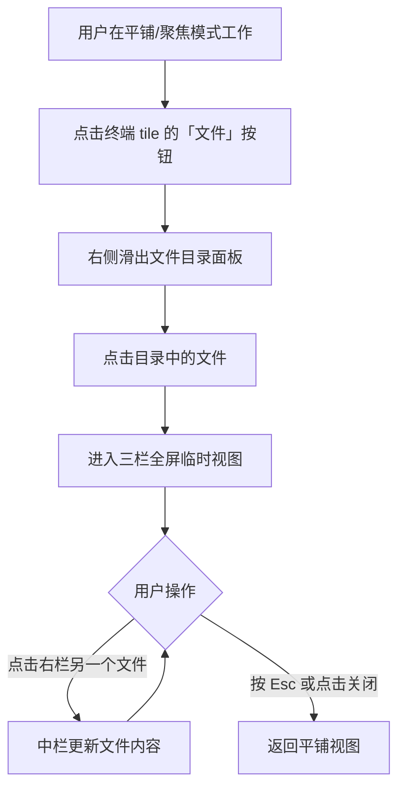
```mermaid
flowchart TD
    A[用户在平铺/聚焦模式工作] --> B[点击终端 tile 的「文件」按钮]
    B --> C[右侧滑出文件目录面板]
    C --> D[点击目录中的文件]
    D --> E[进入三栏全屏临时视图]
    E --> F{用户操作}
    F -->|点击右栏另一个文件| G[中栏更新文件内容]
    F -->|按 Esc 或点击关闭| H[返回平铺视图]
    G --> F
```

### 5.4 聚焦模式流程

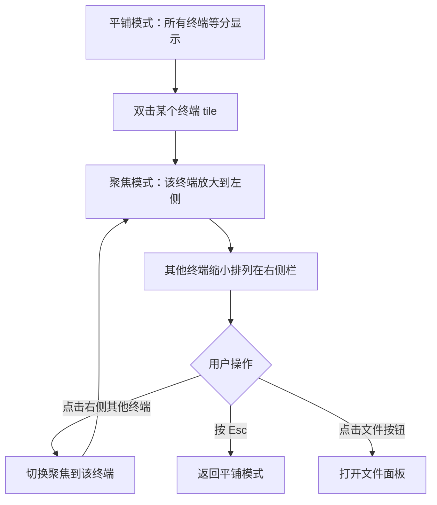
```mermaid
flowchart TD
    A[平铺模式：所有终端等分显示] --> B[双击某个终端 tile]
    B --> C[聚焦模式：该终端放大到左侧]
    C --> D[其他终端缩小排列在右侧栏]
    D --> E{用户操作}
    E -->|点击右侧其他终端| F[切换聚焦到该终端]
    E -->|按 Esc| G[返回平铺模式]
    E -->|点击文件按钮| H[打开文件面板]
    F --> C
```

### 5.5 安装流程

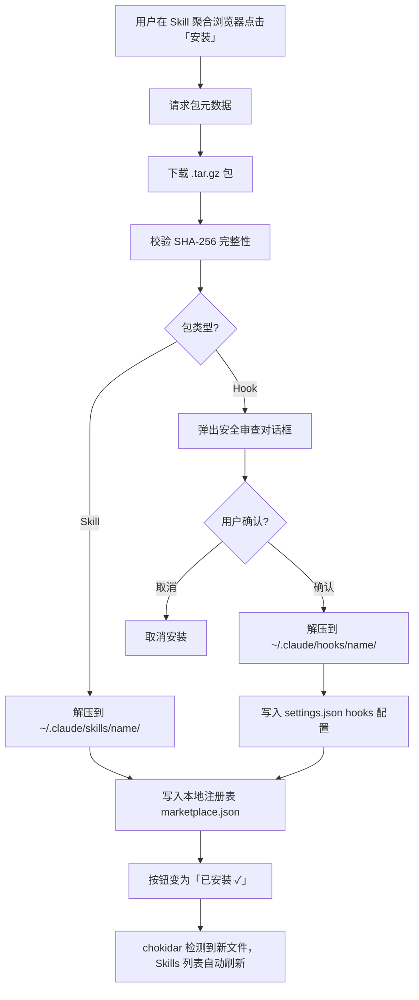
```mermaid
flowchart TD
    A[用户在 Skill 聚合浏览器点击「安装」] --> B[请求包元数据]
    B --> C[下载 .tar.gz 包]
    C --> D[校验 SHA-256 完整性]
    D --> E{包类型?}
    E -->|Skill| F[解压到 ~/.claude/skills/name/]
    E -->|Hook| G[弹出安全审查对话框]
    G --> H{用户确认?}
    H -->|确认| I[解压到 ~/.claude/hooks/name/]
    I --> J[写入 settings.json hooks 配置]
    H -->|取消| K[取消安装]
    F --> L[写入本地注册表 marketplace.json]
    J --> L
    L --> M[按钮变为「已安装 ✓」]
    M --> N[chokidar 检测到新文件，Skills 列表自动刷新]
```

### 5.6 Skill 展示页发布流程（V2-P2）

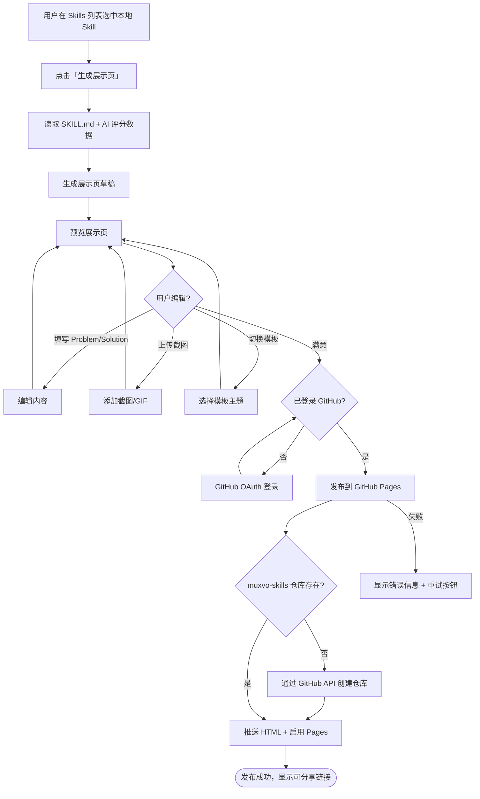
```mermaid
flowchart TD
    A[用户在 Skills 列表选中本地 Skill] --> B[点击「生成展示页」]
    B --> C[读取 SKILL.md + AI 评分数据]
    C --> D[生成展示页草稿]
    D --> E[预览展示页]
    E --> F{用户编辑?}
    F -->|填写 Problem/Solution| G[编辑内容]
    F -->|上传截图| H[添加截图/GIF]
    F -->|切换模板| I[选择模板主题]
    G --> E
    H --> E
    I --> E
    F -->|满意| J{已登录 GitHub?}
    J -->|否| K[GitHub OAuth 登录]
    K --> J
    J -->|是| L[发布到 GitHub Pages]
    L --> M{muxvo-skills 仓库存在?}
    M -->|否| N[通过 GitHub API 创建仓库]
    N --> O[推送 HTML + 启用 Pages]
    M -->|是| O
    O --> P([发布成功，显示可分享链接])
    L -->|失败| Q[显示错误信息 + 重试按钮]
```

### 5.7 更新检测流程

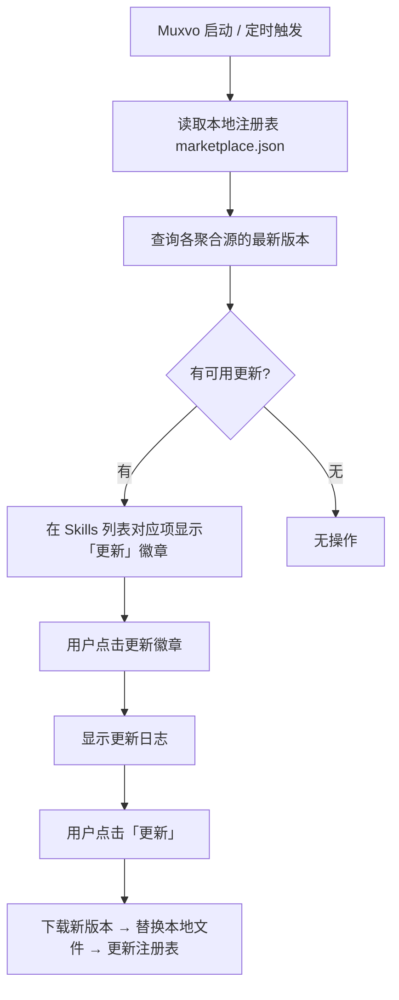
```mermaid
flowchart TD
    A[Muxvo 启动 / 定时触发] --> B[读取本地注册表 marketplace.json]
    B --> C[查询各聚合源的最新版本]
    C --> D{有可用更新?}
    D -->|有| E[在 Skills 列表对应项显示「更新」徽章]
    E --> F[用户点击更新徽章]
    F --> G[显示更新日志]
    G --> H[用户点击「更新」]
    H --> I[下载新版本 → 替换本地文件 → 更新注册表]
    D -->|无| J[无操作]
```

### 5.8 GitHub OAuth 登录流程（V2-P2）

> 认证功能降级到 V2-P2。V2-P0/P1 的聚合浏览和安装不需要登录。

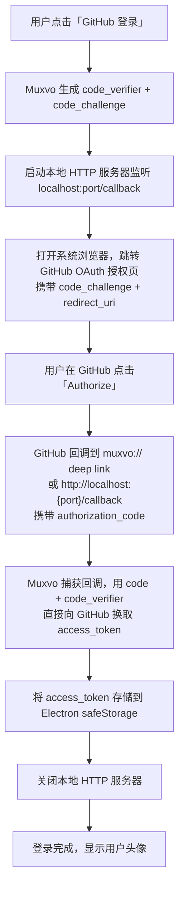
```mermaid
flowchart TD
    A[用户点击「GitHub 登录」] --> B[Muxvo 生成 code_verifier + code_challenge]
    B --> C[启动本地 HTTP 服务器监听 localhost:port/callback]
    C --> D[打开系统浏览器，跳转 GitHub OAuth 授权页\n携带 code_challenge + redirect_uri]
    D --> E[用户在 GitHub 点击「Authorize」]
    E --> F["GitHub 回调到 muxvo:// deep link\n或 http://localhost:{port}/callback\n携带 authorization_code"]
    F --> G[Muxvo 捕获回调，用 code + code_verifier\n直接向 GitHub 换取 access_token]
    G --> H[将 access_token 存储到 Electron safeStorage]
    H --> I[关闭本地 HTTP 服务器]
    I --> J[登录完成，显示用户头像]
```

> 说明：采用 PKCE（Proof Key for Code Exchange）流程，无需 Muxvo 服务器参与。客户端本地完成 code_verifier/code_challenge 生成、授权码交换和 token 存储，token 通过 Electron safeStorage（macOS Keychain / Windows DPAPI）加密保存。

### 5.9 Hook 安全审查流程

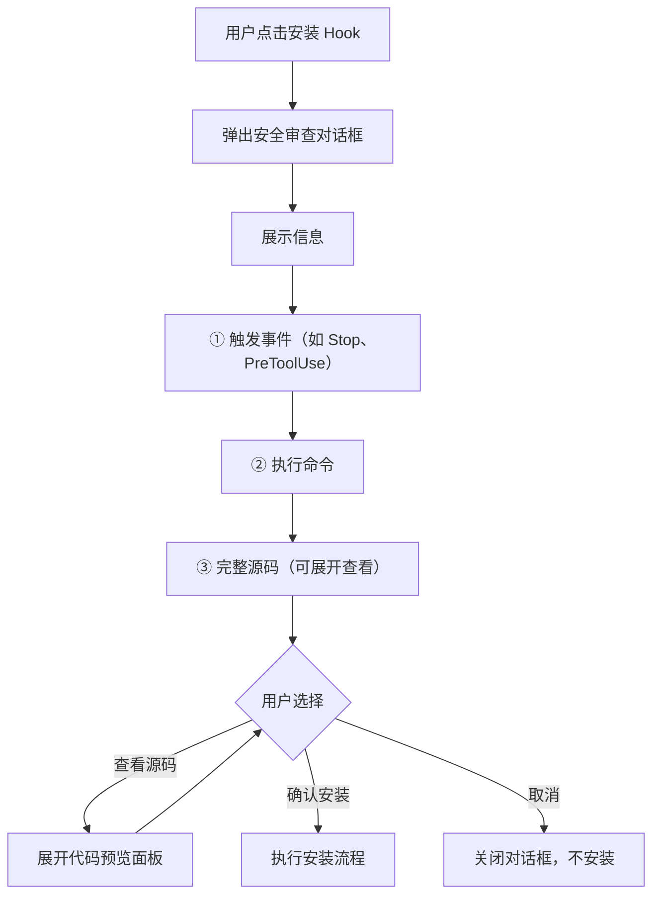
```mermaid
flowchart TD
    A[用户点击安装 Hook] --> B[弹出安全审查对话框]
    B --> C[展示信息]
    C --> D["① 触发事件（如 Stop、PreToolUse）"]
    D --> E["② 执行命令"]
    E --> F["③ 完整源码（可展开查看）"]
    F --> G{用户选择}
    G -->|查看源码| H[展开代码预览面板]
    H --> G
    G -->|确认安装| I[执行安装流程]
    G -->|取消| J[关闭对话框，不安装]
```

### 5.10 AI Skill 评分流程（V2-P1）

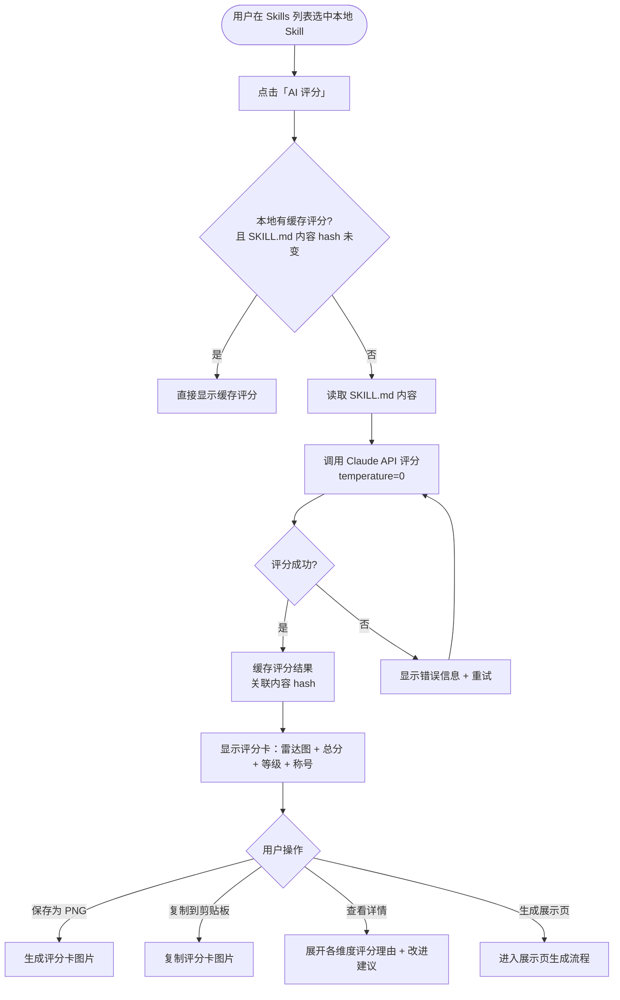
```mermaid
flowchart TD
    Start([用户在 Skills 列表选中本地 Skill]) --> Click[点击「AI 评分」]
    Click --> CheckCache{本地有缓存评分?\n且 SKILL.md 内容 hash 未变}
    CheckCache -->|是| ShowCached[直接显示缓存评分]
    CheckCache -->|否| Parse[读取 SKILL.md 内容]
    Parse --> CallAPI[调用 Claude API 评分\ntemperature=0]
    CallAPI --> Success{评分成功?}
    Success -->|是| Cache[缓存评分结果\n关联内容 hash]
    Cache --> Display[显示评分卡：雷达图 + 总分 + 等级 + 称号]
    Display --> Actions{用户操作}
    Actions -->|保存为 PNG| SaveImage[生成评分卡图片]
    Actions -->|复制到剪贴板| CopyImage[复制评分卡图片]
    Actions -->|查看详情| ShowDetail[展开各维度评分理由 + 改进建议]
    Actions -->|生成展示页| GoShowcase[进入展示页生成流程]
    Success -->|否| Error[显示错误信息 + 重试]
    Error --> CallAPI
```

---

## 6、状态机

### 6.1 应用生命周期

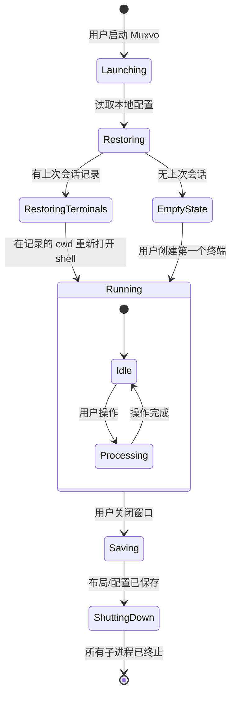
```mermaid
stateDiagram-v2
    [*] --> Launching: 用户启动 Muxvo
    Launching --> Restoring: 读取本地配置
    Restoring --> RestoringTerminals: 有上次会话记录
    Restoring --> EmptyState: 无上次会话
    RestoringTerminals --> Running: 在记录的 cwd 重新打开 shell
    EmptyState --> Running: 用户创建第一个终端
    Running --> Saving: 用户关闭窗口
    Saving --> ShuttingDown: 布局/配置已保存
    ShuttingDown --> [*]: 所有子进程已终止

    state Running {
        [*] --> Idle
        Idle --> Processing: 用户操作
        Processing --> Idle: 操作完成
    }
```

**转换条件：**

| 源状态 | 目标状态 | 触发条件 | 系统动作 |
|--------|---------|----------|----------|
| Launching | Restoring | 应用窗口创建完毕 | 读取 `~/Library/Application Support/Muxvo/config.json` |
| Restoring | RestoringTerminals | `config.openTerminals.length > 0` | 在记录的 cwd 逐个重新启动新的 claude 进程（非恢复旧进程） |
| Restoring | EmptyState | `config.openTerminals.length === 0` | 显示空 Grid + 引导提示 |
| Running | Saving | 窗口 `close` 事件 | 序列化当前 Grid 布局、列宽比例、终端列表 |
| ShuttingDown | [*] | 所有子进程 `exit` 事件 | `app.quit()` |

### 6.2 终端进程生命周期

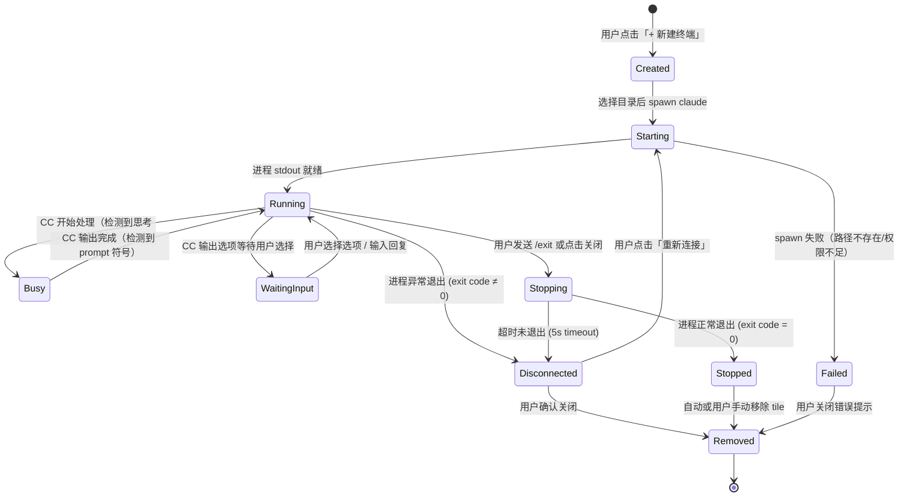
```mermaid
stateDiagram-v2
    [*] --> Created: 用户点击「+ 新建终端」

    Created --> Starting: 选择目录后 spawn claude
    Starting --> Running: 进程 stdout 就绪
    Starting --> Failed: spawn 失败（路径不存在/权限不足）

    Running --> Busy: CC 开始处理（检测到思考中输出）
    Busy --> Running: CC 输出完成（检测到 prompt 符号）
    Running --> WaitingInput: CC 输出选项等待用户选择

    WaitingInput --> Running: 用户选择选项 / 输入回复
    Running --> Stopping: 用户发送 /exit 或点击关闭
    Running --> Disconnected: 进程异常退出 (exit code ≠ 0)

    Stopping --> Stopped: 进程正常退出 (exit code = 0)
    Stopping --> Disconnected: 超时未退出 (5s timeout)

    Disconnected --> Starting: 用户点击「重新连接」
    Disconnected --> Removed: 用户确认关闭

    Stopped --> Removed: 自动或用户手动移除 tile
    Failed --> Removed: 用户关闭错误提示

    Removed --> [*]
```

**状态 UI 映射：**

| 状态 | 状态点颜色 | 状态点动画 | Tile 交互 | 输入栏状态 |
|------|-----------|-----------|-----------|-----------|
| Created | 灰色 | 无 | 不可交互 | 禁用 |
| Starting | 黄色 | 闪烁 | 不可交互 | 禁用，显示"启动中..." |
| Running | 绿色 | 呼吸脉冲 | 正常交互 | 可用 |
| Busy | 绿色 | 快速脉冲 | 可查看输出，输入排队 | 显示"处理中..." |
| WaitingInput | 琥珀色 | 呼吸脉冲 | 显示选项按钮 | 可用，显示选项 |
| Stopping | 灰色 | 闪烁 | 不可交互 | 禁用，显示"正在关闭..." |
| Stopped | 灰色 | 无 | 可查看历史输出 | 禁用 |
| Disconnected | 红色 | 无 | 显示重连按钮 | 禁用，显示"已断开" |
| Failed | 红色 | 无 | 显示错误信息 | 禁用 |

### 6.3 视图模式

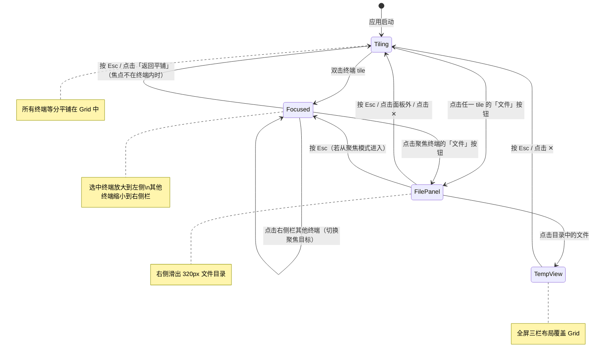
```mermaid
stateDiagram-v2
    [*] --> Tiling: 应用启动

    Tiling --> Focused: 双击终端 tile
    Focused --> Tiling: 按 Esc / 点击「返回平铺」（焦点不在终端内时）
    Focused --> Focused: 点击右侧栏其他终端（切换聚焦目标）

    Tiling --> FilePanel: 点击任一 tile 的「文件」按钮
    Focused --> FilePanel: 点击聚焦终端的「文件」按钮

    FilePanel --> TempView: 点击目录中的文件
    FilePanel --> Tiling: 按 Esc / 点击面板外 / 点击 ✕
    FilePanel --> Focused: 按 Esc（若从聚焦模式进入）

    TempView --> Tiling: 按 Esc / 点击 ✕

    note right of Tiling: 所有终端等分平铺在 Grid 中
    note right of Focused: 选中终端放大到左侧\n其他终端缩小到右侧栏
    note right of FilePanel: 右侧滑出 320px 文件目录
    note right of TempView: 全屏三栏布局覆盖 Grid
```

**Esc 键焦点规则：**

> **核心原则**：当输入焦点在终端内时，所有按键（包括 Esc）直接透传给终端，Muxvo 不截获。只有当焦点在 Muxvo UI 层（面板、搜索框、对话框等）时，Esc 才触发 Muxvo 行为。这避免了与 vim、readline 等终端内工具的 Esc 冲突。

**Esc 键优先级（从高到低，仅在 Muxvo UI 层有焦点时生效）：**

| 优先级 | 当前状态 | Esc 行为 |
|--------|---------|----------|
| 1 | 安全审查对话框打开 | 关闭对话框（不安装） |
| 2 | 文件夹选择器打开 | 关闭文件夹选择器 |
| 3 | Skill 浏览器打开 | 关闭 Skill 浏览器 |
| 4 | 三栏临时视图打开 | 关闭临时视图，返回平铺 |
| 5 | 文件面板打开 | 关闭文件面板 |
| 6 | 聚焦模式（焦点不在终端内） | 返回平铺模式 |
| 7 | 平铺模式 | 无操作 |

### 6.4 终端 Tile 交互状态

```mermaid
stateDiagram-v2
    [*] --> Default

    Default --> Hover : mouseenter
    Hover --> Default : mouseleave

    Default --> Selected : click（单击选中，高亮边框）
    Hover --> Selected : click
    Selected --> Default : click other tile
    Selected --> Focused : dblclick（双击进入聚焦模式）
    Default --> Focused : dblclick

    Default --> Dragging : dragstart
    Hover --> Dragging : dragstart
    Selected --> Dragging : dragstart
    Dragging --> Default : dragend

    Default --> DragOver : dragover from other
    DragOver --> Default : dragleave
    DragOver --> Default : drop
```

**状态说明：**

| 状态 | 说明 | 视觉效果 |
|------|------|---------|
| Default | 默认状态 | - |
| Hover | 鼠标悬停 | 3D 倾斜 + 光泽层 |
| Selected | 选中（amber 边框） | amber 边框高亮 |
| Dragging | 正在被拖拽 | opacity: 0.4 |
| DragOver | 另一个 tile 拖到此 tile 上方 | accent 边框 + glow |

**CSS 样式映射：**

| 状态 | border | opacity | transform | 额外效果 |
|------|--------|---------|-----------|---------|
| Default | `var(--border)` | 1 | none | - |
| Hover | `var(--border)` | 1 | `rotateX/Y(±4°)` | 光泽反射层 |
| Selected | `var(--accent)` | 1 | none | amber 边框 glow |
| Dragging | `var(--border)` | 0.4 | none | 半透明 |
| DragOver | `var(--accent)` | 1 | none | `box-shadow: accent-glow` |

### 6.5 文件面板状态

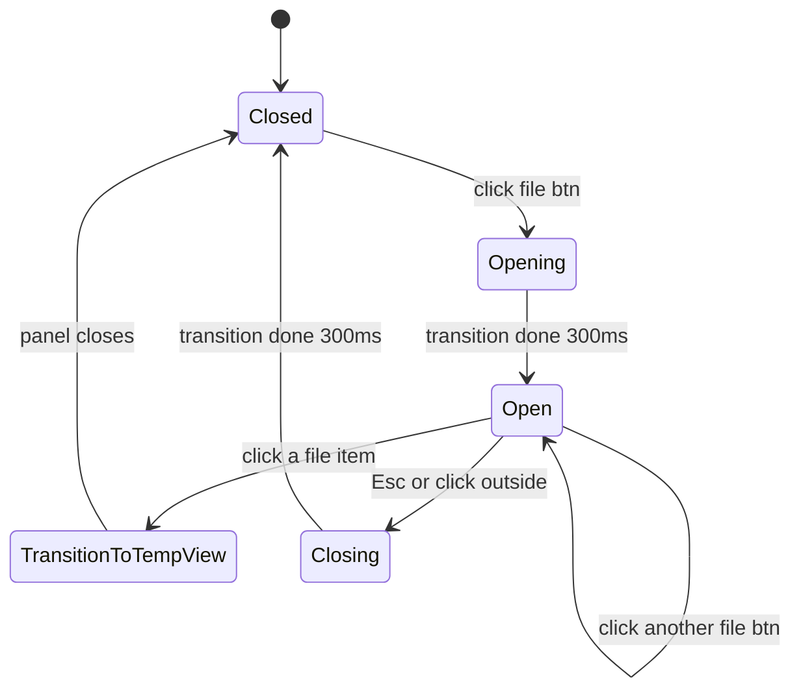
```mermaid
stateDiagram-v2
    [*] --> Closed

    Closed --> Opening : click file btn
    Opening --> Open : transition done 300ms

    Open --> Open : click another file btn

    Open --> TransitionToTempView : click a file item
    TransitionToTempView --> Closed : panel closes

    Open --> Closing : Esc or click outside
    Closing --> Closed : transition done 300ms
```

**转换说明：**

| 转换 | 触发条件 | 动画 |
|------|---------|------|
| Closed → Opening | 点击终端 tile 的「文件」按钮 | translateX(100%) → translateX(0) |
| Open → Open | 点击另一个终端的「文件」按钮 | 切换项目内容，无动画 |
| Open → TransitionToTempView | 点击目录中的文件 | 面板关闭，三栏视图打开 |
| Open → Closing | Esc / 点击面板外 / 点击 ✕ | translateX(0) → translateX(100%) |

### 6.6 三栏临时视图状态

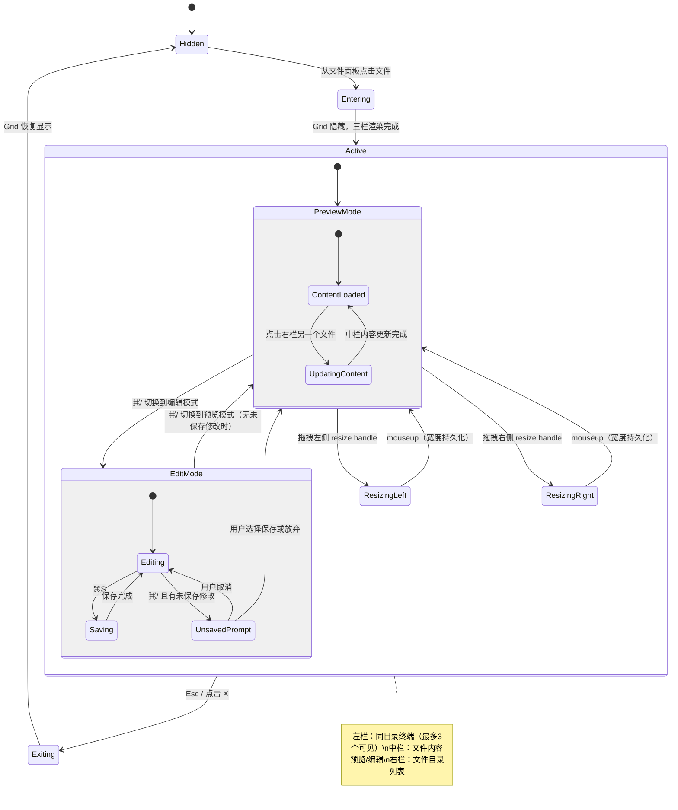
```mermaid
stateDiagram-v2
    [*] --> Hidden

    Hidden --> Entering: 从文件面板点击文件
    Entering --> Active: Grid 隐藏，三栏渲染完成

    state Active {
        [*] --> PreviewMode

        state PreviewMode {
            [*] --> ContentLoaded
            ContentLoaded --> UpdatingContent: 点击右栏另一个文件
            UpdatingContent --> ContentLoaded: 中栏内容更新完成
        }

        state EditMode {
            [*] --> Editing
            Editing --> Saving: ⌘S
            Saving --> Editing: 保存完成
            Editing --> UnsavedPrompt: ⌘/ 且有未保存修改
            UnsavedPrompt --> PreviewMode: 用户选择保存或放弃
            UnsavedPrompt --> Editing: 用户取消
        }

        PreviewMode --> EditMode: ⌘/ 切换到编辑模式
        EditMode --> PreviewMode: ⌘/ 切换到预览模式（无未保存修改时）

        PreviewMode --> ResizingLeft: 拖拽左侧 resize handle
        PreviewMode --> ResizingRight: 拖拽右侧 resize handle
        ResizingLeft --> PreviewMode: mouseup（宽度持久化）
        ResizingRight --> PreviewMode: mouseup（宽度持久化）
    }

    Active --> Exiting: Esc / 点击 ✕
    Exiting --> Hidden: Grid 恢复显示

    note right of Active: 左栏：同目录终端（最多3个可见）\n中栏：文件内容预览/编辑\n右栏：文件目录列表
```

**三栏尺寸规则：**

| 栏位 | 默认宽度 | 最小宽度 | 最大宽度 | 调整方式 |
|------|---------|---------|---------|---------|
| 左栏（终端） | 250px | 150px | 500px | 拖拽左 handle |
| 中栏（内容） | flex: 1 | 自适应 | 自适应 | 随左右栏变化 |
| 右栏（目录） | 280px | 150px | 500px | 拖拽右 handle |

**左栏终端显示规则：**

| 同目录终端数 | 显示方式 |
|-------------|---------|
| 1 | 占满左栏全高 |
| 2 | 等分两份 |
| 3 | 等分三份 |
| 4+ | 显示 3 个（等分），其余滚动查看 |

### 6.7 目录切换状态（按前台进程状态分支）

> cwd 切换行为取决于当前终端的前台进程类型。

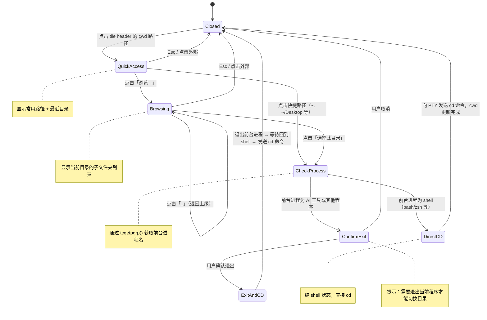
```mermaid
stateDiagram-v2
    [*] --> Closed

    Closed --> QuickAccess: 点击 tile header 的 cwd 路径
    QuickAccess --> Browsing: 点击「浏览...」
    QuickAccess --> CheckProcess: 点击快捷路径（~, ~/Desktop 等）

    Browsing --> Browsing: 点击子文件夹（进入）
    Browsing --> Browsing: 点击「..」（返回上级）
    Browsing --> CheckProcess: 点击「选择此目录」

    CheckProcess --> DirectCD: 前台进程为 shell（bash/zsh 等）
    CheckProcess --> ConfirmExit: 前台进程为 AI 工具或其他程序

    DirectCD --> Closed: 向 PTY 发送 cd 命令，cwd 更新完成
    ConfirmExit --> ExitAndCD: 用户确认退出
    ConfirmExit --> Closed: 用户取消
    ExitAndCD --> Closed: 退出前台进程 → 等待回到 shell → 发送 cd 命令

    QuickAccess --> Closed: Esc / 点击外部
    Browsing --> Closed: Esc / 点击外部

    note right of QuickAccess: 显示常用路径 + 最近目录
    note right of Browsing: 显示当前目录的子文件夹列表
    note right of CheckProcess: 通过 tcgetpgrp() 获取前台进程名
    note right of DirectCD: 纯 shell 状态，直接 cd
    note right of ConfirmExit: 提示：需要退出当前程序才能切换目录
```

**前台进程检测机制（B2）：**

通过系统调用 `tcgetpgrp()` 获取 PTY 的前台进程组 ID，再查进程名：

| 前台进程 | 判定方式 | 切换行为 |
|---------|----------|----------|
| shell（bash/zsh/fish 等） | 进程名匹配已知 shell 列表 | 直接向 PTY 发送 `cd <new_path>\n` |
| AI CLI 工具或其他程序 | 进程名不在 shell 列表中（如 claude、codex、gemini、python 等） | 弹出确认对话框：「当前正在运行 {进程名}，需要退出后才能切换目录。确认退出？」→ 用户确认后发送 SIGINT → 等待回到 shell → 发送 cd 命令 |

> **技术说明**：macOS/Linux 上通过 `tcgetpgrp(fd)` 获取前台进程组 ID，再通过 `/proc/{pid}/comm`（Linux）或 `ps -p {pid} -o comm=`（macOS）获取进程名。此方案比 PTY 文本模式匹配可靠得多。

**目录切换的连锁动作：**

| 动作 | 说明 |
|------|------|
| 终端 header 更新 | cwd 路径文本更新 |
| 自动归组 | 检查是否有同目录终端，若有则移动到旁边 |
| 文件按钮更新 | 下次点击文件按钮读取新目录的文件 |

### 6.8 自定义名称编辑状态

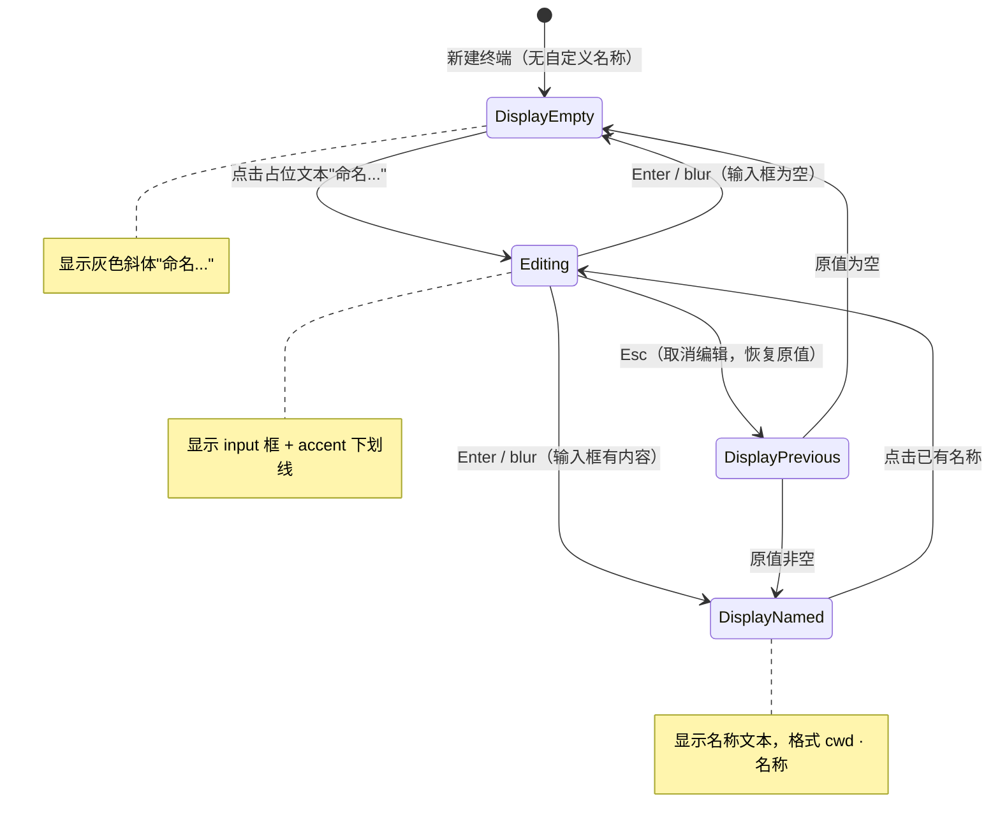
```mermaid
stateDiagram-v2
    [*] --> DisplayEmpty: 新建终端（无自定义名称）

    DisplayEmpty --> Editing: 点击占位文本"命名..."
    DisplayNamed --> Editing: 点击已有名称

    Editing --> DisplayNamed: Enter / blur（输入框有内容）
    Editing --> DisplayEmpty: Enter / blur（输入框为空）
    Editing --> DisplayPrevious: Esc（取消编辑，恢复原值）

    DisplayPrevious --> DisplayEmpty: 原值为空
    DisplayPrevious --> DisplayNamed: 原值非空

    note right of DisplayEmpty: 显示灰色斜体"命名..."
    note right of DisplayNamed: 显示名称文本，格式 cwd · 名称
    note right of Editing: 显示 input 框 + accent 下划线
```

### 6.9 Grid 边框调整状态

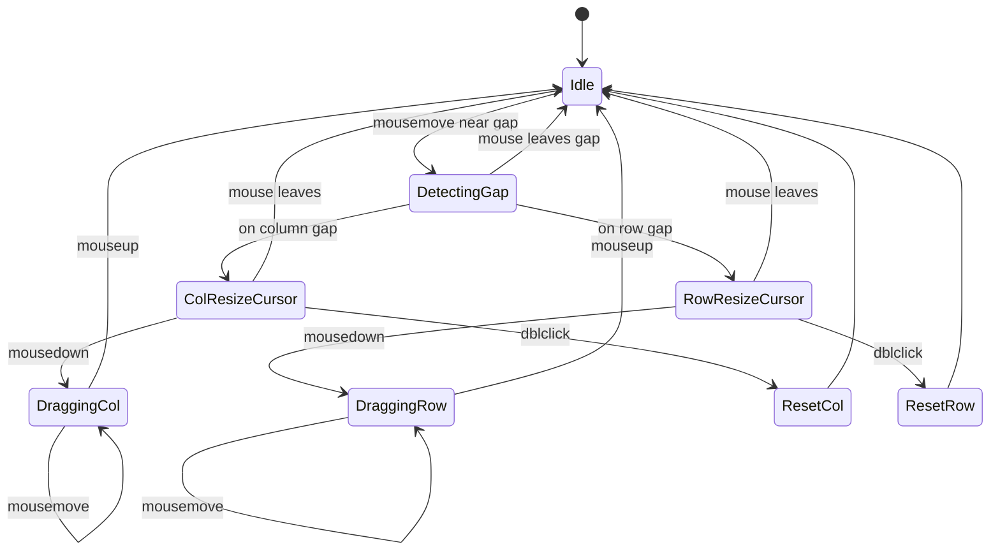
```mermaid
stateDiagram-v2
    [*] --> Idle

    Idle --> DetectingGap : mousemove near gap
    DetectingGap --> ColResizeCursor : on column gap
    DetectingGap --> RowResizeCursor : on row gap
    DetectingGap --> Idle : mouse leaves gap

    ColResizeCursor --> DraggingCol : mousedown
    RowResizeCursor --> DraggingRow : mousedown
    ColResizeCursor --> Idle : mouse leaves
    RowResizeCursor --> Idle : mouse leaves

    DraggingCol --> DraggingCol : mousemove
    DraggingRow --> DraggingRow : mousemove
    DraggingCol --> Idle : mouseup
    DraggingRow --> Idle : mouseup

    ColResizeCursor --> ResetCol : dblclick
    RowResizeCursor --> ResetRow : dblclick
    ResetCol --> Idle
    ResetRow --> Idle
```

**状态说明：**

| 状态 | 光标样式 | 说明 |
|------|---------|------|
| Idle | default | 仅平铺模式生效，聚焦模式下不触发 |
| DetectingGap | default | mousemove 检测鼠标是否接近 tile 间隙 |
| ColResizeCursor | col-resize | 鼠标在列间隙上 |
| RowResizeCursor | row-resize | 鼠标在行间隙上 |
| DraggingCol | col-resize | 拖拽中，持续更新 columnRatios |
| DraggingRow | row-resize | 拖拽中，持续更新 rowRatios |
| ResetCol / ResetRow | - | 双击重置列/行比例为 1（等分） |

### 6.10 聊天历史面板状态

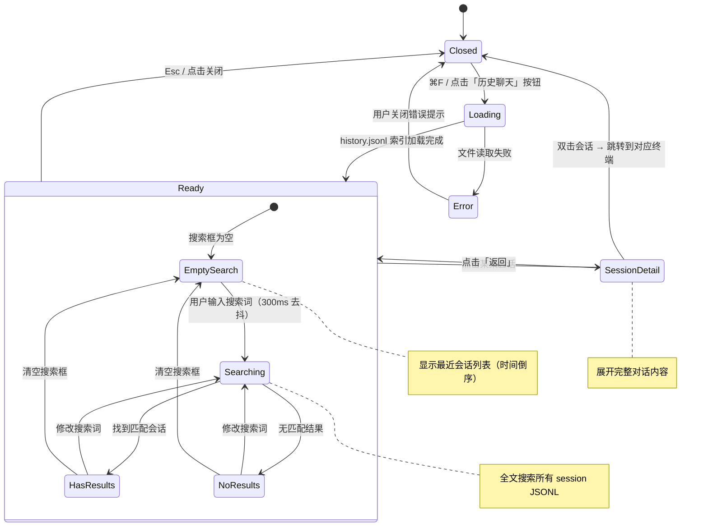
```mermaid
stateDiagram-v2
    [*] --> Closed

    Closed --> Loading: ⌘F / 点击「历史聊天」按钮
    Loading --> Ready: history.jsonl 索引加载完成
    Loading --> Error: 文件读取失败

    state Ready {
        [*] --> EmptySearch: 搜索框为空
        EmptySearch --> Searching: 用户输入搜索词（300ms 去抖）
        Searching --> HasResults: 找到匹配会话
        Searching --> NoResults: 无匹配结果
        HasResults --> Searching: 修改搜索词
        NoResults --> Searching: 修改搜索词
        HasResults --> EmptySearch: 清空搜索框
        NoResults --> EmptySearch: 清空搜索框
    }

    Ready --> SessionDetail: 点击某条会话
    SessionDetail --> Ready: 点击「返回」
    SessionDetail --> Closed: 双击会话 → 跳转到对应终端

    Ready --> Closed: Esc / 点击关闭
    Error --> Closed: 用户关闭错误提示

    note right of EmptySearch: 显示最近会话列表（时间倒序）
    note right of Searching: 全文搜索所有 session JSONL
    note right of SessionDetail: 展开完整对话内容
```

### 6.11 配置管理器状态

```mermaid
stateDiagram-v2
    [*] --> Closed

    Closed --> CategoryList: 点击「配置」按钮

    state CategoryList {
        [*] --> Overview: 显示分类卡片
        Overview --> SkillsList: 点击 Skills 卡片
        Overview --> HooksList: 点击 Hooks 卡片
        Overview --> PlansList: 点击 Plans 卡片
        Overview --> TasksList: 点击 Tasks 卡片
        Overview --> SettingsView: 点击 Settings 卡片
        Overview --> ClaudeMdView: 点击 CLAUDE.md 卡片
        Overview --> MemoryView: 点击 Memory 卡片
        Overview --> McpView: 点击 MCP 卡片

        SkillsList --> ResourcePreview: 点击某个 skill
        HooksList --> ResourcePreview: 点击某个 hook
        PlansList --> ResourcePreview: 点击某个 plan
        TasksList --> ResourcePreview: 点击某个 task
        ResourcePreview --> SkillsList: 返回列表
        ResourcePreview --> HooksList: 返回列表
        ResourcePreview --> PlansList: 返回列表
        ResourcePreview --> TasksList: 返回列表

        SettingsView --> SettingsEditing: 用户修改设置
        SettingsEditing --> SettingsView: 保存成功
        ClaudeMdView --> ClaudeMdEditing: 用户修改内容
        ClaudeMdEditing --> ClaudeMdView: 保存成功
    }

    CategoryList --> Closed: Esc / 点击关闭

    note right of Overview: Skills(30) / Hooks(3) / Plans(129)\nTasks / Settings / CLAUDE.md / Memory / MCP
    note right of SettingsEditing: 直接写入 settings.json
    note right of ClaudeMdEditing: 直接写入 CLAUDE.md
```

**资源类型与操作权限：**

| 资源类型 | 查看 | 搜索 | 编辑 | 文件格式 |
|----------|------|------|------|----------|
| Skills | ✅ | ✅ | ❌ 只读 | Markdown |
| Hooks | ✅ | ❌ | ❌ 只读 | Shell/JS |
| Plans | ✅ | ✅ | ❌ 只读 | Markdown |
| Tasks | ✅ | ✅ | ❌ 只读 | JSON |
| Settings | ✅ | ❌ | ✅ 可编辑 | JSON |
| CLAUDE.md | ✅ | ❌ | ✅ 可编辑 | Markdown |
| Memory | ✅ | ✅ | ❌ 只读 | Markdown |
| MCP | ✅ | ❌ | ❌ 只读 | JSON |

### 6.12 文件监听状态

```mermaid
stateDiagram-v2
    [*] --> Inactive: 应用启动

    Inactive --> Watching: 终端创建 → 监听其 cwd 目录
    Watching --> Watching: 新文件创建 → UI 标记 NEW
    Watching --> Watching: 文件修改 → UI 刷新
    Watching --> Watching: 文件删除 → UI 移除
    Watching --> WatchError: fs.watch 错误（权限/路径不存在）
    WatchError --> Watching: 自动重试 (3s interval, max 3 retries)
    WatchError --> Inactive: 重试失败 → 停止监听

    Watching --> Inactive: 终端关闭 → 停止监听该目录

    note right of Watching: 使用 chokidar 监听\n- 项目文件目录变化\n- session JSONL 文件更新\n- ~/.claude/ 资源变化
```

**监听范围：**

| 监听目标 | 触发时机 | UI 反应 |
|----------|---------|---------|
| 终端 cwd 目录 | 终端创建/cwd 切换 | 文件面板自动刷新 |
| `~/.claude/projects/{id}/*.jsonl` | 持续 | 聊天历史实时更新 |
| `~/.claude/plans/` | 持续 | Plans 列表自动刷新 |
| `~/.claude/skills/` | 持续 | Skills 列表自动刷新 |
| 项目内新文件 | CC 创建文件时 | 文件浏览器标记 `NEW` |
| `~/Library/Application Support/Muxvo/chat-history/` | Muxvo 同步完成时 | 镜像同步状态指示器更新 |

### 6.13 富编辑器覆盖层状态

```mermaid
stateDiagram-v2
    [*] --> RichEditor: 终端启动（默认）

    state RichEditor {
        [*] --> Idle: 编辑器空闲
        Idle --> Composing: 用户开始输入
        Composing --> Composing: 继续输入 / 粘贴文本
        Composing --> ImageAttaching: 用户粘贴图片（Ctrl+V）
        ImageAttaching --> Composing: 图片保存到临时文件，编辑器显示缩略图
        Composing --> Sending: 用户按发送（Enter / Cmd+Enter）
        Sending --> Idle: 提取文本 → 检测前台进程 → 按协议转换 → pty.write() → 清空编辑器
    }

    RichEditor --> RawTerminal: Alternate Screen Buffer 进入（\x1b[?1049h）/ 手动快捷键切换
    RawTerminal --> RichEditor: Alternate Screen Buffer 退出（\x1b[?1049l）/ 手动快捷键切换

    note right of RichEditor: 富编辑器可见，接收键盘输入\nxterm.js 只渲染输出（断开键盘）
    note right of RawTerminal: 富编辑器隐藏\nxterm.js 直接接收键盘输入\n（用于 vim/htop/less 等全屏 TUI）
```

**模式 UI 映射：**

| 模式 | 富编辑器 | xterm.js 键盘 | 适用场景 |
|------|---------|--------------|---------|
| RichEditor | 可见，接收所有键盘输入（Ctrl+C/Z/D 穿透到终端） | 断开 | Claude Code、Codex、Gemini CLI、shell 提示符 |
| RawTerminal | 隐藏 | 直接接收 | vim、htop、less、man、ssh、tmux 等全屏 TUI |

**图片附件生命周期：**

| 状态 | 说明 |
|------|------|
| 无附件 | 编辑器正常文本模式 |
| 附加中 | 用户粘贴图片，保存到 `/tmp/muxvo-images/{uuid}.png` |
| 已附加 | 缩略图显示在编辑器中，用户可点击 × 移除 |
| 发送中 | 按前台工具适配发送（CC: 模拟 Ctrl+V / 其他: 插入文件路径） |

### 6.14 Skill 聚合浏览器状态

```mermaid
stateDiagram-v2
    [*] --> Closed

    Closed --> Loading: 点击「Skills」按钮 / 点击「浏览更多」
    Loading --> Ready: 多源聚合数据加载完成
    Loading --> PartialReady: 部分源加载成功，部分失败
    Loading --> LoadError: 所有源加载失败

    state Ready {
        [*] --> Discovery: 默认展示（按来源优先排序）
        Discovery --> SearchResults: 用户输入搜索词（300ms 去抖）
        SearchResults --> Discovery: 清空搜索框
        SearchResults --> SearchResults: 修改搜索词

        Discovery --> PackageDetail: 点击某个包
        SearchResults --> PackageDetail: 点击某个包
        PackageDetail --> Discovery: 点击返回
    }

    PartialReady --> Ready: 失败源重试成功
    Ready --> Closed: Esc / 点击 ✕
    LoadError --> Closed: Esc / 关闭
    LoadError --> Loading: 点击「重试」

    note right of Loading: 并行请求多个聚合源\n（Anthropic 官方、SkillsMP、GitHub 等）
    note right of PartialReady: 显示已加载的源，标注失败源"暂不可用"
```

### 6.15 包安装状态

```mermaid
stateDiagram-v2
    [*] --> NotInstalled

    NotInstalled --> Downloading: 用户点击「安装」
    Downloading --> SecurityReview: 类型为 Hook
    Downloading --> Installing: 类型为 Skill，下载完成
    SecurityReview --> Installing: 用户确认
    SecurityReview --> NotInstalled: 用户取消
    Installing --> Installed: 解压 + 注册完成
    Installing --> InstallFailed: 解压/写入失败

    Installed --> UpdateAvailable: 检测到新版本
    UpdateAvailable --> Downloading: 用户点击「更新」
    Installed --> Uninstalling: 用户点击「卸载」
    UpdateAvailable --> Uninstalling: 用户点击「卸载」
    Uninstalling --> NotInstalled: 删除本地文件 + 注册表记录

    InstallFailed --> NotInstalled: 用户关闭错误提示
```

**状态 UI 映射：**

| 状态 | 按钮文案 | 按钮样式 | 附加信息 |
|------|---------|---------|---------|
| NotInstalled | 安装 | 主色调（amber）实心按钮 | - |
| Downloading | 下载中... | 灰色禁用 + 进度条 | 显示下载进度 |
| SecurityReview | - | - | 安全审查对话框 |
| Installing | 安装中... | 灰色禁用 + 旋转图标 | - |
| Installed | 已安装 ✓ | 绿色描边按钮 | hover 显示「卸载」 |
| UpdateAvailable | 更新到 x.y.z | amber 描边按钮 + 徽章 | 显示更新日志链接 |
| InstallFailed | 重试安装 | 红色描边按钮 | 显示错误原因 |
| Uninstalling | 卸载中... | 灰色禁用 | - |

### 6.16 AI 评分状态（V2-P1）

```mermaid
stateDiagram-v2
    [*] --> NotScored: Skill 存在但未评分

    NotScored --> Scoring: 点击「AI 评分」
    Scoring --> Scored: 评分完成
    Scoring --> ScoreFailed: API 调用失败

    ScoreFailed --> Scoring: 重试
    ScoreFailed --> NotScored: 取消

    Scored --> Scoring: Skill 内容变更后重新评分
    Scored --> GeneratingShowcase: 点击「生成展示页」
```

### 6.17 用户认证状态（V2-P2）

> 仅在展示页发布功能实现时需要。V2-P0（聚合浏览）和 V2-P1（AI 评分）不需要认证。

```mermaid
stateDiagram-v2
    [*] --> LoggedOut

    LoggedOut --> Authorizing: 点击「GitHub 登录」
    Authorizing --> LoggedIn: 收到 JWT token
    Authorizing --> LoggedOut: 授权失败/取消

    LoggedIn --> LoggedOut: token 过期 / 用户登出
```

### 6.18 Showcase 展示页生命周期状态

```mermaid
stateDiagram-v2
    [*] --> NotGenerated: Skill 已评分但未生成展示页

    NotGenerated --> Generating: 点击「生成展示页」
    Generating --> Previewing: 生成草稿（合并评分卡 + SKILL.md 数据）
    Generating --> GenerateFailed: 生成失败

    GenerateFailed --> Generating: 重试
    GenerateFailed --> NotGenerated: 取消

    Previewing --> Editing: 用户修改模板/截图/Problem&Solution
    Editing --> Previewing: 保存修改，刷新预览

    Previewing --> Publishing: 点击「发布展示页」
    Publishing --> Published: GitHub Pages 发布成功
    Publishing --> PublishFailed: 发布失败（网络/权限/API 限制）

    PublishFailed --> Publishing: 重试
    PublishFailed --> Previewing: 返回编辑

    Published --> Updating: 修改已发布的展示页
    Updating --> Published: 更新成功
    Updating --> PublishFailed: 更新失败

    Published --> Unpublished: 用户主动下线
    Unpublished --> Publishing: 重新发布
    Unpublished --> NotGenerated: 删除展示页配置
```

**状态 UI 映射：**

| 状态 | UI 表现 |
|------|---------|
| NotGenerated | Skills 列表中显示「生成展示页」按钮（前提：已有 AI 评分） |
| Generating | 按钮变为 loading 状态 + "正在生成展示页..." |
| GenerateFailed | 弹出错误提示 |
| Previewing | 打开展示页预览面板（右侧） |
| Editing | 预览面板切换为编辑模式（模板选择器、Problem/Solution 编辑、截图上传） |
| Publishing | 预览面板顶部显示发布进度条 |
| Published | 显示「已发布」徽章 + 可分享链接 + 「复制链接」按钮 |
| PublishFailed | 发布进度条变红 + 错误信息 + 重试按钮 |
| Updating | 类似 Publishing，顶部显示"正在更新..." |
| Unpublished | 显示「已下线」标记 + 「重新发布」按钮 |

---

## 7、数据结构

### 7.1 CC 现有数据结构（只读）

Muxvo 不创建自己的数据库，直接读取 CC 已有文件：

**history.jsonl 每行结构：**
```json
{
  "display": "用户输入的文本",
  "pastedContents": {},
  "timestamp": 1759555019732,
  "project": "/Users/rl/path/to/project",
  "sessionId": "uuid-string"
}
```

**Session JSONL 每行结构：**
```json
{
  "type": "user|assistant",
  "messageId": "uuid",
  "sessionId": "uuid",
  "timestamp": "ISO8601",
  "cwd": "当前工作目录",
  "gitBranch": "分支名",
  "message": { "role": "user|assistant", "content": "..." }
}
```

**Task JSON 结构：**
```json
{
  "id": "1",
  "subject": "任务标题",
  "description": "任务描述",
  "status": "pending|in_progress|completed",
  "blocks": ["2"],
  "blockedBy": []
}
```

### 7.2 Muxvo 本地配置（唯一自有数据）

Muxvo 仅存储自身的窗口布局和偏好设置：

```json
{
  "window": {
    "width": 1400,
    "height": 900,
    "x": 100,
    "y": 100
  },
  "openTerminals": [
    { "cwd": "/path/to/project", "customName": "VoKey", "active": true }
  ],
  "gridLayout": {
    "columnRatios": [1, 1],
    "rowRatios": [1, 1]
  },
  "ftvLeftWidth": 250,
  "ftvRightWidth": 280,
  "theme": "dark",
  "fontSize": 14
}
```

### 7.3 包（Package）

> 统一数据模型。V2-P0 聚合模式下由各源数据映射填充；V2-P2 自有发布后由 Muxvo 直接管理。各源缺失字段显示为"不可用"。

```json
{
  "id": "uuid",
  "name": "commit-helper",
  "type": "skill",
  "displayName": "Commit Message Generator",
  "description": "根据 git diff 自动生成规范的 commit message",
  "readme": "完整的 SKILL.md 内容...",
  "author": {
    "username": "rl",
    "avatarUrl": "https://github.com/rl.png",
    "badges": ["contributor", "popular"]
  },
  "category": "development",
  "tags": ["git", "commit", "workflow"],
  "license": "MIT",
  "stats": {
    "downloads": 12340,
    "weeklyDownloads": 890,
    "avgRating": 4.7,
    "reviewCount": 23,
    "favoriteCount": 156
  },
  "latestVersion": "1.2.0",
  "versions": [
    {
      "version": "1.2.0",
      "changelog": "新增对 monorepo 的支持",
      "publishedAt": "2026-02-07T10:00:00Z",
      "fileSize": 24576,
      "fileList": ["SKILL.md", "LICENSE"]
    }
  ],
  "createdAt": "2026-01-15T08:00:00Z",
  "updatedAt": "2026-02-07T10:00:00Z"
}
```

### 7.4 评价（Review）

> V2-P2 自有发布后启用。聚合模式下各源的评价数据格式各异，暂不统一映射。

```json
{
  "id": "uuid",
  "packageName": "commit-helper",
  "author": {
    "username": "developer1",
    "avatarUrl": "https://github.com/developer1.png"
  },
  "rating": 5,
  "title": "非常好用，节省大量时间",
  "body": "安装后 commit message 质量明显提升，推荐！",
  "createdAt": "2026-02-01T14:30:00Z"
}
```

### 7.5 本地注册表（Muxvo 市场自有数据）

```json
// ~/Library/Application Support/Muxvo/marketplace.json
{
  "auth": {
    "username": "rl",
    "avatarUrl": "https://github.com/rl.png"
  },
  "installed": {
    "commit-helper": {
      "type": "skill",
      "version": "1.2.0",
      "packageId": "uuid",
      "source": "skillsmp",
      "sourceUrl": "https://skillsmp.com/skills/commit-helper",
      "installedAt": "2026-02-08T10:30:00Z",
      "updatedAt": "2026-02-08T10:30:00Z"
    },
    "auto-deploy": {
      "type": "hook",
      "version": "1.0.0",
      "packageId": "uuid",
      "source": "github",
      "sourceUrl": "https://github.com/user/auto-deploy",
      "installedAt": "2026-02-05T09:00:00Z",
      "updatedAt": "2026-02-05T09:00:00Z",
      "hookConfig": {
        "event": "Stop",
        "command": "~/.claude/hooks/auto-deploy/run.sh"
      }
    }
  },
  "lastUpdateCheck": "2026-02-08T16:00:00Z"
}
```

### 7.6 包归档格式

发布和下载的包是一个 `.tar.gz` 文件，包含：

```
commit-helper-1.2.0.tar.gz
├── package.json          # 包元数据清单
├── SKILL.md              # skill 内容（必须）
├── LICENSE               # 许可证（可选）
└── references/           # 参考文件（可选）
    └── example.md
```

**package.json 结构：**

```json
{
  "name": "commit-helper",
  "type": "skill",
  "version": "1.2.0",
  "displayName": "Commit Message Generator",
  "description": "根据 git diff 自动生成规范的 commit message",
  "category": "development",
  "tags": ["git", "commit", "workflow"],
  "license": "MIT",
  "files": ["SKILL.md", "LICENSE", "references/example.md"]
}
```

**Hook 包额外包含 hookConfig：**

```json
{
  "name": "auto-deploy",
  "type": "hook",
  "version": "1.0.0",
  "hookConfig": {
    "event": "Stop",
    "matcher": null,
    "command": "~/.claude/hooks/auto-deploy/run.sh",
    "timeout": 120
  }
}
```

### 7.7 AI 评分结果（SkillScore）

> 存储在本地 `~/Library/Application Support/Muxvo/skill-scores/{skill-dir-name}.json`，每次评分时缓存。

```json
{
  "version": 1,
  "skillDirName": "commit-helper",
  "contentHash": "a1b2c3d4e5f6...",
  "scores": {
    "practicality": { "score": 88, "reason": "解决了真实的 commit 编写痛点，场景描述清晰" },
    "engineering": { "score": 92, "reason": "Prompt 结构清晰，有错误处理，考虑了边界条件" },
    "innovation": { "score": 65, "reason": "类似功能的 Skill 已有多个，差异化不够" },
    "documentation": { "score": 78, "reason": "有使用说明，但缺少参数说明和示例" },
    "reusability": { "score": 85, "reason": "参数化程度高，多数项目可直接使用" }
  },
  "total": 83,
  "grade": "Advanced",
  "title": "Workflow Architect",
  "suggestions": [
    "添加具体的使用示例代码块",
    "在 description 中说明与类似 Skill 的差异点"
  ],
  "scoredAt": "2026-02-10T00:00:00Z",
  "apiModel": "claude-sonnet-4-5-20250929"
}
```

### 7.8 Showcase 展示页配置（SkillShowcase）

> 存储在本地 `~/Library/Application Support/Muxvo/showcases/{skill-dir-name}.json`，发布后同步到 GitHub Pages。

```json
{
  "version": 1,
  "skillDirName": "commit-helper",
  "template": "developer-dark",
  "hero": {
    "title": "Commit Helper",
    "tagline": "告别手写 commit message"
  },
  "problemSolution": {
    "problem": "每次写 commit message 都要想半天，格式还不统一",
    "solution": "自动分析 git diff，按 Conventional Commits 规范生成 message"
  },
  "features": [
    { "icon": "git-commit", "title": "智能分析 diff", "description": "自动分析 git diff 生成规范的 commit message" }
  ],
  "demos": [
    { "type": "screenshot", "url": "screenshots/demo1.png", "caption": "生成效果展示" }
  ],
  "tags": ["git", "workflow", "automation"],
  "scoreRef": "skill-scores/commit-helper.json",
  "publish": {
    "status": "published",
    "publishedAt": "2026-02-10T00:00:00Z",
    "url": "https://username.github.io/muxvo-skills/commit-helper",
    "githubRepo": "username/muxvo-skills"
  },
  "lastGeneratedAt": "2026-02-10T00:00:00Z",
  "lastEditedAt": "2026-02-10T00:00:00Z"
}
```

---

## 8、详细功能说明

### 8.1 全屏平铺终端管理（功能 A/B/C/I/M）

**页面构成：**
- 顶部菜单栏（36px）：应用名 + 终端计数 + 工具按钮
- 主区域：CSS Grid 平铺所有终端 tile，智能计算行列
- 底部控制栏：「+ 新建终端」按钮 + 项目数量显示
- 每个终端 tile 包含：
  - Header：状态点（绿/灰/红）+ cwd 路径（可点击切换目录）+ 自定义名称（可编辑）+ 聚焦按钮 + 文件按钮
  - 终端内容区（xterm.js 渲染，编辑器模式下只负责输出展示）
  - 底部富编辑器覆盖层（编辑器模式）/ xterm.js 原生输入（原始终端模式，运行 vim/htop 等全屏 TUI 时自动切换）

**Grid 布局规则：**

| 终端数 | 布局 |
|--------|------|
| 1 | 1×1 全屏 |
| 2 | 2×1 左右对半 |
| 3 | 3×1 三等分 |
| 4 | 2×2 四宫格 |
| 5 | 上3下2（下行居中） |
| 6 | 3×2 六宫格 |
| 7+ | ceil(√n) 列，自动计算 |

**聚焦模式：**
- 双击终端 tile → 该终端放大到屏幕左侧（约 75% 宽度）（单击仅选中高亮边框，防止误触）
- 其他终端缩小排列在右侧栏，最多同时显示 3 个，超出可滚动
- 点击右侧栏终端 → 切换聚焦目标
- 按 Esc 或点击「返回平铺」→ 恢复 Grid 布局

**拖拽排序：**
- 拖拽 tile header → 移动到目标位置（HTML5 Drag and Drop）
- 拖拽中源 tile 半透明，目标位置高亮

**边框调整大小：**
- 鼠标移到两个 tile 之间的间隙 → 光标变为 col-resize / row-resize
- 拖拽 → 调整相邻列/行的比例
- 双击 → 重置为等分

**同目录自动归组：**
- 新建终端时，若已有同目录终端 → 自动排列到旁边

**双段式命名：**
- cwd 部分：显示路径，点击弹出目录选择器。shell 态直接 cd 切换；有前台进程运行时弹出确认退出对话框后切换（见 6.7 节）
- 自定义名称：点击可编辑，格式 `~/path · 名称`

**状态区分：**
- 运行中：绿色状态点（带呼吸动画），终端可交互
- 空闲：灰色状态点，上次会话内容仍可查看
- 已断开：红色状态点，提示重新连接

### 8.2 文件浏览与三栏临时视图（功能 H/G）

**文件面板（右侧滑出）：**
- 点击终端 tile 的「文件」按钮 → 从右侧滑出 320px 文件目录面板
- 面板内容：文件树形目录，CC 新创建的文件标记 `NEW` 绿色徽章
- 关闭方式：点击 ✕、按 Esc、或点击面板外区域

**三栏全屏临时视图：**
- 点击文件目录中的文件 → 进入全屏三栏视图（覆盖平铺 Grid）

```
┌──────────────┬─────────────────────────┬──────────────┐
│  同目录终端   │      文件内容预览         │   文件目录    │
│  (最多显示3个) │                         │   (可滚动)    │
│  (可滚动)     │   HotkeyManager.swift   │  📂 Sources  │
│              │   import Carbon         │   App.swift  │
│  终端 A      │   import Combine        │  ▸HotkeyMgr ←│
│  ─────────   │   ...                   │   Recog.swift│
│  终端 B      │                         │   ...        │
└──────────────┴─────────────────────────┴──────────────┘
```

- 左栏（~250px）：当前终端 + 所有 cwd 相同的终端，最多同时显示 3 个，超过可滚动
- 中栏（flex: 1）：文件内容预览（Markdown 渲染 / JSON 格式化 / 代码高亮）
- 右栏（~280px）：文件目录，当前文件高亮，点击切换中栏内容
- 左右栏宽度可拖拽调整，调整后跨文件保持
- 按 Esc 或点击右栏 ✕ 关闭 → 返回平铺视图

#### 8.2.1 Markdown 渲染规格

三栏临时视图中栏预览 Markdown 文件时，需支持完整的 Markdown 渲染，确保 CC 生成的 plan、CLAUDE.md、MEMORY.md 等文件在应用内可读性良好。

**预览/编辑双模式：**

| 模式 | 说明 | 切换方式 |
|------|------|----------|
| 渲染预览（默认） | Markdown 渲染为富文本样式，用户阅读浏览 | 打开文件时默认进入 |
| 源码编辑 | 显示 Markdown 原始文本，用户可修改内容 | 按 `⌘/` 切换 |

- 按 `⌘/` 在两种模式之间切换
- 编辑模式下按 `⌘S` 保存修改到文件
- 中栏顶部显示当前模式标识（如「预览」/「编辑」），点击也可切换
- 编辑模式下若有未保存修改，切换到预览模式前提示保存

**支持的格式清单：**

| 类别 | 支持格式 |
|------|----------|
| CommonMark 标准 | 标题（6 级）、段落、粗体、斜体、链接、图片、行内代码、代码块、引用块、有序列表、无序列表、分割线 |
| GFM 扩展 | 表格、删除线、任务列表（复选框）、自动链接 |

**各格式渲染规格：**

| 格式 | 渲染效果 |
|------|----------|
| 一级标题 `#` | 字号 1.8em，加粗，底部 1px 分割线 |
| 二级标题 `##` | 字号 1.5em，加粗 |
| 三级标题 `###` | 字号 1.25em，加粗 |
| 四~六级标题 | 字号 1em，加粗 |
| **粗体** | 加粗，使用标题色（比正文更醒目） |
| *斜体* | 字体倾斜 |
| ~~删除线~~ | 中间划线，透明度降至 0.7 |
| `行内代码` | 背景高亮，等宽字体，字号 0.9em，圆角 4px |
| 代码块 | 深色背景区分，等宽字体，内边距 1em，圆角 8px，支持水平滚动 |
| 引用块 `>` | 左侧 4px 彩色边框，斜体，支持多层嵌套 |
| 无序列表 | 圆点标记，支持嵌套缩进 |
| 有序列表 | 数字编号，自动递增，支持嵌套 |
| 任务列表 | 复选框样式（只读，不可交互），已完成/未完成状态 |
| 表格 | 表头加粗 + 背景色区分，单元格边框，支持左/中/右对齐 |
| 链接 | 高亮色显示，悬停显示下划线 |
| 图片 | 最大宽度 100%，圆角 8px |
| 分割线 | 1px 实线，上下间距 1.5em |

**暗色主题配色：**

适配 Muxvo 整体暗色风格，主要色值如下：

| 元素 | 色值 |
|------|------|
| 预览区背景 | 透明（跟随中栏背景） |
| 正文颜色 | `#e5e5e5` |
| 标题 / 粗体颜色 | `#ffffff` |
| 链接颜色 | `#6bb3f8` |
| 代码块背景 | `#2d2d2d` |
| 行内代码颜色 | `#f8a5c2` |
| 引用块边框 | `#444` |
| 引用块文字 | `#999` |
| 分割线 / 表格边框 | `#333` |
| 表头背景 | 与代码块背景一致 |

**排版参数：**

| 属性 | 值 |
|------|-----|
| 基础字号 | 15px |
| 行高 | 1.8 |
| 正文字体 | -apple-system, BlinkMacSystemFont, Segoe UI, sans-serif |
| 代码字体 | SF Mono, Monaco, Courier New, monospace |
| 内容区内边距 | 24px（上下）× 32px（左右） |

### 8.3 聊天历史浏览器（功能 D/E/F）

#### 8.3.1 数据来源与双源读取

| 数据源 | 优先级 | 内容 | 用途 |
|--------|--------|------|------|
| `~/.claude/history.jsonl` | 主 | 全局索引，每行一条会话摘要 | 会话列表、项目筛选 |
| `~/.claude/projects/{id}/{session}.jsonl` | 主 | 完整对话内容 | 会话详情、全文搜索 |
| `Muxvo/chat-history/history-index.jsonl` | 备 | CC history.jsonl 的镜像 | CC 数据不可用时的兜底 |
| `Muxvo/chat-history/projects/{hash}/sessions/*.jsonl` | 备 | CC session 的镜像 | CC session 不可用时的兜底 |

**读取优先级逻辑：**
- CC 原始文件存在且可读 → 读 CC（保证最新数据）
- CC 原始文件不存在/不可读 → 自动切换到 Muxvo 镜像副本（兜底），用户无感知

**JSONL 解析规则：**
- 每行独立 JSON，逐行流式读取（不一次性加载整个文件）
- 遇到格式错误的行：跳过该行，继续解析（静默处理）
- history.jsonl 字段：`display`（摘要）、`timestamp`、`project`（项目路径）、`sessionId`
- session JSONL 字段：`type`（user/assistant）、`message.content`、`timestamp`、`cwd`

#### 8.3.2 聊天历史同步模块（P0 — 随 D 功能同步交付）

Muxvo 在后台维护 CC 聊天记录的增量镜像，存储在 `~/Library/Application Support/Muxvo/chat-history/`（参见 3.4 节数据目录结构）。

**同步触发时机：**
- Muxvo 启动时：全量扫描，对比 CC 与 Muxvo 镜像，补全缺失的 session
- 运行中：chokidar 监听 `~/.claude/projects/` 和 `~/.claude/history.jsonl` 变化，增量同步
- 同步为后台任务，不阻塞 UI

**同步逻辑：**
- 按 sessionId 去重
- 用文件 mtime 判断是否需要更新（CC 文件更新 → 覆盖镜像副本）。mtime 比较精度为秒级（`Math.floor(mtimeMs / 1000)`），避免不同文件系统毫秒精度差异导致误判
- 仅同步，不删除（CC 侧删了文件，Muxvo 镜像保留）
- 同步状态记录在 `sync-state.json`，包含每个项目的最后同步时间和文件 mtime

**同步状态 UI：**
- 聊天历史面板底部显示：「Muxvo 镜像 · 最后同步 HH:MM」
- 同步进行中时显示旋转图标
- 当数据来源为 Muxvo 镜像时，可选显示提示：「部分历史记录来自本地备份」

#### 8.3.3 页面布局（三栏邮件客户端风格）

**整体布局：** 三栏联动，类似 Apple Mail

> 参考原型：`prototype-history-A.html`

**入口：** 菜单栏「历史聊天」按钮，点击进入全屏聊天历史视图，Esc 返回终端

| 栏位 | 宽度 | 内容 |
|------|------|------|
| 左栏（项目列表） | 220px | 项目列表（彩色圆点 + 项目名 + 会话数），顶部搜索框，底部同步状态 |
| 中栏（会话列表） | 340px | 会话卡片列表（标题 + 时间 + 预览摘要 + 标签），按时间倒序 |
| 右栏（会话详情） | flex 占满剩余空间 | 选中会话的完整对话（气泡式布局） |

**布局约束：** 左栏最小宽度 180px，中栏最小宽度 280px，右栏最小宽度 400px。窗口宽度不足时，左栏可收起为图标模式（60px）。

**左栏 - 项目列表：**
- 「全部项目」选项（默认选中），显示总会话数
- 每个项目：彩色圆点 + 项目名（取路径最后一段）+ 该项目会话数
- 底部：同步状态指示

**中栏 - 会话卡片列表：**

| 元素 | 数据来源 | 说明 |
|------|----------|------|
| 标题 | history.jsonl → `title` 字段（CC 自动生成）；若为空，取首条 user 消息前 50 字符 | 截取显示 |
| 时间 | history.jsonl → timestamp | 格式：今天 HH:MM / 昨天 / MM-DD |
| 预览 | session 最后一条 assistant 消息 | 2 行截断 |
| 标签 | 自动分类 | feat / fix / refactor / plan（基于关键词匹配） |
| tool calls 数 | 统计 session 中的工具调用 | 如 "12 calls" |

**右栏 - 会话详情：**

| 消息类型 | 渲染方式 |
|----------|----------|
| user 消息 | 右侧气泡（accent 背景色），显示 "YOU" 标签 |
| assistant 消息 | 左侧气泡（elevated 背景色），显示 "CLAUDE" 标签，支持 Markdown 渲染（复用 8.2.1 的渲染规格） |
| 代码块 | 语法高亮 + 复制按钮 |
| 工具调用 | 蓝色左边框高亮，显示工具名 + 状态图标，默认折叠，点击展开查看完整参数 |
| 工具结果 | 绿色左边框高亮，紧跟工具调用下方，同样默认折叠 |

**三栏联动交互：**
- 左栏选择项目 → 中栏过滤显示该项目的会话
- 中栏点击会话 → 右栏加载该会话的完整对话
- 双击会话 → 如果对应项目终端已打开，跳转到该终端

#### 8.3.4 全文搜索

**搜索范围：** 跨所有项目、跨所有会话的 user 和 assistant 消息内容

**搜索实现：**
1. 首次启动时，扫描所有 session JSONL 建立倒排索引
2. 索引存储在 `~/Library/Application Support/Muxvo/search-index/`（持久化，下次启动直接加载）
3. chokidar 监听 JSONL 文件变化，增量更新索引
4. 大文件保护：单个 JSONL > 100MB 时，仅索引最近 6 个月的记录

**搜索交互：**
- 左栏顶部搜索框输入 → 300ms 去抖 → 搜索索引 → 中栏显示匹配的会话列表
- 搜索结果高亮匹配关键词
- 每条结果显示：匹配上下文片段（前后各 50 字符）+ 所属项目 + 时间

**快捷键：** `⌘F` 打开搜索 / `Esc` 关闭 / `↑↓` 切换结果 / `Enter` 打开会话

#### 8.3.5 会话时间线视图（V1-P2）

**布局：**
- 纵轴：时间线（按天分组）
- 每天显示：日期标题 + 当天所有会话卡片
- 不同项目用不同颜色标识
- 作为聊天历史的辅助视图，可从三栏布局切换进入

#### 8.3.6 性能策略

| 策略 | 说明 |
|------|------|
| 延迟加载 | 仅在打开历史面板时加载 history.jsonl |
| 虚拟滚动 | 会话列表超过 50 条时使用虚拟滚动 |
| 分页加载详情 | 会话详情页每次加载 50 条消息，滚动到顶部加载更多 |
| 索引持久化 | 搜索索引写入磁盘，避免每次重建 |
| 增量更新 | chokidar 监听变化，只重新索引新增内容 |
| 镜像同步节流 | 批量文件变化时合并同步操作，避免频繁 IO |

### 8.4 配置管理器（功能 J/K/L）

**页面构成：**
- 分类卡片列表：
  - Skills（30个）→ 点击展开技能列表，可预览每个 skill 的 markdown 内容
  - Hooks（3个）→ 查看 hook 脚本内容
  - Plans（129个）→ 搜索和预览所有 plan 文件
  - Tasks → 查看所有 task 列表和状态
  - Settings → 查看 `settings.json` 内容
  - CLAUDE.md → 查看和编辑全局指令
  - Memory → 查看各项目的 MEMORY.md
  - MCP Servers → 查看 MCP 配置
  - Plugins → 查看已安装插件

**交互说明：**
- 点击分类卡片 → 展开该类资源列表
- 点击具体资源 → 预览内容
- CLAUDE.md 和 Settings 支持直接编辑并保存

### 8.5 Skill 聚合浏览器（功能 N2）

> **策略说明**：不自建商城，而是聚合多个已有 skill 生态来源，做最好的统一浏览/搜索/安装前端。

**页面构成：**
- 全屏覆盖层（与三栏临时视图同模式，覆盖终端 Grid）
- 左侧边栏（200px）：来源筛选 + 类型筛选
- 右侧主区域：搜索框 + 包卡片列表（标注来源）

**聚合数据源：**

| 来源 | 数据获取方式 | 标识 |
|------|-------------|------|
| Anthropic 官方 | `anthropics/skills` GitHub 仓库 API | 🏛 官方 |
| SkillsMP | SkillsMP 公开 API / 网页爬取 | 📦 SkillsMP |
| GitHub awesome-lists | GitHub API 解析 README 链接 | 🐙 GitHub |
| 本地已安装 | `~/.claude/skills/` 目录扫描 | 💻 本地 |

**左侧边栏内容：**

```
来源
──────
  ☑ 全部来源
  ☑ 🏛 Anthropic 官方
  ☑ 📦 SkillsMP
  ☑ 🐙 GitHub
  ☑ 💻 本地已安装

类型
──────
  ○ 全部
  ○ Skills
  ○ Hooks
```

**包卡片内容：**

```
┌─────────────────────────────────────────────────┐
│ ⚡ commit-helper              🏛 官方   [安装]   │
│ 根据 git diff 自动生成规范的 commit message       │
│ 来源: Anthropic 官方仓库  ·  by @anthropic       │
└─────────────────────────────────────────────────┘
```

- 类型图标：⚡ = Skill，🪝 = Hook
- **来源标识**：每个卡片清晰标注数据来自哪个聚合源
- 名称：monospace 字体
- 描述：单行截断

**排序选项：**
- 来源优先（官方 > SkillsMP > GitHub）
- 名称字母序

### 8.6 包详情页（功能 N2 子页）

点击包卡片进入详情页（面板内导航，非新页面）：

```
┌─────────────────────────────────────────────────┐
│ ← 返回                                          │
│                                                  │
│ ⚡ commit-helper                🏛 Anthropic 官方 │
│ Commit Message Generator                         │
│ by @anthropic                                    │
│                                                  │
│ [安装]                                           │
│                                                  │
│ ───── README ─────                               │
│                                                  │
│ （从来源获取并渲染 SKILL.md 的完整内容）            │
│                                                  │
│ ───── 来源信息 ─────                              │
│                                                  │
│ 来源: Anthropic 官方仓库                          │
│ 链接: github.com/anthropics/skills/...           │
│ 最后更新: 2026-02-07                              │
└─────────────────────────────────────────────────┘
```

### 8.7 一键安装（功能 O）

**Skill 安装流程（对用户可见的步骤）：**
1. 点击 [安装] → 按钮变为「下载中...」+ 进度条
2. 从对应聚合源下载（GitHub raw / SkillsMP CDN 等）
3. 下载完成 → 按钮变为「安装中...」
4. 安装完成 → 按钮变为「已安装 ✓」
5. Skills 列表自动刷新，新安装的 skill 出现在列表中
6. 本地注册表记录安装来源，用于后续更新检测

**Hook 安装流程（对用户可见的步骤）：**
1. 点击 [安装] → 弹出安全审查对话框（见 8.12 节）
2. 用户确认后 → 下载 → 解压 → 安装完成

**卸载：**
- 已安装的包，hover「已安装 ✓」按钮 → 显示「卸载」
- 点击卸载 → 确认对话框 → 删除本地文件 + 清理注册表

### 8.8 自有发布（功能 P2，V2-P2）

> 仅在聚合+推荐模式验证后考虑实现。需先搭建 Muxvo 自有服务端。
>
> 基本流程：从配置管理器选择本地 skill → 自动读取元数据 → 发布到 Muxvo 自有源。详细规格在 V2-P2 启动时编写。

### 8.9 AI Skill 评分（功能 SR，V2-P1）

**功能概述**：调用 Claude API 对本地 SKILL.md 进行多维度质量评分，生成雷达图评分卡，用户可保存/分享。

**评分维度与权重：**

| 维度 | 权重 | 评分要点 |
|------|------|---------|
| 实用性 | 25% | 解决真实问题的程度，使用场景是否清晰 |
| 工程质量 | 25% | Prompt 结构、错误处理、边界条件覆盖 |
| 创新性 | 20% | 与已有 Skill 的差异度，是否有新颖的工具链组合 |
| 文档完善度 | 15% | 说明文档、使用示例、参数说明的完整性 |
| 可复用性 | 15% | 其他用户能否直接使用、参数化程度、通用性 |

**等级制：**

| 总分区间 | 等级 | 说明 |
|---------|------|------|
| 0-39 | Promising | 有潜力，需要改进 |
| 40-59 | Solid | 基础完善，可正常使用 |
| 60-79 | Advanced | 质量较高，值得推荐 |
| 80-94 | Expert | 优秀，工程标杆 |
| 95-100 | Masterwork | 极致，几乎完美 |

**评分一致性保障：**
- Claude API 调用时 `temperature=0`
- 评分结果与 SKILL.md 内容 hash 绑定缓存，内容未变则返回缓存分数
- 使用等级制展示（±5 分的波动不影响等级）

**评分卡 UI：**
- 五维度雷达图（SVG/Canvas 渲染）
- 总分 + 等级标签 + 称号（如 "Workflow Architect"）
- 各维度得分 + 评分理由（可折叠）
- 改进建议（默认折叠，2-3 条具体可操作建议）
- 操作按钮：保存为 PNG / 复制到剪贴板 / 生成展示页

**API 调用规格：**
- 模型：Claude Sonnet（成本低、速度快）
- 预估成本：每次评分 $0.02-0.05（SKILL.md 通常 1-5K tokens）
- 返回格式：JSON（scores + total + grade + title + suggestions）

### 8.10 Skill Showcase 展示页（功能 SS，V2-P2）

**功能概述**：基于 AI 评分 + SKILL.md 自动生成精美展示页面，用户补充 Problem/Solution 和截图后发布到 GitHub Pages。

**信息自动提取**：

| 信息 | 提取方式 | 可靠性 |
|------|---------|--------|
| Skill 名称 | YAML frontmatter `name` 字段 | 高 |
| 描述 | YAML frontmatter `description` 字段 | 高 |
| 功能要点 | Markdown body 中的列表项（`- ` 开头） | 中 |
| 适用场景 | `description` 中的 "Use when" 模式匹配 | 中 |
| AI 评分数据 | 本地评分缓存（7.7 节） | 高 |
| 复杂度指标 | 文件行数、references/ 目录文件数 | 低 |

**解析 fallback 策略（无 YAML frontmatter 时）：**
- name：使用 skill 目录名（如 `commit-helper`）
- description：使用 Markdown body 的第一段文字（截取前 200 字符）
- features：提取所有一级列表项（`- ` 开头）
- 用户可在展示页编辑界面手动修正所有自动提取的内容

**用户必填内容：**
- Problem：这个 Skill 解决什么问题（有模板引导：「在做___时，经常遇到___」）
- Solution：怎么解决的（1-3 句描述核心方法）

**用户可选内容**：效果截图/GIF、分类标签。

**模板系统**：
- 提供 2-3 套预设模板主题（如 developer-dark、minimal-light、vibrant）
- 颜色根据 Skill 分类自动分配主色调

**发布流程**：
1. 前置条件：该 Skill 已完成 AI 评分
2. 用户点击「生成展示页」→ 系统合并评分卡 + SKILL.md 数据生成预览
3. 用户填写 Problem/Solution、选择模板、补充截图
4. 点击「发布」→ GitHub OAuth 登录 → 一键发布到 GitHub Pages
5. 生成可分享链接（`username.github.io/muxvo-skills/skill-name`），提供一键复制按钮

**GitHub Pages 发布细节：**
- 所需 OAuth scope：`repo`（创建/写入仓库）、`read:user`（读取用户信息）
- 首次发布时自动创建 `muxvo-skills` 公开仓库 + 启用 GitHub Pages
- 如仓库已存在但非 Muxvo 创建，提示用户确认

**安装按钮行为：**
- 已安装 Muxvo：点击触发 `muxvo://install/{skill-source}/{skill-name}` deep link
- 未安装 Muxvo：显示手动安装命令 + 「下载 Muxvo」按钮
- deep link 检测：尝试触发 `muxvo://` 协议，超时 2 秒未响应则判定未安装

**OG Card 支持（社交分享预览）：**
- `og:title`：Skill 名称 + 等级标签
- `og:description`：一句话描述 + 总分
- `og:image`：自动生成评分卡截图（1200x630px）
- `twitter:card`：summary_large_image

**安全注意事项**：
- Markdown 渲染使用 DOMPurify 做 sanitize，防范 XSS
- 不允许嵌入任意 HTML/JavaScript
- 图片只允许从白名单域名加载（GitHub、Imgur 等）

**后续迭代（V2-P3 社区平台）**：
- showcase.muxvo.com 社区上线
- 评分排行榜（周榜/月榜）
- 百分位排名（"你超越了 XX% 的 Skill 作者"）
- 个人主页（`showcase.muxvo.com/@username`）
- 高级展示模板（付费功能）

### 8.11 更新检测与推送（功能 T）

**检测时机：**
- Muxvo 启动时
- 每 6 小时自动检测一次

**检测方式：**
- 遍历本地注册表中的已安装包
- 根据安装来源，检查对应聚合源中是否有更新版本

**更新提示方式：**
- 菜单栏 [Skills] 按钮上显示红色数字徽章（可更新的包数量）
- 配置管理器 → Skills/Hooks 列表中，有更新的项显示 amber 色「更新可用」徽章

**更新操作：**
- 单个更新：点击徽章 → 从原来源下载新版本 → 替换本地文件
- 批量更新：聚合浏览器顶部显示「N 个更新可用，[全部更新]」

### 8.12 Hook 安全审查（功能 U）

**安全审查对话框：**

```
┌──────────────────────────────────────────────┐
│  ⚠️ 安装 Hook: auto-deploy                    │
│                                              │
│  此 hook 将在以下事件触发时执行代码：            │
│                                              │
│  触发事件: Stop（CC 结束执行时）                │
│  执行命令: ~/.claude/hooks/auto-deploy/run.sh │
│  超时时间: 120 秒                              │
│                                              │
│  [▸ 查看源码]                                 │
│                                              │
│  ┌────────────────────────────────────────┐  │
│  │ #!/bin/bash                            │  │
│  │ # Auto deploy after CC finishes        │  │
│  │ cd "$PROJECT_DIR"                      │  │
│  │ git push origin main                   │  │
│  │ ...                                    │  │
│  └────────────────────────────────────────┘  │
│                                              │
│  [取消]              [确认安装，我信任此代码]    │
└──────────────────────────────────────────────┘
```

**关键设计：**
- 确认按钮文案强调用户需要信任代码：「确认安装，我信任此代码」
- 源码默认折叠，可展开查看完整内容
- 风险关键词高亮（`curl`、`eval`、`rm -rf` 等高风险命令标红）

### 8.13 内容安全说明

> 聚合模式下 Muxvo 不托管内容，因此不需要发布审查和内容治理。各聚合源自行负责内容质量。Muxvo 仅在 Hook 安装时提供本地安全审查（见 8.12）。
>
> V2-P2 如果实现自有发布功能，再补充完整的内容治理规格。

### 8.14 首次使用引导流程

**触发条件：** 首次启动 Muxvo（`~/Library/Application Support/Muxvo/config.json` 不存在或 `onboardingCompleted` 为 false）

**引导步骤：**

| 步骤 | 内容 | 用户操作 |
|------|------|----------|
| 1 | 欢迎页：「欢迎使用 Muxvo — AI Coding 终端工作台」+ 产品简介 | 点击「开始」 |
| 2 | 检测 AI CLI 工具：扫描 PATH 中的 `claude`、`codex`、`gemini` 等 | 自动检测，显示已安装的工具列表。未检测到任何工具时提示「Muxvo 也可以作为普通终端使用」 |
| 3 | 创建第一个终端：引导用户选择一个项目目录 | 点击「选择目录」或从检测到的项目列表中选择 |
| 4 | 快捷键提示：overlay 显示核心快捷键（⌘T 新建、双击聚焦、⌘F 搜索、Esc 返回） | 点击「知道了」关闭 |

**跳过机制：**
- 每个步骤都有「跳过」按钮
- 跳过后直接进入空白主界面
- 引导完成或跳过后，标记 `onboardingCompleted: true`，不再触发

### 8.15 聊天历史导出

**入口：** 聊天历史面板 → 项目筛选下拉旁边的「导出」按钮

**导出流程：**
1. 选择导出范围：
   - 当前筛选的项目（默认）
   - 全部项目
   - 指定时间范围
2. 选择导出格式：
   - Markdown（一个对话一个 .md 文件，按日期/项目组织目录结构）
   - JSON（结构化数据，保留所有元信息）
3. 选择导出位置（文件夹选择器）
4. 点击「导出」→ 进度条 → 完成提示

**导出目录结构（Markdown 格式示例）：**

```
export-2026-02-08/
├── vokey/
│   ├── 2026-02-07_实现快捷键管理.md
│   └── 2026-02-08_修复录音Bug.md
└── muxvo/
    └── 2026-02-08_PRD评审.md
```

---

### 8.16 富编辑器覆盖层（功能 RE1/RE2/RE3）

> 用 Web 富编辑器完全替代终端原生输入体验。用户看到的是现代编辑器界面（像 Slack/ChatGPT 的输入框），发送时程序在后台自动把内容转发到真正的终端 PTY。

**界面构成：**

```
┌──────────────────────────────────────────────────────────┐
│  ~/vokey · VoKey                               [File] [×] │
│                                                           │
│  ┌─ xterm.js 终端输出区（只读展示）─────────────────────┐  │
│  │  $ claude                                              │  │
│  │  > 请分析这段代码...                                    │  │
│  │                                                        │  │
│  │  我来分析这段代码。首先看一下结构...                      │  │
│  │  [工具调用: Read file src/main.ts]                      │  │
│  │  ...                                                   │  │
│  └────────────────────────────────────────────────────────┘  │
│  ┌─ 富编辑器（用户实际交互的地方）──────────────────────────┐  │
│  │  [screenshot.png 缩略图] [×]                             │  │
│  │  ┌────────────────────────────────────────────────────┐  │  │
│  │  │ 请帮我分析这张截图中的 UI 问题，                     │  │  │
│  │  │ 特别关注颜色对比度和字体大小                          │  │  │
│  │  └────────────────────────────────────────────────────┘  │  │
│  │  [附件]                        Shift+Enter 换行 │ [发送]  │  │
│  └──────────────────────────────────────────────────────────┘  │
└──────────────────────────────────────────────────────────────┘
```

**编辑器技术选型：**

| 方案 | 推荐阶段 |
|------|---------|
| `contenteditable` div | MVP（V1-P1）—— 轻量、原生图片粘贴支持 |
| CodeMirror 6 或 Tiptap | 后续升级 —— API 更强、可扩展 |

**文本转发机制：**

用户按发送后，编辑器提取纯文本，检测前台进程类型（通过 `tcgetpgrp()`，见 6.7 节），按对应协议转换后通过 `pty.write()` 发送：

| 前台进程 | 换行发送方式 | 提交方式 | 说明 |
|----------|-------------|---------|------|
| Claude Code | `\x1b\r`（ESC+CR）分隔各行 | 最后一行后发 `\r` | CC 用 ESC+CR 表示"换行但不提交" |
| bash / zsh / fish | 直接发送整段文本 | `\n` | shell 按行执行 |
| Codex / Gemini CLI | 待适配 | 待适配 | V1-P2 阶段适配 |

**图片处理流程：**

1. 用户在编辑器中 Ctrl+V / Cmd+V 粘贴图片（标准 Web Clipboard API）
2. 编辑器显示缩略图预览，用户可点击 × 移除
3. 图片保存到临时目录：`/tmp/muxvo-images/{uuid}.png`（Electron `app.getPath('temp')`）
4. 发送时按前台工具适配：

| 前台工具 | 图片发送方式 | 说明 |
|----------|-------------|------|
| Claude Code | 将图片写入系统剪贴板 → 发送 `\x16`（Ctrl+V 字符）→ 触发 CC 原生图片粘贴处理 | CC 的 TUI 会从剪贴板读取图片 |
| Claude Code（fallback） | 插入文件路径作为文本 | 如果剪贴板模拟失败 |
| Gemini CLI / Codex | 插入文件路径作为文本 | 这些工具通过文件路径接受图片 |
| Shell | 插入文件路径作为文本 | 用户自行决定如何使用 |

5. 临时文件清理：终端关闭时删除、或 24 小时后自动清理

**模式切换机制：**

| 检测方式 | 说明 | 可靠性 |
|----------|------|--------|
| Alternate Screen Buffer 信号 | 监听 xterm.js 解析器的 `\x1b[?1049h`（进入）/ `\x1b[?1049l`（退出） | 高 —— 所有全屏 TUI 程序都使用此信号 |
| 进程名检测（fallback） | `tcgetpgrp()` 获取前台进程名，匹配已知 TUI 程序列表（vim/nvim/htop/less/man/ssh/tmux 等） | 中 —— 可能遗漏不常见的程序 |
| 手动切换 | 用户按快捷键切换编辑器/终端模式 | 作为最终兜底 |

Claude Code 本身不使用 Alternate Screen Buffer，所以编辑器模式会正确保持。

**按键穿透规则（编辑器模式下）：**

| 按键 | 行为 | 说明 |
|------|------|------|
| Ctrl+C | 穿透到终端 | 中断当前进程 |
| Ctrl+Z | 穿透到终端 | 挂起当前进程 |
| Ctrl+D | 穿透到终端 | EOF 信号 |
| Enter / Cmd+Enter | 编辑器发送 | 可配置哪个键触发发送 |
| Shift+Enter | 编辑器换行 | 在编辑器内插入新行 |
| 其他按键 | 编辑器输入 | 正常文本编辑 |

**分阶段实施对应功能编号：**

| 编号 | 阶段 | 内容 |
|------|------|------|
| RE1 | V1-P1 | contenteditable 编辑器、文本→PTY 转发、CC 多行协议、图片→临时文件→路径、手动模式切换 |
| RE2 | V1-P2 | 自动模式检测（Alternate Screen Buffer + 进程名）、图片剪贴板模拟、各工具协议适配 |
| RE3 | V2 | 斜杠命令自动补全、输入历史、文件拖拽、代码块语法高亮 |

---

## 9、页面布局设计

> ✅ 已确认：方案 D「全屏平铺 + 聚焦放大」，原型参考 `prototypes/D-tiling-focus.html`

### 核心布局：全屏平铺 Grid

```
┌────────────────────────────────────────────────────┐
│  Muxvo          3 个终端          [历史] [配置]      │ ← 菜单栏 (36px)
├───────────────┬───────────────┬────────────────────┤
│               │               │                    │
│  ~/vokey      │  ~/flash      │  ~/muxvo           │
│  · VoKey      │  · FlashCard  │                    │
│  🟢           │  🟢           │  🟢                │
│               │               │                    │
│  终端内容      │  终端内容      │  终端内容           │
│               │               │                    │
│  ❯ _          │  ❯ _          │  ❯ _               │
│               │               │                    │
├───────────────┴───────────────┴────────────────────┤
│  + 新建终端                            3 个终端      │ ← 底部控制栏
└────────────────────────────────────────────────────┘
```

### 聚焦模式

```
┌────────────────────────────────────────────────────┐
│  Muxvo          [返回平铺]                          │
├───────────────────────────────────┬────────────────┤
│                                   │  ~/flash       │
│  ~/vokey · VoKey                  │  · FlashCard   │
│  🟢                               │  🟢            │
│                                   │  终端内容       │
│  终端内容（放大）                    │  ❯ _          │
│                                   ├────────────────┤
│                                   │  ~/muxvo       │
│  ❯ _                              │  🟢            │
│                                   │  终端内容       │
│                                   │  ❯ _          │
├───────────────────────────────────┴────────────────┤
│  + 新建终端                            3 个终端      │
└────────────────────────────────────────────────────┘
```

- 左侧：聚焦终端放大（~75% 宽度）
- 右侧：其他终端缩小排列，最多同时显示 3 个，超出可滚动

### 文件浏览：三栏临时视图

```
┌──────────────┬─────────────────────────┬──────────────┐
│  同目录终端   │      文件内容预览         │   文件目录  ✕│
│  (最多3个)    │                         │   (可滚动)    │
│              │   HotkeyManager.swift   │  📂 Sources  │
│  终端 A      │   ─────────────────     │   App.swift  │
│  ─────────   │   import Carbon         │  ▸HotkeyMgr ←│
│  终端 B      │   import Combine        │   Recog.swift│
│              │   ...                   │   ...        │
└──────────────┴─────────────────────────┴──────────────┘
```

- 三栏之间边框可拖拽调整宽度，宽度跨文件保持

### Skill 聚合浏览器布局

```
┌────────────────────────────────────────────────────────────┐
│  Muxvo          [终端 3] [Skills 28] [MCP 3] [Skills]      │ ← 菜单栏
├────────────────────────────────────────────────────────────┤
│                                                            │
│  ┌──────────┬─────────────────────────────────────────┐   │
│  │          │  🔍 搜索所有来源的 skills...             │   │
│  │ 来源     │                                         │   │
│  │ ────     │  为你推荐（基于当前项目）          [✕]  │   │
│  │ ☑ 全部   │                                         │   │
│  │ ☑ 🏛官方  │  ┌────────────────────────────────────┐ │   │
│  │ ☑ 📦SMP  │  │⚡ commit-helper      🏛 官方 [安装] │ │   │
│  │ ☑ 🐙GH   │  │根据 git diff 自动生成 commit msg    │ │   │
│  │ ☑ 💻本地  │  │来源: Anthropic · by @anthropic      │ │   │
│  │          │  ├────────────────────────────────────┤ │   │
│  │ 推荐     │  │⚡ tdd-workflow    📦 SkillsMP [安装]│ │   │
│  │ ────     │  │TDD 驱动开发工作流                    │ │   │
│  │ 为你推荐  │  │来源: SkillsMP · by @dev123          │ │   │
│  │ 热门     │  ├────────────────────────────────────┤ │   │
│  │          │  │⚡ code-reviewer  🐙 GitHub [已安装✓]│ │   │
│  │ 类型     │  │Review code for quality              │ │   │
│  │ ────     │  │来源: awesome-claude-skills          │ │   │
│  │ ○ 全部   │  └────────────────────────────────────┘ │   │
│  │ ○ Skills │                                         │   │
│  │ ○ Hooks  │                                         │   │
│  └──────────┴─────────────────────────────────────────┘   │
│                                                            │
└────────────────────────────────────────────────────────────┘
```

### Skills 列表扩展布局

```
┌────────────────────────────────────────┐
│  Skills  28 个                         │
├────────────────────────────────────────┤
│  [  🔍 浏览更多 Skills  ]              │ ← 打开聚合浏览器
│  ─────────────────────────────────     │
│  ⚡ commit-helper                      │
│     根据 git diff 生成 commit message   │
│     来源: 🏛 Anthropic 官方             │ ← 来源标识
│  ⚡ frontend-design                    │
│     创建高质量的前端界面设计              │
│     来源: 📦 SkillsMP · by @alice      │ ← 聚合安装的显示来源
│     ⚠️ 更新可用                        │ ← 有更新时显示
│  ⚡ prd-generator                      │
│     将产品想法转化为完备的 PRD 文档       │
│     来源: 💻 本地创建                   │
│  ...                                   │
└────────────────────────────────────────┘
```

### 富编辑器 Tile 布局

```
┌──────────────────────────────────────────────────┐
│  🟢 ~/vokey · VoKey                    [📁] [⤢]  │ ← Tile Header
├──────────────────────────────────────────────────┤
│                                                   │
│  $ claude                                         │
│  > 请帮我重构这个组件...                            │ ← xterm.js 输出区
│                                                   │
│  好的，让我先看一下代码结构。                        │
│  [Read src/components/App.tsx]                     │
│  ...                                              │
│                                                   │
├──────────────────────────────────────────────────┤
│  [img.png] [×]                                    │ ← 图片附件预览
│  ┌──────────────────────────────────────────────┐ │
│  │ 请看这张截图，帮我修复 header 的样式问题       │ │ ← 富编辑器
│  │ 特别是移动端的响应式布局                        │ │
│  └──────────────────────────────────────────────┘ │
│  [📎]                    Shift+Enter 换行  [发送]  │ ← 编辑器工具栏
└──────────────────────────────────────────────────┘
```

注：运行 vim/htop 等全屏 TUI 时，底部富编辑器区域自动隐藏，xterm.js 扩展到全高并直接接收键盘输入。

### 3D 视觉效果（Apple 风格）

- 背景：动态渐变光斑缓慢漂移
- Tile hover：根据鼠标位置 3D 倾斜（±4°）+ 光泽反射层
- 聚焦动画：3D translateZ 深度变化
- 菜单栏：毛玻璃材质（backdrop-filter: blur）
- 状态点：绿色呼吸脉冲动画
- 入场动画：tiles 从底部交错飞入

---

## 10、快捷键设计

> 以下快捷键以 macOS 为准。Windows/Linux 上 `⌘` 替换为 `Ctrl`，详见附录 E。

| 快捷键 | 功能 |
|--------|------|
| `⌘T` | 新建终端 |
| `⌘W` | 关闭当前终端 |
| `⌘1~9` | 聚焦第 N 个终端 |
| `⌘[` / `⌘]` | 切换到上/下一个终端 |
| `Esc` | 返回平铺 / 关闭面板 / 关闭临时视图（按优先级，仅在 Muxvo UI 层有焦点时生效，终端内 Esc 直接透传） |
| `⌘F` | 搜索（上下文感知：聊天历史视图内搜索聊天记录） |
| `⌘E` | 切换文件面板 |
| `⌘⇧M` | 打开/关闭 Skill 浏览器 |
| `⌘/` | 切换 Markdown 预览/编辑模式（三栏视图中栏） |
| `⌘S` | 保存编辑中的文件 |
| `/` | Skill 浏览器内聚焦搜索框 |

---

## 11、策略

### 11.1 异常处理【AI 补充】

| 场景 | 处理方式 | 提示文案 |
|------|----------|----------|
| 前台进程崩溃 | 标签状态变红，提供重启按钮 | "进程已断开，点击重新启动 shell" |
| 文件读取失败 | 显示错误提示 | "无法读取文件，请检查文件权限" |
| JSONL 解析错误 | 跳过错误行，继续解析 | 静默处理 |
| ~/.claude/ 目录不存在 | 功能降级，聊天历史和配置管理不可用，终端管理正常 | "未检测到 Claude Code 数据目录，聊天历史和配置管理功能暂不可用" |
| 磁盘空间不足 | 提示清理 | "磁盘空间不足，建议清理旧的 debug 日志" |
| 网络不可用 | 显示离线提示，仅展示本地已安装数据 | "无法连接聚合源，请检查网络" |
| 下载失败 | 自动重试 1 次，仍失败则提示 | "下载失败，请稍后重试" |
| 包完整性校验失败 | 拒绝安装，提示重新下载 | "文件校验失败，请重新下载" |
| 安装路径无写入权限 | 提示权限问题 | "无法写入 ~/.claude/skills/，请检查目录权限" |
| 发布时未登录（V2-P2） | 引导登录 | "请先登录 GitHub 账号" |
| GitHub OAuth 失败（V2-P2） | 提示重试 | "GitHub 授权失败，请重试" |
| 聚合源返回错误 | 显示通用错误，切换到其他可用源 | "部分聚合源不可用，已切换到备用源" |
| 已安装的包版本冲突（本地已修改） | 提示用户选择 | "本地文件已修改，覆盖还是保留本地版本？" |
| CC 聊天记录被清理 | 自动切换到 Muxvo 镜像副本，用户无感知 | "部分历史记录来自本地备份"（可选提示） |
| Muxvo 镜像目录权限不足 | 降级为纯只读模式（仅读 CC 原始文件，不同步） | "无法写入数据目录，历史备份已暂停" |
| 同步过程中 CC 文件被锁定 | 跳过该文件，下次同步时重试 | 无提示（静默重试） |
| CC 数据格式变更 | 版本检测 + 降级处理 | "CC 数据格式已更新，部分功能可能受限，请更新 Muxvo" |
| SKILL.md 解析失败（展示页生成） | 切换为手动填写模式，用文件名作 name | 提供 SKILL.md 格式规范链接 |
| GitHub Pages 发布超时（展示页发布） | 30秒超时后提示重试 | 保存草稿到本地，可稍后重试 |
| GitHub API rate limit（展示页发布） | 提示"GitHub API 配额已用完，请稍后再试" | 显示配额重置时间 |
| 展示页图片上传失败（截图补充） | 提示文件大小限制（单张 ≤ 5MB）和格式限制（PNG/JPG/GIF） | 自动压缩重试 |
| GitHub 仓库被手动删除（已发布展示页） | 检测到仓库不存在，状态标记为 Unpublished | 提示用户重新发布 |

### 11.2 性能策略【AI 补充】

| 策略 | 说明 |
|------|------|
| JSONL 延迟加载 | 聊天历史仅在打开时加载，不预加载所有文件 |
| JSONL 并发读取安全 | AI CLI 工具可能正在写入 JSONL 文件，Muxvo 读取时需处理：(1) 忽略不以 `\n` 结尾的末尾行（可能是写入中的不完整 JSON）(2) 解析失败的行静默跳过 (3) chokidar 检测到文件变化后延迟 200ms 再读取，避免读到写入一半的数据 |
| 文件索引缓存 | 首次扫描后缓存文件列表，后续通过 fs.watch 增量更新 |
| 虚拟滚动 | 长列表（如 129 个 Plans）使用虚拟滚动渲染 |
| 终端缓冲区限制 | 聚焦/可见终端保留 10000 行滚动缓冲区；非可见终端自动缩减至 1000 行；重新可见时不恢复已丢弃的行 |
| 最大终端数限制 | 上限 20 个终端。达到上限时「+ 新建终端」按钮变灰并提示"已达最大终端数，请关闭不用的终端"。如需调整上限，可在 Settings 中配置 |
| 内存监控 | 每 60 秒检查 Electron 进程内存占用。超过 2GB 时在菜单栏显示黄色警告图标，hover 提示"内存占用较高，建议关闭部分终端" |
| 搜索去抖 | 搜索输入 300ms 去抖，避免频繁 IO |
| 分页加载 | 市场包列表每页 20 条，滚动到底部加载下一页 |
| 缓存热门列表 | 热门/精选列表缓存 1 小时，减少请求 |
| 图片懒加载 | 用户头像滚动到可见区域时加载 |
| 更新检查合并 | 所有已安装包的更新检查合并为一次请求 |
| README 渲染缓存 | 已查看过的包详情页缓存渲染结果 |
| 搜索索引 | 首次启动时建立倒排索引（基于 JSONL），后续通过 chokidar 增量更新。索引存储在 `~/Library/Application Support/Muxvo/search-index/` |
| 索引构建策略 | 后台 Web Worker 执行，不阻塞 UI。显示进度条（"正在建立搜索索引... N%"）。渐进式可用：已索引的文件立即可搜索。超时保护：单个文件索引超过 30 秒则跳过。总构建超过 5 分钟则暂停，下次启动继续 |
| 大文件保护 | 单个 JSONL > 100MB 时，仅索引最近 6 个月的记录 |

### 11.3 缺省态规范

| 场景 | 文案 | 图标/插图 | 操作按钮 |
|------|------|-----------|----------|
| **终端区域** | | | |
| 无打开的终端（首次使用后） | "按 ⌘T 新建终端，开始工作" | 终端图标 | [新建终端] |
| 终端已全部关闭 | "所有终端已关闭" | - | [新建终端] [恢复上次布局] |
| **聊天历史** | | | |
| 无聊天历史（未检测到 CC） | "未检测到 Claude Code 聊天记录。安装 CC 并使用后，历史会自动出现" | 对话气泡图标 | [了解 Claude Code] |
| 无聊天历史（CC 已安装但无记录） | "还没有聊天记录，开始一段对话后这里会自动更新" | 对话气泡图标 | - |
| 聊天搜索无结果 | "没有找到匹配的记录，试试其他关键词" | 搜索图标 | [清除搜索] |
| 搜索索引构建中 | "正在建立搜索索引...（已完成 N%）\n可以先浏览最近的会话" | 进度条 | - |
| **文件浏览** | | | |
| 空目录 | "此目录为空" | 文件夹图标 | - |
| 文件加载中 | Loading 动画 | 旋转图标 | - |
| 无权限读取 | "无法读取此目录，请检查权限" | 锁图标 | - |
| **配置管理** | | | |
| 无 Plans | "当前没有 Plans" | 文档图标 | - |
| 无 Skills | "还没有 Skills，可以在终端中使用 claude code 自动创建" | 闪电图标 | - |
| 无 Hooks | "还没有配置 Hooks" | 钩子图标 | - |
| Settings 读取失败 | "无法读取 settings.json" | 警告图标 | [重试] |
| **Skill 浏览器（V2）** | | | |
| 聚合浏览器首次打开 | "发现来自多个来源的 Skills，开始探索吧" | 搜索图标 | [浏览 Skills] |
| 搜索无结果 | "没有找到匹配的 Skill，试试其他关键词" | 搜索图标 | [清除搜索] |
| 无已安装的社区包 | "还没有安装任何 Skill，浏览热门 Skill 试试？" | 闪电图标 | [浏览 Skills] |
| 聚合源全部不可用 | "无法连接聚合源，请检查网络" | 断网图标 | [重试] |

**Skill Showcase 展示页缺省态：**

| 场景 | 缺省态展示 |
|------|-----------|
| 无本地 Skill | "还没有本地 Skill。创建一个 Skill 后即可生成展示页。[如何创建 Skill]" |
| SKILL.md 解析失败（无 frontmatter） | "无法自动提取信息，请手动填写 Skill 名称和描述。[手动填写]" |
| 未进行 AI 评分 | "生成展示页前需要先完成 AI 评分。[立即评分]" |
| GitHub OAuth 未登录 | "发布展示页需要 GitHub 账号。[登录 GitHub] 或 [导出为本地 HTML]" |
| GitHub Pages 发布失败 | "发布失败：{错误原因}。[重试] [导出为本地 HTML]" |
| 展示页 CDN 未生效 | "展示页已发布，GitHub Pages 通常需要 1-2 分钟生效。[刷新检查]" |

---

## 12、技术参考

> 以下为技术实现参考，不作为 PRD 强制要求

### 12.1 技术选型

| 组件 | 推荐方案 | 说明 |
|------|----------|------|
| 框架 | Electron | 跨平台桌面应用 |
| 终端渲染 | xterm.js | 成熟的终端模拟器组件（输出展示） |
| 富编辑器（V1） | contenteditable div | 替代终端原生输入，MVP 阶段 |
| 富编辑器（升级） | CodeMirror 6 / Tiptap | 后续升级，更强的 API 和可扩展性 |
| Markdown 渲染 | markdown-it / marked | 轻量级 MD 解析 |
| 代码高亮 | highlight.js / Shiki | 语法高亮 |
| 文件监听 | chokidar | 跨平台文件监听 |
| 进程管理 | node-pty | 伪终端管理 + 富编辑器文本转发 |
| 认证（V2-P2） | GitHub OAuth | 自有发布功能需要时才实现 |
| Token 存储 | Electron safeStorage | OS 级加密（macOS Keychain） |
| 更新检测 | 启动时 + 6 小时轮询 | 从聚合源检查已安装包更新 |

---

### 12.2 V2 架构说明

**V2-P0（聚合浏览）：无需自建服务端**

聚合模式下，Muxvo 客户端直接请求各公开数据源的 API：
- Anthropic 官方：GitHub API（`github.com/anthropics/skills`）
- SkillsMP：SkillsMP 公开 API 或网页数据
- GitHub awesome-lists：GitHub API 解析 README

所有数据处理在客户端完成，**零服务端成本**。

**V2-P1（AI 评分）：无需自建服务端**

- AI 评分通过用户本地的 Claude API 调用完成
- 评分结果缓存在本地 `~/Library/Application Support/Muxvo/skill-scores/`
- 零服务端成本（API 费用由用户承担，约 $0.02-0.05/次）

**V2-P2（展示页发布）：依赖 GitHub Pages，无需自建服务端**

- 展示页发布到用户自己的 GitHub Pages
- GitHub OAuth 通过 PKCE 流程，无需 Muxvo 服务端参与
- 零服务端成本

**V2-P3（社区平台，如果启动）：需要轻量服务端**

- showcase.muxvo.com 社区平台
- 技术栈：Next.js + Supabase（或 Cloudflare Pages + Workers + D1）
- 预估月成本：$0（免费额度）→ $25/月（增长期）
- 详细后端 PRD 在 V2-P3 启动时单独编写

---

## 13、数据统计

### 13.1 关键指标

| 指标 | 定义 | 目的 |
|------|------|------|
| 日活跃标签数 | 每天打开的项目标签数量 | 衡量多项目管理需求 |
| 面板打开率 | 用户展开面板的频率 | 衡量文件/历史查看需求 |
| 搜索使用率 | 全局搜索的使用频率 | 衡量历史回溯需求 |
| 会话恢复率 | 从历史中恢复会话的比例 | 衡量聊天记录保留的价值 |
| Skill 浏览器日活 | 每天打开 Skill 浏览器的用户数 | 衡量 Skill 发现需求 |
| 安装转化率 | 安装数 / 详情页浏览数 | 衡量包详情页的转化效果 |
| 留存率 | 安装后 7 天仍保留的包比例 | 衡量内容质量 |
| 聚合源覆盖率 | 可搜索到的 Skill 总数 | 衡量聚合数据完整性 |
| AI 评分率 | 评分的 Skill 数 / 本地 Skill 总数 | 衡量 AI 评分功能的采用度 |
| 评分卡分享率 | 分享评分卡的次数 / 评分次数 | 衡量评分卡的传播价值 |
| 展示页生成率 | 生成展示页的 Skill 数 / 已评分 Skill 数 | 衡量展示页功能的采用度 |
| 展示页发布率 | 发布数 / 生成数 | 衡量从生成到发布的转化 |
| 分享链接点击量 | 展示页外部访问次数（需页面端统计） | 衡量外部传播效果 |
| 外部转化率 | 展示页访问后下载 Muxvo 的比例 | 衡量获客效果 |

### 13.2 北极星指标

- **V1 北极星指标**：**日活跃用户留存率**——安装 7 天后仍在使用 Muxvo 的用户比例。此指标直接反映产品是否比直接用终端更好用。
- **V2 北极星指标**：**周展示页生成量**——每周生成的 Skill Showcase 展示页数量。此指标同时反映 AI 评分的采用度（前置条件）和用户的展示意愿，是外部传播飞轮的核心衡量。

> **关于商业化**：V1 阶段不考虑商业化，专注验证产品价值和获取用户。V2 阶段根据用户基数和 Showcase 生态成熟度，逐步引入以下商业化方向：
>
> **潜在收入来源（V2+）：**
> | 收入来源 | 描述 | 启动条件 |
> |---------|------|---------|
> | 展示页高级模板 | 2-3 套免费基础模板 + 付费高级模板（自定义布局、动效、品牌色等） | SS 功能上线且生成率 > 30% |
> | 社区 Pro 功能 | 自定义域名、SEO 优化、数据分析面板 | SC 功能上线且月活作者 > 500 |
> | 团队/企业版 | 团队共享 Skill 库、统一配置管理 | 企业用户需求验证 |
>
> **免费/付费边界原则**：核心终端工作台功能永久免费，AI 评分和基础展示页永久免费，付费功能围绕"展示增强"和"团队协作"。

### 13.3 埋点事件定义

> V1 阶段所有数据统计为纯本地统计，不联网上报。数据存储在 `~/Library/Application Support/Muxvo/analytics.json`，用户可在 Settings 中查看或清除。

**终端管理事件：**

| 事件名 | 触发时机 | 携带参数 |
|--------|----------|----------|
| `terminal.create` | 创建新终端 | `{cwd, timestamp}` |
| `terminal.close` | 关闭终端 | `{cwd, duration_seconds, had_foreground_process}` |
| `terminal.focus` | 双击进入聚焦模式 | `{terminal_index}` |
| `terminal.cwd_switch` | 切换目录 | `{from_cwd, to_cwd, method: "direct_cd" \| "exit_and_cd"}` |
| `terminal.drag_reorder` | 拖拽排序 | `{terminal_count}` |
| `terminal.resize_border` | 拖拽边框调整大小 | - |

**面板事件：**

| 事件名 | 触发时机 | 携带参数 |
|--------|----------|----------|
| `panel.file_open` | 打开文件面板 | `{cwd}` |
| `panel.file_preview` | 预览文件（进入三栏视图） | `{file_type}` |
| `panel.history_open` | 打开聊天历史面板 | - |
| `panel.history_search` | 执行聊天搜索 | `{query_length, result_count}` |
| `panel.history_export` | 导出聊天记录 | `{format, project_count, session_count}` |
| `panel.config_open` | 打开配置管理器 | - |
| `panel.config_category` | 点击配置分类 | `{category}` |
| `panel.skill_browser_open` | 打开 Skill 浏览器 | - |

**富编辑器事件：**

| 事件名 | 触发时机 | 携带参数 |
|--------|----------|----------|
| `editor.activate` | 富编辑器覆盖层激活（终端获得焦点且非 TUI 模式） | `{terminal_index}` |
| `editor.image_paste` | 粘贴图片到富编辑器 | `{image_size_kb, source: "clipboard"\|"drag"}` |
| `editor.multiline_send` | 发送多行内容 | `{line_count, char_count}` |
| `editor.fallback_to_terminal` | 检测到 Alternate Screen Buffer，自动切换到原始终端模式 | `{trigger_program: string}` |
| `editor.return_from_terminal` | TUI 程序退出，恢复富编辑器模式 | `{fallback_duration_seconds}` |

**Skill 发现/安装事件（V2）：**

| 事件名 | 触发时机 | 携带参数 |
|--------|----------|----------|
| `skill.install` | 安装 Skill/Hook | `{package_name, type, source}` |
| `skill.uninstall` | 卸载 Skill/Hook | `{package_name}` |
**AI 评分事件（V2-P1）：**

| 事件名 | 触发时机 | 携带参数 |
|--------|----------|----------|
| `score.generate` | 触发 AI 评分 | `{skill_name, cached: boolean}` |
| `score.result` | 评分完成 | `{skill_name, total_score, grade, api_duration_ms}` |
| `score.save_image` | 保存评分卡为 PNG | `{skill_name}` |
| `score.copy_image` | 复制评分卡到剪贴板 | `{skill_name}` |

**Showcase 展示页事件（V2-P2）：**

| 事件名 | 触发时机 | 携带参数 |
|--------|----------|----------|
| `showcase.generate` | 生成展示页草稿 | `{skill_name, has_frontmatter: boolean}` |
| `showcase.template_switch` | 切换模板 | `{from_template, to_template}` |
| `showcase.screenshot_add` | 添加截图/GIF | `{file_type, file_size_kb}` |
| `showcase.publish` | 发布展示页到 GitHub Pages | `{skill_name, template, has_screenshots: boolean, publish_duration_ms}` |
| `showcase.publish_fail` | 发布失败 | `{skill_name, error_type: "auth"\|"network"\|"rate_limit"\|"repo_create"}` |
| `showcase.share_link_copy` | 复制分享链接 | `{skill_name, context: "publish_success"\|"skill_list"}` |
| `showcase.update` | 更新已发布的展示页 | `{skill_name, changed_fields: string[]}` |

**应用生命周期事件：**

| 事件名 | 触发时机 | 携带参数 |
|--------|----------|----------|
| `app.launch` | 应用启动 | `{terminal_count_restored, version, platform}` |
| `app.quit` | 应用退出 | `{session_duration_minutes, terminal_count}` |
| `app.onboarding_complete` | 完成引导流程 | `{skipped: boolean}` |

**数据存储格式：**

```json
// ~/Library/Application Support/Muxvo/analytics.json
{
  "version": 1,
  "events": [
    { "event": "terminal.create", "timestamp": "ISO8601", "params": {...} }
  ],
  "daily_summary": {
    "2026-02-08": {
      "terminals_created": 5,
      "sessions_duration_minutes": 180,
      "searches": 3,
      "panels_opened": { "file": 8, "history": 2, "config": 1 },
      "ai_interactions": {
        "total_responses": 45,
        "acceptance_rate": 0.73,
        "tool_switches": 3,
        "friction_points": 7
      }
    }
  }
}
```

**统计面板入口：** Settings → 「使用统计」卡片，展示过去 7 天 / 30 天的使用趋势图表（柱状图 + 折线图），包含终端使用时长、搜索频率、功能使用分布。

**数据保留策略：**
- 明细事件（`events` 数组）：保留最近 90 天，超过自动清理
- 每日摘要（`daily_summary`）：保留最近 1 年
- 清理时机：每次 `app.launch` 时检查并执行清理
- 用户可在 Settings → 使用统计 中手动清除所有数据

---

## 附录

### A. CC 数据文件位置总览

```
~/.claude/
├── history.jsonl          # 全局聊天历史索引
├── settings.json          # 全局设置
├── CLAUDE.md              # 全局指令
├── mcp.json               # MCP 服务器配置
├── plans/                 # 所有 plan 文件 (129个)
├── tasks/                 # 任务列表
├── skills/                # 技能定义 (30个)
├── hooks/                 # 钩子脚本
├── plugins/               # 插件管理
└── projects/              # 按项目组织的数据
    └── {project-id}/
        ├── memory/MEMORY.md
        ├── {session-id}.jsonl
        └── {session-id}/
            ├── subagents/
            └── tool-results/
```

### B. 待确认项

- [x] 页面布局方案选定 → 已确认为方案 D「全屏平铺 + 聚焦放大」
- [x] 原型设计确认 → `prototypes/D-tiling-focus.html`（V8.2，2379 行）
- [x] 内容审核机制 → 聚合模式不自建内容，无需治理（见 8.13 节）
- [x] 包名使用 namespace → 已确认，格式为 `@username/package-name`（避免抢注、消除冲突，与 npm 用户习惯一致）
- [x] cwd 切换方案 → AI 工具运行时退出后切换，非自然语言方式（见 6.7 节）
- [x] 进程状态检测 → 通过 `tcgetpgrp()` 获取前台进程名（见 6.7 节）
- [x] Tile 聚焦方式 → 单击选中、双击聚焦（见 6.3/6.4 节）
- [x] 聊天记录存储 → 保持只读 CC 数据 + 新增导出功能（见 8.15 节）
- [x] 产品定位 → 通用 AI 终端工作台，V1 深度集成 CC
- [x] V2 商城策略 → 聚合浏览 + Skill Showcase（AI 评分 + 展示页），不自建独立商城（见 1.6/3.9 节）
- [ ] 富编辑器技术选型最终确认（contenteditable vs CodeMirror 6）
- [ ] 聚合源 API 可用性验证（Anthropic 官方仓库、SkillsMP、GitHub awesome-lists）
- [ ] AI 评分 Prompt 设计与一致性验证（同 Skill 多次评分偏差 < 5 分）
- [ ] Skill Showcase 展示页模板设计（2-3 套主题视觉设计）
- [ ] 展示页 GitHub Pages 自动发布流程验证（GitHub API + Pages 配置）
- [ ] 评分卡雷达图渲染方案选型（SVG vs Canvas vs ECharts）

### C. AI 补充内容清单

- 异常处理（11.1）
- 性能策略（11.2）
- 缺省态规范（11.3）
- 首次使用引导（8.14）
- 聊天历史导出（8.15）
- 数据埋点设计（13.3）
- 进程状态检测机制（6.7）
- PTY 内存管理策略（11.2）
- JSONL 并发读取处理（11.2）
- 搜索索引构建策略（11.2）
- PKCE 认证流程（3.6）

### D. 上线策略

#### D.1 冷启动策略

**阶段 0：先证明本地价值（V1 上线后 1-2 个月）**
- 目标：积累 200+ 活跃用户，验证终端工作台 + 富编辑器的 PMF
- 不做 Skill 聚合，只做好终端管理和富编辑器体验
- 收集用户反馈，确认"skills 发现困难"是真实痛点

**阶段 1：聚合源验证（V2 开发期间）**

| 动作 | 目标 | 说明 |
|------|------|------|
| 验证聚合源 API | 3+ 个可用源 | 确认 Anthropic 官方仓库、SkillsMP、GitHub awesome-lists 的 API 可用性和数据格式 |
| 实现基础聚合 | 覆盖 1000+ skills | 跨源去重、统一格式、来源标识 |
| 本地安装统计 | 追踪 skill 安装数据 | 为聚合浏览器排序提供参考 |

**阶段 2：AI 评分验证（V2-P1 开发期间）**
- 实现 AI Skill 评分功能，邀请 20-30 个 CC 活跃用户内测
- 重点观察：用户是否愿意打分？评分卡是否被分享到社交媒体？
- 根据反馈调整评分维度和 Prompt

**阶段 3：展示页验证（V2-P2 开发期间）**
- 实现完整展示页生成 + GitHub Pages 发布
- 重点观察：展示页生成率、发布率、外部分享链接点击量

**社区平台启动条件（V2-P3）：**
> 以下条件全部满足前，不启动社区平台开发。过渡期用 GitHub Discussions 零成本验证需求。

- 月活用户 > 1,000
- 展示页月生成量 > 100
- 展示页外部分享链接月点击量 > 500

#### D.2 分阶段上线

| 阶段 | 包含功能 | 目标 |
|------|----------|------|
| V1 | 通用终端管理(A/B/C/I/M) + 富编辑器基础(RE1) + 聊天历史(D/E) + 文件浏览(G/H) + 配置管理(J) | 本地工作台 + 富编辑器：验证 PMF |
| V1+ | 富编辑器完善(RE2) + 会话时间线(F) + 分类查看(K) + 设置编辑(L) | 体验完善 |
| V2-Phase 1 | Skill 聚合浏览(N2) + 安装(O) + Hook 审查(U) + **AI 评分(SR)** + 更新检测(T) | 聚合浏览 + AI 评分 MVP（零服务端） |
| V2-Phase 2 | **Skill Showcase 展示页(SS)** + 发布/分享(P2) + 富编辑器高级(RE3) | 展示页生成 + GitHub Pages 发布 |
| V2-Phase 3 | **Showcase 社区平台(SC)** | showcase.muxvo.com 社区（需轻量服务端） |

### E. 跨平台路径与快捷键映射

| 资源 | macOS | Windows | Linux |
|------|-------|---------|-------|
| CC 配置目录 | `~/.claude/` | `%APPDATA%/claude/` | `~/.claude/` |
| Muxvo 配置目录 | `~/Library/Application Support/Muxvo/` | `%APPDATA%/muxvo/` | `~/.config/muxvo/` |
| 快捷键修饰键 | `⌘` | `Ctrl` | `Ctrl` |
| Token 存储 | Keychain | DPAPI | libsecret |
| 深度链接协议 | `muxvo://` | `muxvo://` | `muxvo://` |

快捷键映射规则：PRD 中所有 `⌘` 在 Windows/Linux 上替换为 `Ctrl`。
