# CCMux - Electron桌面应用 - PRD - V1.3

| 项目 | 内容 |
|------|------|
| 创建时间 | 2026-02-07 |
| 版本号 | V1.3 |
| 创建人 | RL |
| 修订记录 | V1.0 首版；V1.1 新增 Skills/Hooks 社区市场功能（N-Z）；V1.2 基于辩证分析优化：明确产品阶段、重建优先级、补充后端架构/安全模型/跨平台策略；V1.3 基于三人团队评审落地：产品定位通用化（支持任意 AI CLI 工具）、进程状态检测机制、cwd 切换修正、Esc 焦点规则、tile 双击聚焦、首次引导、缺省态、数据埋点、聊天导出 |
| 评审时间 | 待评审 |
| 评审结果 | 待评审 |

---

## 1、产品定位与目标

### 1.1 产品定位

> 一句话总结：CCMux 是一个为 AI CLI 工具（Claude Code、Codex、Gemini CLI 等）重度用户打造的 Electron 桌面工作台，集成多项目终端管理、聊天历史搜索、文件浏览和配置可视化于一体。V1 深度集成 Claude Code，终端管理层完全通用。

### 1.2 目标用户与使用场景

**目标用户**：
- AI CLI 工具重度用户——每天使用 Claude Code / Codex / Gemini CLI 等工具，同时管理多个项目的开发者
- V1 重点服务 Claude Code 用户（聊天历史、配置管理等功能依赖 CC 数据格式）

**典型使用场景**：
- 开发者日常使用 AI CLI 工具工作时，打开 CCMux 替代直接打开多个终端窗口
- 需要回顾某个项目之前的聊天记录时，在 CCMux 内搜索历史（V1 支持 CC）
- CC 生成了新的 plan/markdown 文件后，直接在 CCMux 内预览
- 想查看/管理 CC 的 skills、hooks、settings 等配置时，在 CCMux 内浏览
- 在不同终端中运行不同的 AI CLI 工具（如一个跑 Claude Code，另一个跑 Codex）

### 1.3 用户核心痛点

| 编号 | 痛点 | 描述 |
|------|------|------|
| 1 | 多终端管理混乱 | 同时跑多个项目需要开多个终端窗口，切换管理困难 |
| 2 | 聊天记录难以浏览和检索 | AI CLI 工具的对话记录散落在各个 session 文件中，缺乏统一的浏览和搜索入口 |
| 3 | 生成文件查看不便 | CC 在项目文件夹生成 plan/markdown 等文件，需切换到 VS Code 查看，工作流被打断 |
| 4 | 配置文件难以浏览 | CC 的 skills、hooks、plans、settings 等集中管理在 `~/.claude/`，人类无法直观浏览查看 |
| 5 | Skills 发现困难 | 目前 skills 只能通过口口相传或手动复制文件传播，没有统一的发现渠道 |
| 6 | 安装流程繁琐 | 手动下载文件、放到正确目录、配置正确格式，门槛高且容易出错 |
| 7 | 无法评估质量 | 没有评分、下载量等信号帮助用户判断 skill 的质量和可靠性 |
| 8 | 更新靠人工 | skill 作者更新后，用户无从知晓，也无法一键更新 |
| 9 | Hooks 有安全顾虑 | hooks 执行任意代码，用户需要在安装前能审查代码内容 |

### 1.4 产品价值

- **对用户**：把 AI CLI 工具的「使用」和「管理」合并到一个桌面应用，消除多工具切换的摩擦
- **对社区用户**：降低发现和使用优质 skills/hooks 的门槛，从「手动找文件」变成「搜索 + 一键安装」
- **对内容作者**：提供展示平台和分发渠道，下载量和评价是正向激励
- **对 CCMux 产品**：社区内容构成护城河——代码可开源，但累积的下载量、评价数据、用户口碑无法复制
- **核心设计原则**：终端切换是第一优先级（主页面），文件/配置查看是按需下钻的二级操作。不是"IDE 里嵌终端"，而是"终端管理器 + 按需展开的项目详情"。市场是配置管理器的自然延伸——用户已经在这里浏览本地 skills，现在可以浏览社区 skills

### 1.5 战略价值（护城河分析）

| 可复制 | 不可复制 |
|--------|----------|
| UI 代码、服务端代码 | 累积的下载量（社会证明） |
| 安装/发布逻辑 | 评价内容（信任信号） |
| 数据库结构 | 用户账号和信誉积分 |
| | 热门/趋势数据 |
| | 作者-受众关系 |
| | 社区精选集 |

**网络效应飞轮**：更多用户 → 更多下载/评价 → 更多作者发布 → 更多优质内容 → 更多新用户

### 1.6 产品阶段定义

| 阶段 | 产品形态 | 核心命题 | 成功标准 |
|------|----------|----------|----------|
| V1 — 终端工作台 | 纯本地应用，无服务端 | 比直接用终端管理 AI CLI 工具更高效 | 日活用户留存率 > 40% |
| V2 — 社区市场 | 本地 + 服务端 | 成为 AI CLI skills 的发现和分发渠道 | 周活跃安装量 > 100 |

- V1 不包含任何联网功能，专注于终端管理、聊天历史、文件浏览、配置管理四大本地场景
- V1 终端管理层完全通用（可运行任何 CLI 工具），聊天历史和配置管理深度集成 CC
- V2 在 V1 用户基数验证 PMF 后启动，需单独编写市场后端 PRD
- 功能清单中的优先级按阶段区分：V1-P0/P1/P2 和 V2-P0/P1/P2

---

## 2、功能清单与优先级

### V1 — 终端工作台（纯本地）

| 编号 | 功能 | 描述 | 优先级 | 解决痛点 |
|------|------|------|--------|----------|
| A | 全屏平铺式终端管理 | 所有终端平铺占满屏幕，智能 Grid 布局自适应数量（1=全屏，2=对半，4=四宫格...） | V1-P0 | 痛点1 |
| B | 聚焦模式 | 双击任一终端放大到左侧，其他终端缩小排列在右侧栏（最多显示3个，可滚动），Esc 返回平铺（焦点不在终端内时） | V1-P0 | 痛点1 |
| D | 聊天历史浏览器 | 读取 CC 的 session JSONL 文件，按项目/时间展示历史对话（V1 仅支持 CC 格式） | V1-P0 | 痛点2 |
| G | 内置 Markdown 预览 | 直接在应用内预览 CC 生成的 plan/markdown 文件 | V1-P0 | 痛点3 |
| I | 双段式命名 | 每个终端显示 cwd 路径（可点击切换目录，shell 态直接 cd，AI 工具运行中则退出后切换）+ 可选自定义名称，格式：`~/path · 名称` | V1-P0 | 痛点1 |
| C | 终端拖拽排序 + 边框调整大小 | 拖拽 tile header 排序终端位置；拖拽 tile 之间的边框调整大小比例 | V1-P1 | 痛点1 |
| E | 全文搜索 | 跨项目、跨会话搜索历史对话内容 | V1-P1 | 痛点2 |
| H | 文件浏览器 + 三栏临时视图 | 点击文件按钮滑出目录面板，点击文件进入三栏全屏视图（左：同目录终端 / 中：文件内容 / 右：文件目录） | V1-P1 | 痛点3 |
| J | ~/.claude/ 可视化浏览器 | 以可视化方式浏览 `~/.claude/` 目录下的所有资源 | V1-P1 | 痛点4 |
| M | 同目录终端自动归组 | 新建终端或切换目录后，自动将同目录终端排列在一起 | V1-P1 | 痛点1 |
| F | 会话时间线视图 | 按时间线展示所有项目的会话记录 | V1-P2 | 痛点2 |
| K | Plans/Skills/Hooks/Tasks 分类查看 | 按类型分类展示 CC 管理的各类资源，支持搜索和预览 | V1-P2 | 痛点4 |
| L | Settings/CLAUDE.md 查看与编辑 | 查看和编辑 CC 的全局设置和指令文件 | V1-P2 | 痛点4 |

### V2 — 社区市场（V1 PMF 验证后启动）

| 编号 | 功能 | 描述 | 优先级 | 解决痛点 |
|------|------|------|--------|----------|
| N | 市场浏览面板 | 全屏覆盖层展示社区 skills/hooks，支持搜索、分类筛选、排序 | V2-P0 | 痛点5 |
| O | 一键安装 | 点击安装按钮，自动下载并放置到 `~/.claude/skills/` 或 `~/.claude/hooks/` | V2-P0 | 痛点6 |
| P | 一键发布 | 从本地 skills/hooks 列表直接发布到社区，自动读取元数据 | V2-P0 | 痛点5 |
| Q | GitHub 登录 | 使用 GitHub 账号登录市场，零注册摩擦 | V2-P0 | - |
| U | Hook 安全审查 | 安装 hook 前展示完整源码和权限声明，用户确认后才安装 | V2-P0 | 痛点9 |
| R | 下载量统计 | 每个包显示累计下载量，作为质量参考信号 | V2-P1 | 痛点7 |
| S | 评分评价系统 | 用户对安装的 skill/hook 打分（1-5 星）和撰写评价 | V2-P1 | 痛点7 |
| T | 更新检测与推送 | 启动时检查已安装包的更新，显示更新徽章，支持一键更新 | V2-P1 | 痛点8 |
| W | 分类与标签 | 固定分类 + 自由标签，帮助用户按场景发现内容 | V2-P1 | 痛点5 |
| Z | 版本管理（基础） | semver 展示 + 更新日志 + 回滚到上一版本 | V2-P1 | 痛点8 |
| V | 用户个人页 | 展示用户发布的包、获得的下载量和评价、信誉徽章 | V2-P2 | - |
| X | 趋势/精选/最新 | 算法驱动的热门排行 + 编辑推荐 + 最新发布 | V2-P2 | 痛点5 |
| Y | 精选集（Collections） | 用户/官方策展的包组合，如「前端开发必备 Skills」 | V2-P2 | 痛点5 |
| Z+ | 版本管理（完整） | 版本间差异查看、版本锁定 | V2-P2 | 痛点8 |

---

## 3、核心策略

> 核心规则 1：终端永远是主角——用户打开应用后默认看到的是终端，所有其他功能都是「在终端旁边展开」而不是「切换到另一个页面」
>
> 核心规则 2：不复制 AI 工具数据——CCMux 不重复存储 AI CLI 工具已有的数据（聊天历史、配置、skills 等），始终从原始文件读取，保持单一数据源。CCMux 仅存储自身运行所需的状态（窗口布局、用户偏好、市场注册表、搜索索引）
>
> 核心规则 3：市场是配置管理器的延伸——从「浏览本地 skills」自然过渡到「浏览社区 skills」，不是独立的页面
>
> 核心规则 4：安装零配置——一键安装后直接可用，无需手动修改任何配置文件（hooks 除外，需确认权限）
>
> 核心规则 5：发布零摩擦——从本地已有 skill 出发，自动解析元数据，用户只需补充分类和标签

### 3.1 终端管理策略

- 所有终端平铺在一个 CSS Grid 中，智能计算行列布局
- 每个终端 tile 显示：状态点（运行中/空闲） + cwd 路径 + 自定义名称 + 文件按钮
- 支持通过底部「+ 新建终端」按钮创建新终端，选择目录后打开 shell（用户自行决定运行什么命令）
- 关闭终端时，如果有前台进程正在运行，提示是否终止
- 支持拖拽排序、边框拖拽调整大小、同目录自动归组

**终端生命周期说明：**
- CCMux 关闭时，所有子进程随之终止
- 重新打开 CCMux 时，在记录的目录重新打开 shell（非恢复旧进程）
- 终端重启后是空白 shell，之前的输出和上下文不会恢复（xterm.js 状态不做序列化，原因：序列化复杂、恢复的旧输出易误导用户、AI CLI 工具本身也不支持 session 恢复）
- 用户可通过聊天历史浏览器回溯之前的对话内容

### 3.2 数据读取策略

CCMux 读取以下 CC 数据文件（只读）：

| 数据类型 | 文件位置 | 格式 |
|----------|----------|------|
| 全局聊天历史 | `~/.claude/history.jsonl` | JSONL |
| 项目会话详情 | `~/.claude/projects/{project-id}/{session-id}.jsonl` | JSONL |
| Plans | `~/.claude/plans/*.md` | Markdown |
| Tasks | `~/.claude/tasks/{id}/*.json` | JSON |
| Skills | `~/.claude/skills/*/` | 目录 + Markdown |
| Hooks | `~/.claude/hooks/` | Shell/JS |
| 全局设置 | `~/.claude/settings.json` | JSON |
| 全局指令 | `~/.claude/CLAUDE.md` | Markdown |
| 项目记忆 | `~/.claude/projects/{project-id}/memory/MEMORY.md` | Markdown |
| MCP 配置 | `~/.claude/mcp.json` | JSON |
| 插件配置 | `~/.claude/plugins/config.json` | JSON |

**格式兼容性策略：**
- CCMux 在解析每种文件时，先检测格式版本/结构是否符合预期
- 遇到未知字段：忽略（向前兼容）
- 遇到缺失必要字段：该条记录跳过，不崩溃
- 遇到完全无法解析的格式：功能降级，显示提示，不影响其他功能

### 3.3 文件监听策略

- 使用 `fs.watch` / `chokidar` 监听关键文件变化
- 当 CC 创建新文件（如新的 plan）时，自动在文件浏览器中高亮标记 `NEW`
- 当 session JSONL 文件更新时，实时刷新聊天历史

### 3.4 市场入口策略

市场有两个入口，体现「配置管理器延伸」的设计原则：

| 入口 | 位置 | 行为 |
|------|------|------|
| Skills 下拉列表顶部 | 配置管理器 → Skills 列表最上方 | 点击「浏览社区 Skills」→ 打开市场面板 |
| 菜单栏独立按钮 | 顶部菜单栏，位于 [MCP] 按钮右侧 | 点击 [市场] → 打开市场面板 |

### 3.5 认证策略

- 使用 GitHub OAuth + PKCE 登录，开发者用户 100% 有 GitHub 账号
- 浏览和安装不需要登录，发布和评价需要登录
- 登录流程（PKCE 完整流程）：
  1. CCMux 生成随机 `code_verifier`（128 字符），计算 `code_challenge = SHA256(code_verifier)` 并存储在内存中
  2. 打开系统浏览器跳转 GitHub 授权页，URL 中携带 `code_challenge` 和 `code_challenge_method=S256`
  3. 用户授权后，GitHub 重定向到 `ccmux://callback?code=xxx`
  4. CCMux 收到回调，用 `code` + `code_verifier` 向服务端交换 access token
  5. 即使授权码被恶意 app 截获（注册了相同的 ccmux:// 协议），没有 `code_verifier` 也无法换取 token
- 登录状态持久化（token 存储在 OS 安全存储中），不需要每次重新登录

### 3.6 安装策略

**Skills 安装：**
- 下载包 → 校验完整性 → 解压到 `~/.claude/skills/{name}/` → 完成
- chokidar 监听目录变化，Skills 列表自动刷新，无需手动操作

**Hooks 安装（需额外安全确认）：**
- 下载包 → 弹出安全审查对话框 → 用户查看源码和权限声明 → 用户确认 → 解压到 `~/.claude/hooks/{name}/` → 写入 `settings.json` 中的 hooks 配置 → 完成
- hooks 执行任意代码，必须让用户知情并确认

### 3.7 发布策略

- 从配置管理器的 Skills/Hooks 列表中选择本地项→ 点击「发布」
- 自动读取 SKILL.md 的 YAML frontmatter（name、description）填充元数据
- 用户补充：分类、标签、版本号
- 打包上传 → 发布成功

### 3.8 本地注册表

CCMux 需要在本地记录已从市场安装的包信息，用于更新检测：

```json
// ~/.ccmux/marketplace.json
{
  "installed": {
    "commit-helper": {
      "type": "skill",
      "version": "1.0.0",
      "packageId": "uuid",
      "installedAt": "2026-02-08T10:30:00Z"
    }
  },
  "lastUpdateCheck": "2026-02-08T16:00:00Z"
}
```

---

## 4、用户旅程地图

### 4.1 核心功能旅程

| 阶段 | 用户动作 | 系统反馈 | 关键目标 |
|------|----------|----------|----------|
| 启动 | 打开 CCMux | 所有终端平铺显示在 Grid 中 | 快速进入工作状态 |
| 新建终端 | 点击底部「+ 新建终端」 | 弹出目录选择器，选择后新终端出现在 Grid 中 | 开始新的工作会话 |
| 聚焦终端 | 双击某个终端 tile | 该终端放大到左侧，其他缩小到右侧栏 | 专注单个项目 |
| 返回平铺 | 按 Esc（焦点不在终端内时）或点击「返回平铺」按钮 | 所有终端恢复平铺 Grid | 总览所有项目 |
| 查看文件 | 点击终端 tile 上的「文件」按钮 | 右侧滑出文件目录面板 | 浏览项目文件 |
| 预览文件 | 点击目录中的文件 | 进入三栏全屏临时视图（终端 + 内容 + 目录） | 查看文件内容 |
| 搜索历史 | 点击「历史」按钮或 `⌘K` | 展开搜索面板，输入关键词搜索 | 找到之前的聊天内容 |
| 管理配置 | 点击「配置」按钮 | 展示 skills/hooks/settings 等分类 | 浏览和管理 CC 配置 |
| 调整布局 | 拖拽 tile header 或边框 | 终端重新排序或调整大小比例 | 自定义工作区 |

### 4.2 安装者旅程

| 阶段 | 用户动作 | 系统反馈 | 关键目标 |
|------|----------|----------|----------|
| 发现 | 点击菜单栏 [市场] 或 Skills 列表的「浏览社区」 | 打开市场面板，展示热门/最新/精选 | 找到感兴趣的内容 |
| 搜索 | 在搜索框输入关键词 | 实时显示匹配结果 | 找到特定 skill/hook |
| 评估 | 查看包详情：评分、下载量、评价、README | 展示完整信息帮助决策 | 判断是否值得安装 |
| 安装 | 点击 [安装] 按钮 | 下载 → 解压 → 按钮变为「已安装 ✓」 | 获得可用的 skill/hook |
| 使用 | 在 Claude Code 中正常使用新 skill | skill 自动生效 | 提升工作效率 |
| 更新 | 看到更新徽章，点击更新 | 下载新版本 → 替换本地文件 | 获得最新功能 |

### 4.3 作者旅程

| 阶段 | 用户动作 | 系统反馈 | 关键目标 |
|------|----------|----------|----------|
| 登录 | 点击 GitHub 登录 | 浏览器授权 → 回到 CCMux | 获得发布权限 |
| 选择 | 在 Skills 列表中选择本地 skill，点击「发布」 | 弹出发布表单，元数据已自动填充 | 准备发布 |
| 补充 | 填写分类、标签、版本号 | 表单验证 | 完善包信息 |
| 发布 | 点击 [发布] | 上传成功提示 + 市场页面链接 | 分享给社区 |
| 追踪 | 查看个人页的下载量和评价 | 展示统计数据 | 了解使用情况 |
| 更新 | 本地 skill 有修改，点击「发布更新」 | 版本号 bump + 上传 | 推送新版本 |

---

## 5、流程图

### 5.1 应用启动流程

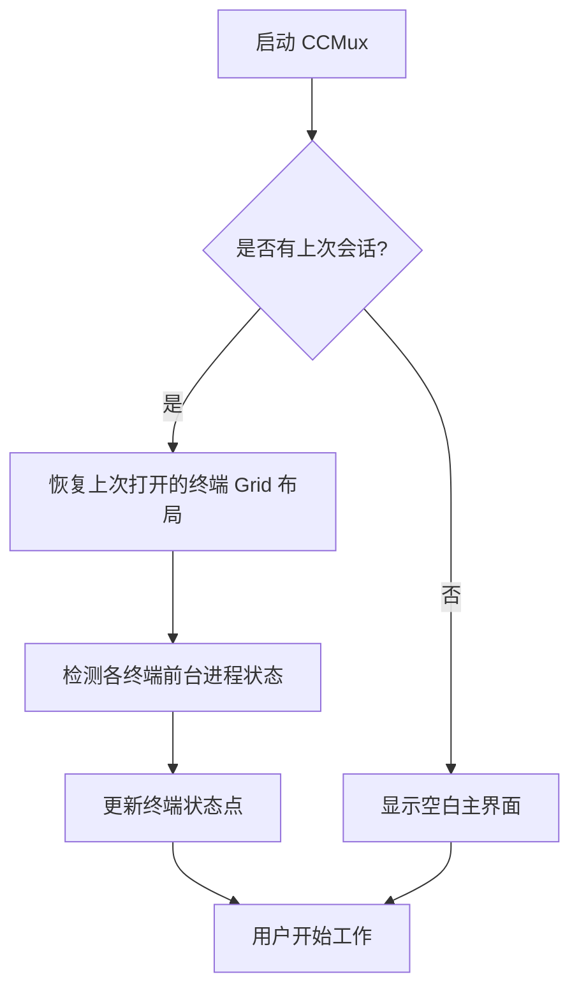

### 5.2 新建终端流程

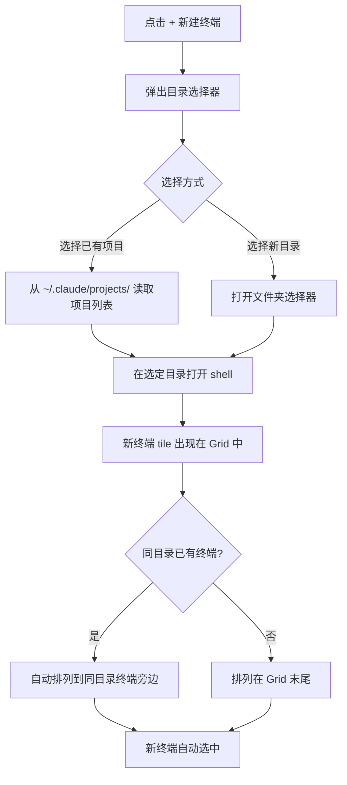

### 5.3 文件浏览流程

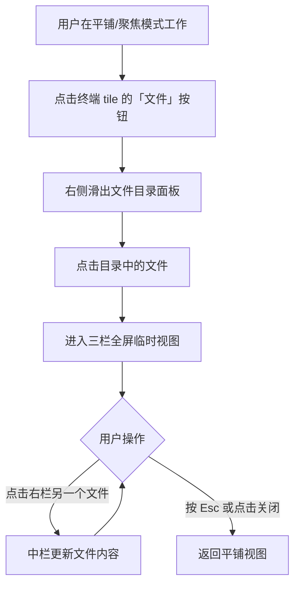

### 5.4 聚焦模式流程

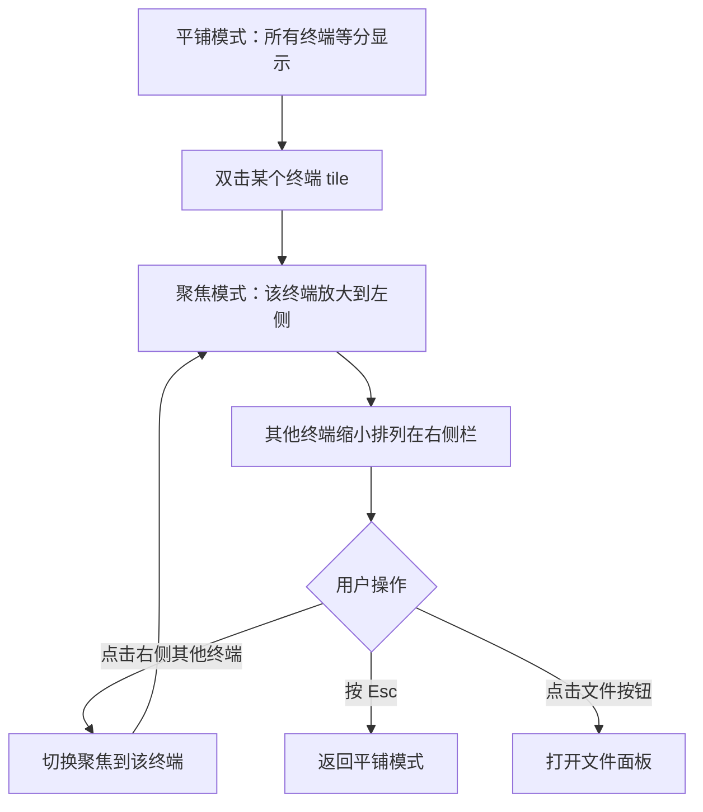

### 5.5 安装流程

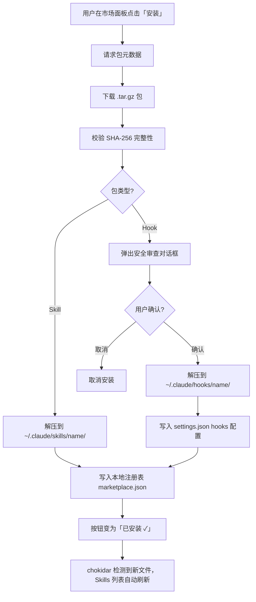

### 5.6 发布流程

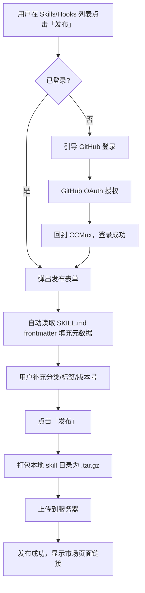

### 5.7 更新检测流程

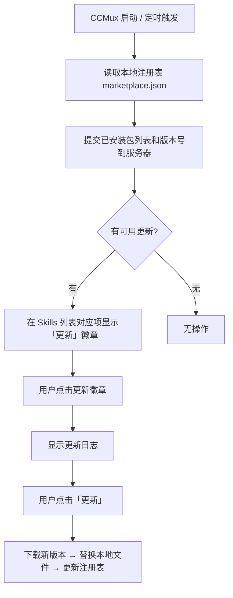

### 5.8 GitHub OAuth 登录流程

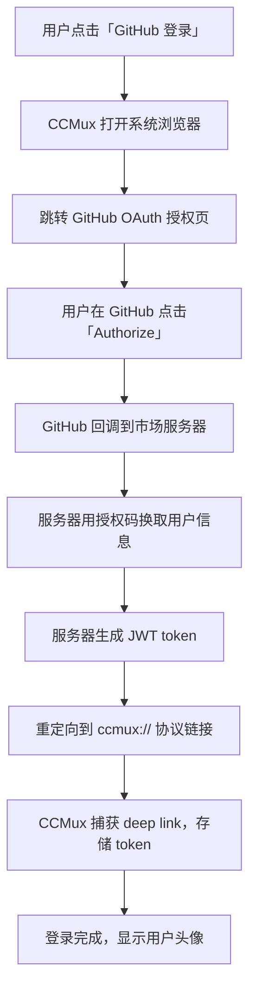

### 5.9 Hook 安全审查流程

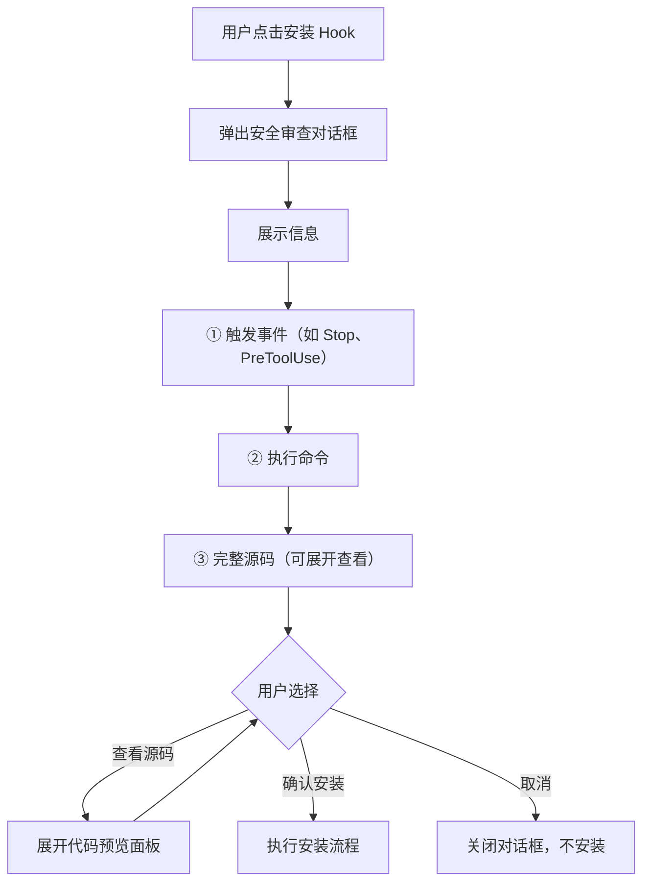

---

## 6、状态机

### 6.1 应用生命周期


**转换条件：**

| 源状态 | 目标状态 | 触发条件 | 系统动作 |
|--------|---------|----------|----------|
| Launching | Restoring | 应用窗口创建完毕 | 读取 `~/.ccmux/config.json` |
| Restoring | RestoringTerminals | `config.openTerminals.length > 0` | 在记录的 cwd 逐个重新启动新的 claude 进程（非恢复旧进程） |
| Restoring | EmptyState | `config.openTerminals.length === 0` | 显示空 Grid + 引导提示 |
| Running | Saving | 窗口 `close` 事件 | 序列化当前 Grid 布局、列宽比例、终端列表 |
| ShuttingDown | [*] | 所有子进程 `exit` 事件 | `app.quit()` |

### 6.2 终端进程生命周期

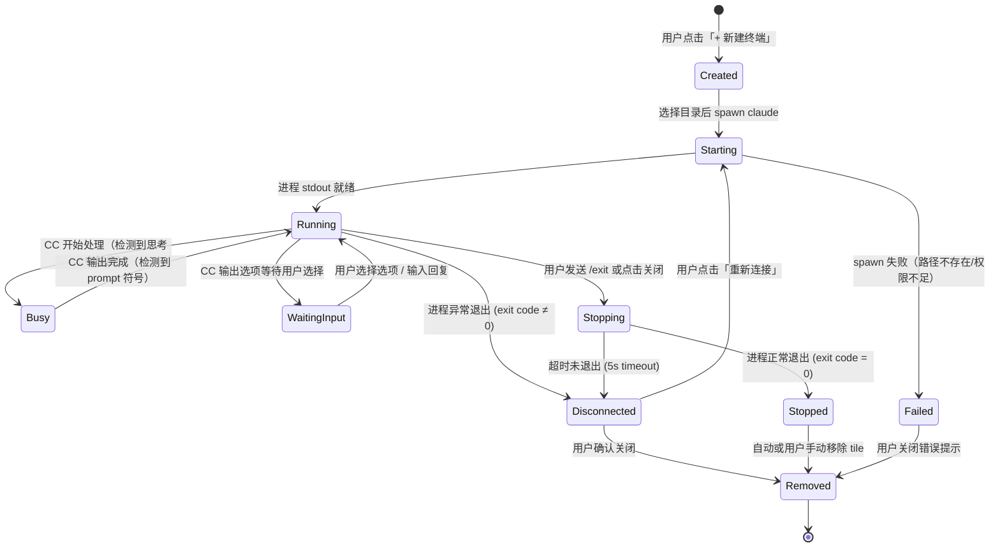

**状态 UI 映射：**

| 状态 | 状态点颜色 | 状态点动画 | Tile 交互 | 输入栏状态 |
|------|-----------|-----------|-----------|-----------|
| Created | 灰色 | 无 | 不可交互 | 禁用 |
| Starting | 黄色 | 闪烁 | 不可交互 | 禁用，显示"启动中..." |
| Running | 绿色 | 呼吸脉冲 | 正常交互 | 可用 |
| Busy | 绿色 | 快速脉冲 | 可查看输出，输入排队 | 显示"处理中..." |
| WaitingInput | 琥珀色 | 呼吸脉冲 | 显示选项按钮 | 可用，显示选项 |
| Stopping | 灰色 | 闪烁 | 不可交互 | 禁用，显示"正在关闭..." |
| Stopped | 灰色 | 无 | 可查看历史输出 | 禁用 |
| Disconnected | 红色 | 无 | 显示重连按钮 | 禁用，显示"已断开" |
| Failed | 红色 | 无 | 显示错误信息 | 禁用 |

### 6.3 视图模式

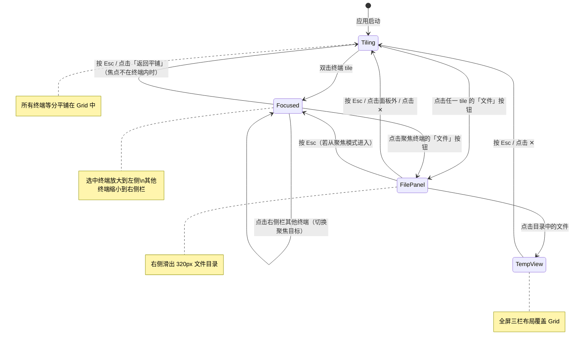

**Esc 键焦点规则：**

> **核心原则**：当输入焦点在终端内时，所有按键（包括 Esc）直接透传给终端，CCMux 不截获。只有当焦点在 CCMux UI 层（面板、搜索框、对话框等）时，Esc 才触发 CCMux 行为。这避免了与 vim、readline 等终端内工具的 Esc 冲突。

**Esc 键优先级（从高到低，仅在 CCMux UI 层有焦点时生效）：**

| 优先级 | 当前状态 | Esc 行为 |
|--------|---------|----------|
| 1 | 安全审查对话框打开 | 关闭对话框（不安装） |
| 2 | 文件夹选择器打开 | 关闭文件夹选择器 |
| 3 | 市场面板打开 | 关闭市场面板 |
| 4 | 三栏临时视图打开 | 关闭临时视图，返回平铺 |
| 5 | 文件面板打开 | 关闭文件面板 |
| 6 | 聚焦模式（焦点不在终端内） | 返回平铺模式 |
| 7 | 平铺模式 | 无操作 |

### 6.4 终端 Tile 交互状态

```mermaid
stateDiagram-v2
    [*] --> Default

    Default --> Hover : mouseenter
    Hover --> Default : mouseleave

    Default --> Selected : click（单击选中，高亮边框）
    Hover --> Selected : click
    Selected --> Default : click other tile
    Selected --> Focused : dblclick（双击进入聚焦模式）
    Default --> Focused : dblclick

    Default --> Dragging : dragstart
    Hover --> Dragging : dragstart
    Selected --> Dragging : dragstart
    Dragging --> Default : dragend

    Default --> DragOver : dragover from other
    DragOver --> Default : dragleave
    DragOver --> Default : drop
```

**状态说明：**

| 状态 | 说明 | 视觉效果 |
|------|------|---------|
| Default | 默认状态 | - |
| Hover | 鼠标悬停 | 3D 倾斜 + 光泽层 |
| Selected | 选中（amber 边框） | amber 边框高亮 |
| Dragging | 正在被拖拽 | opacity: 0.4 |
| DragOver | 另一个 tile 拖到此 tile 上方 | accent 边框 + glow |

**CSS 样式映射：**

| 状态 | border | opacity | transform | 额外效果 |
|------|--------|---------|-----------|---------|
| Default | `var(--border)` | 1 | none | - |
| Hover | `var(--border)` | 1 | `rotateX/Y(±4°)` | 光泽反射层 |
| Selected | `var(--accent)` | 1 | none | amber 边框 glow |
| Dragging | `var(--border)` | 0.4 | none | 半透明 |
| DragOver | `var(--accent)` | 1 | none | `box-shadow: accent-glow` |

### 6.5 文件面板状态

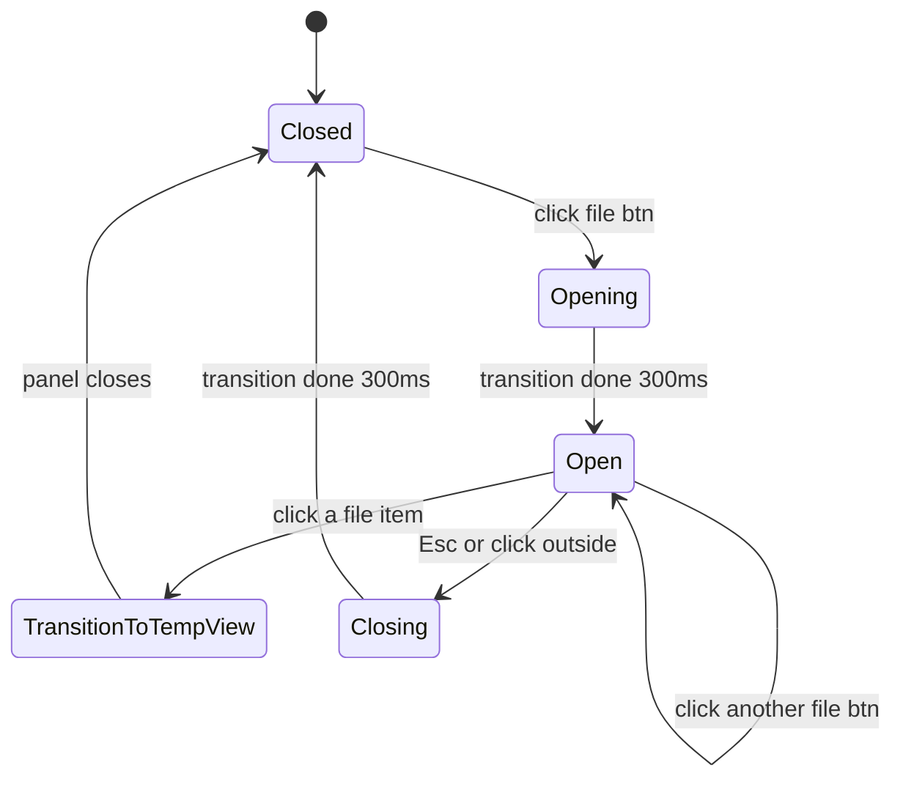

**转换说明：**

| 转换 | 触发条件 | 动画 |
|------|---------|------|
| Closed → Opening | 点击终端 tile 的「文件」按钮 | translateX(100%) → translateX(0) |
| Open → Open | 点击另一个终端的「文件」按钮 | 切换项目内容，无动画 |
| Open → TransitionToTempView | 点击目录中的文件 | 面板关闭，三栏视图打开 |
| Open → Closing | Esc / 点击面板外 / 点击 ✕ | translateX(0) → translateX(100%) |

### 6.6 三栏临时视图状态

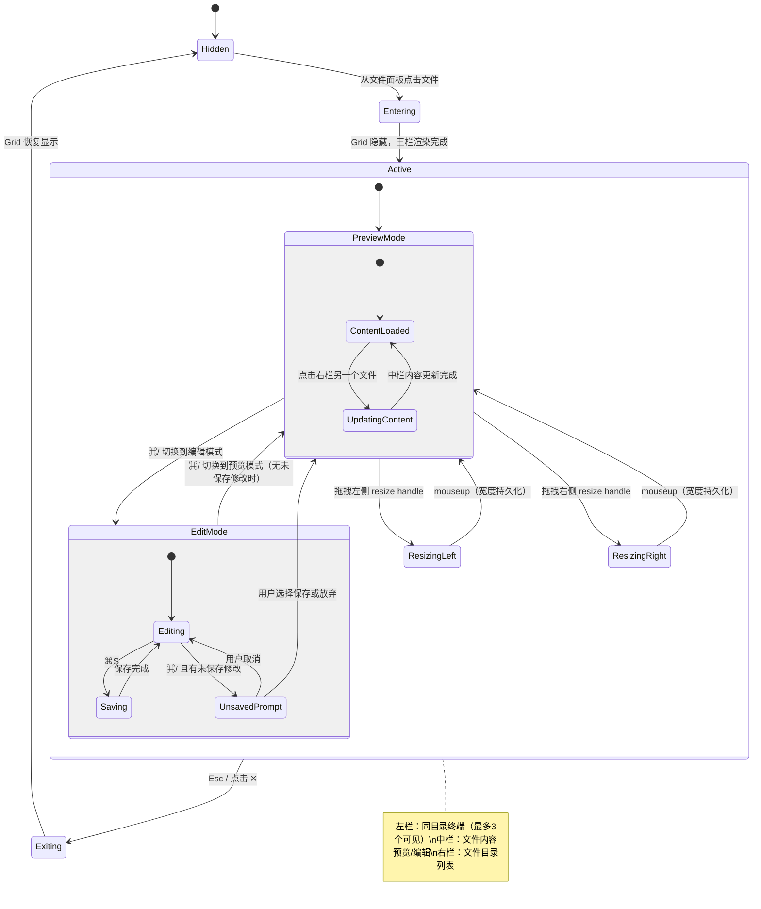

**三栏尺寸规则：**

| 栏位 | 默认宽度 | 最小宽度 | 最大宽度 | 调整方式 |
|------|---------|---------|---------|---------|
| 左栏（终端） | 250px | 150px | 500px | 拖拽左 handle |
| 中栏（内容） | flex: 1 | 自适应 | 自适应 | 随左右栏变化 |
| 右栏（目录） | 280px | 150px | 500px | 拖拽右 handle |

**左栏终端显示规则：**

| 同目录终端数 | 显示方式 |
|-------------|---------|
| 1 | 占满左栏全高 |
| 2 | 等分两份 |
| 3 | 等分三份 |
| 4+ | 显示 3 个（等分），其余滚动查看 |

### 6.7 目录切换状态（按前台进程状态分支）

> cwd 切换行为取决于当前终端的前台进程类型。

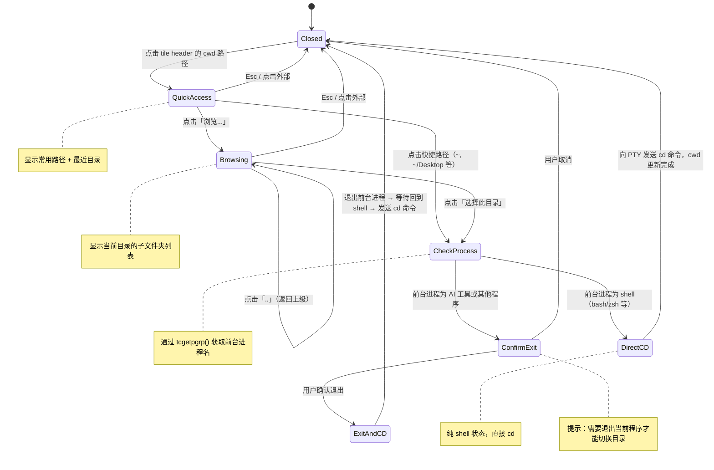

**前台进程检测机制（B2）：**

通过系统调用 `tcgetpgrp()` 获取 PTY 的前台进程组 ID，再查进程名：

| 前台进程 | 判定方式 | 切换行为 |
|---------|----------|----------|
| shell（bash/zsh/fish 等） | 进程名匹配已知 shell 列表 | 直接向 PTY 发送 `cd <new_path>\n` |
| AI CLI 工具或其他程序 | 进程名不在 shell 列表中（如 claude、codex、gemini、python 等） | 弹出确认对话框：「当前正在运行 {进程名}，需要退出后才能切换目录。确认退出？」→ 用户确认后发送 SIGINT → 等待回到 shell → 发送 cd 命令 |

> **技术说明**：macOS/Linux 上通过 `tcgetpgrp(fd)` 获取前台进程组 ID，再通过 `/proc/{pid}/comm`（Linux）或 `ps -p {pid} -o comm=`（macOS）获取进程名。此方案比 PTY 文本模式匹配可靠得多。

**目录切换的连锁动作：**

| 动作 | 说明 |
|------|------|
| 终端 header 更新 | cwd 路径文本更新 |
| 自动归组 | 检查是否有同目录终端，若有则移动到旁边 |
| 文件按钮更新 | 下次点击文件按钮读取新目录的文件 |

### 6.8 自定义名称编辑状态

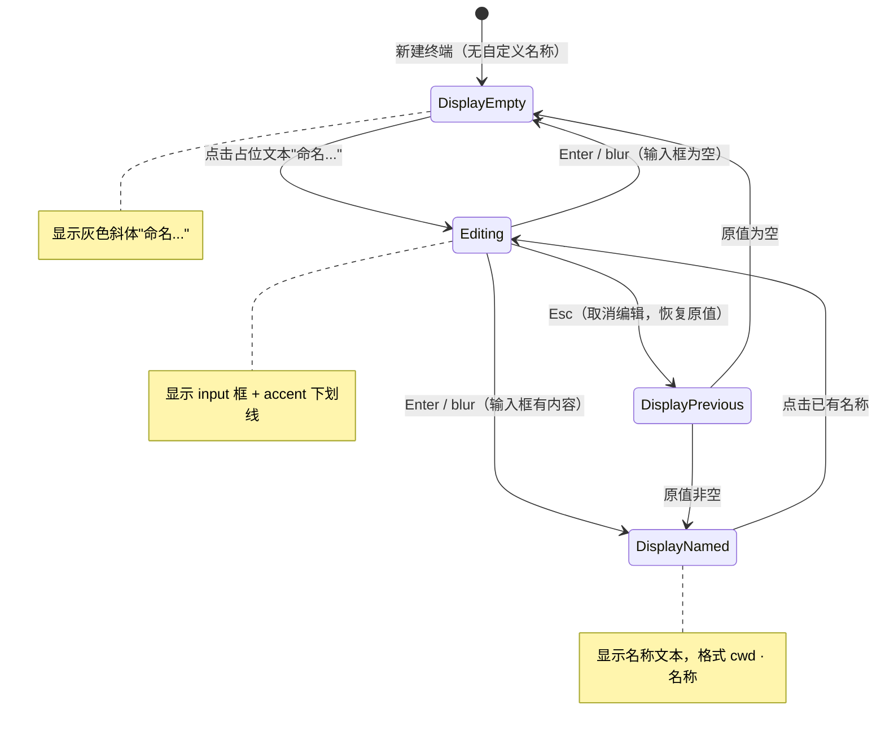

### 6.9 Grid 边框调整状态

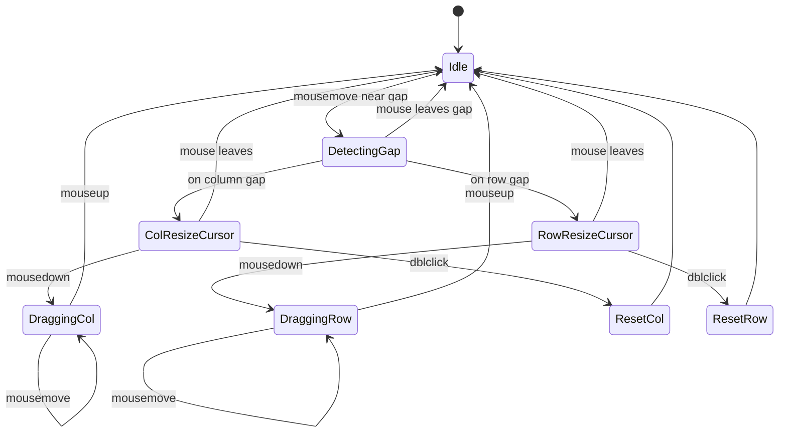

**状态说明：**

| 状态 | 光标样式 | 说明 |
|------|---------|------|
| Idle | default | 仅平铺模式生效，聚焦模式下不触发 |
| DetectingGap | default | mousemove 检测鼠标是否接近 tile 间隙 |
| ColResizeCursor | col-resize | 鼠标在列间隙上 |
| RowResizeCursor | row-resize | 鼠标在行间隙上 |
| DraggingCol | col-resize | 拖拽中，持续更新 columnRatios |
| DraggingRow | row-resize | 拖拽中，持续更新 rowRatios |
| ResetCol / ResetRow | - | 双击重置列/行比例为 1（等分） |

### 6.10 聊天历史面板状态


### 6.11 配置管理器状态

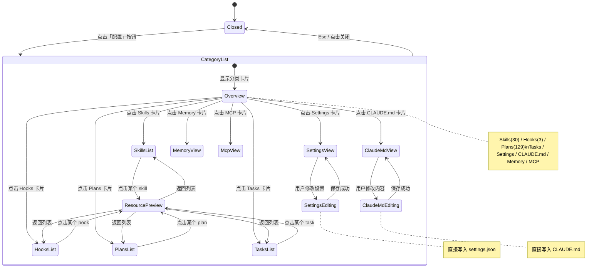

**资源类型与操作权限：**

| 资源类型 | 查看 | 搜索 | 编辑 | 文件格式 |
|----------|------|------|------|----------|
| Skills | ✅ | ✅ | ❌ 只读 | Markdown |
| Hooks | ✅ | ❌ | ❌ 只读 | Shell/JS |
| Plans | ✅ | ✅ | ❌ 只读 | Markdown |
| Tasks | ✅ | ✅ | ❌ 只读 | JSON |
| Settings | ✅ | ❌ | ✅ 可编辑 | JSON |
| CLAUDE.md | ✅ | ❌ | ✅ 可编辑 | Markdown |
| Memory | ✅ | ✅ | ❌ 只读 | Markdown |
| MCP | ✅ | ❌ | ❌ 只读 | JSON |

### 6.12 文件监听状态

```mermaid
stateDiagram-v2
    [*] --> Inactive: 应用启动

    Inactive --> Watching: 终端创建 → 监听其 cwd 目录
    Watching --> Watching: 新文件创建 → UI 标记 NEW
    Watching --> Watching: 文件修改 → UI 刷新
    Watching --> Watching: 文件删除 → UI 移除
    Watching --> WatchError: fs.watch 错误（权限/路径不存在）
    WatchError --> Watching: 自动重试 (3s interval, max 3 retries)
    WatchError --> Inactive: 重试失败 → 停止监听

    Watching --> Inactive: 终端关闭 → 停止监听该目录

    note right of Watching: 使用 chokidar 监听\n- 项目文件目录变化\n- session JSONL 文件更新\n- ~/.claude/ 资源变化
```

**监听范围：**

| 监听目标 | 触发时机 | UI 反应 |
|----------|---------|---------|
| 终端 cwd 目录 | 终端创建/cwd 切换 | 文件面板自动刷新 |
| `~/.claude/projects/{id}/*.jsonl` | 持续 | 聊天历史实时更新 |
| `~/.claude/plans/` | 持续 | Plans 列表自动刷新 |
| `~/.claude/skills/` | 持续 | Skills 列表自动刷新 |
| 项目内新文件 | CC 创建文件时 | 文件浏览器标记 `NEW` |

### 6.13 市场面板状态

```mermaid
stateDiagram-v2
    [*] --> Closed

    Closed --> Loading: 点击「市场」按钮 / 点击「浏览社区」
    Loading --> Ready: 包列表加载完成
    Loading --> LoadError: 网络请求失败

    state Ready {
        [*] --> Discovery: 默认展示热门/最新/精选
        Discovery --> SearchResults: 用户输入搜索词（300ms 去抖）
        SearchResults --> Discovery: 清空搜索框
        SearchResults --> SearchResults: 修改搜索词

        Discovery --> PackageDetail: 点击某个包
        SearchResults --> PackageDetail: 点击某个包
        PackageDetail --> Discovery: 点击返回
        PackageDetail --> PackageDetail: 切换版本/查看评价
    }

    Ready --> Closed: Esc / 点击 ✕
    LoadError --> Closed: Esc / 关闭
    LoadError --> Loading: 点击「重试」
```

### 6.14 包安装状态

```mermaid
stateDiagram-v2
    [*] --> NotInstalled

    NotInstalled --> Downloading: 用户点击「安装」
    Downloading --> SecurityReview: 类型为 Hook
    Downloading --> Installing: 类型为 Skill，下载完成
    SecurityReview --> Installing: 用户确认
    SecurityReview --> NotInstalled: 用户取消
    Installing --> Installed: 解压 + 注册完成
    Installing --> InstallFailed: 解压/写入失败

    Installed --> UpdateAvailable: 检测到新版本
    UpdateAvailable --> Downloading: 用户点击「更新」
    Installed --> Uninstalling: 用户点击「卸载」
    UpdateAvailable --> Uninstalling: 用户点击「卸载」
    Uninstalling --> NotInstalled: 删除本地文件 + 注册表记录

    InstallFailed --> NotInstalled: 用户关闭错误提示
```

**状态 UI 映射：**

| 状态 | 按钮文案 | 按钮样式 | 附加信息 |
|------|---------|---------|---------|
| NotInstalled | 安装 | 主色调（amber）实心按钮 | - |
| Downloading | 下载中... | 灰色禁用 + 进度条 | 显示下载进度 |
| SecurityReview | - | - | 安全审查对话框 |
| Installing | 安装中... | 灰色禁用 + 旋转图标 | - |
| Installed | 已安装 ✓ | 绿色描边按钮 | hover 显示「卸载」 |
| UpdateAvailable | 更新到 x.y.z | amber 描边按钮 + 徽章 | 显示更新日志链接 |
| InstallFailed | 重试安装 | 红色描边按钮 | 显示错误原因 |
| Uninstalling | 卸载中... | 灰色禁用 | - |

### 6.15 发布状态

```mermaid
stateDiagram-v2
    [*] --> Local: 本地 skill/hook，未发布

    Local --> FormFilling: 用户点击「发布」
    FormFilling --> Uploading: 用户点击「确认发布」
    FormFilling --> Local: 用户取消
    Uploading --> Published: 上传成功
    Uploading --> UploadFailed: 上传失败

    Published --> FormFilling: 用户点击「发布更新」（版本 bump）
    UploadFailed --> FormFilling: 用户重试

    note right of Local: Skills/Hooks 列表显示「发布」按钮
    note right of Published: Skills/Hooks 列表显示「已发布 · v1.0.0」
```

### 6.16 用户认证状态

```mermaid
stateDiagram-v2
    [*] --> LoggedOut

    LoggedOut --> Authorizing: 点击「GitHub 登录」
    Authorizing --> LoggedIn: 收到 JWT token
    Authorizing --> LoggedOut: 授权失败/取消

    LoggedIn --> LoggedOut: token 过期 / 用户登出
    LoggedIn --> Refreshing: token 临近过期
    Refreshing --> LoggedIn: 刷新成功
    Refreshing --> LoggedOut: 刷新失败

    note right of LoggedOut: 菜单栏显示「登录」按钮
    note right of LoggedIn: 菜单栏显示 GitHub 头像
```

### 6.17 评价交互状态

```mermaid
stateDiagram-v2
    [*] --> NoReview: 用户未评价此包

    NoReview --> Writing: 点击「写评价」
    Writing --> NoReview: 取消
    Writing --> Submitting: 点击提交
    Submitting --> HasReview: 提交成功
    Submitting --> Writing: 提交失败（保留内容）

    HasReview --> Editing: 点击「编辑评价」
    Editing --> HasReview: 取消 / 保存成功
    HasReview --> Deleting: 点击「删除评价」
    Deleting --> NoReview: 删除成功

    note right of NoReview: 仅已安装的包可评价
    note right of HasReview: 显示自己的评分 + 评价内容
```

---

## 7、数据结构

### 7.1 CC 现有数据结构（只读）

CCMux 不创建自己的数据库，直接读取 CC 已有文件：

**history.jsonl 每行结构：**
```json
{
  "display": "用户输入的文本",
  "pastedContents": {},
  "timestamp": 1759555019732,
  "project": "/Users/rl/path/to/project",
  "sessionId": "uuid-string"
}
```

**Session JSONL 每行结构：**
```json
{
  "type": "user|assistant",
  "messageId": "uuid",
  "sessionId": "uuid",
  "timestamp": "ISO8601",
  "cwd": "当前工作目录",
  "gitBranch": "分支名",
  "message": { "role": "user|assistant", "content": "..." }
}
```

**Task JSON 结构：**
```json
{
  "id": "1",
  "subject": "任务标题",
  "description": "任务描述",
  "status": "pending|in_progress|completed",
  "blocks": ["2"],
  "blockedBy": []
}
```

### 7.2 CCMux 本地配置（唯一自有数据）

CCMux 仅存储自身的窗口布局和偏好设置：

```json
{
  "window": {
    "width": 1400,
    "height": 900,
    "x": 100,
    "y": 100
  },
  "openTerminals": [
    { "cwd": "/path/to/project", "customName": "VoKey", "active": true }
  ],
  "gridLayout": {
    "columnRatios": [1, 1],
    "rowRatios": [1, 1]
  },
  "ftvLeftWidth": 250,
  "ftvRightWidth": 280,
  "theme": "dark",
  "fontSize": 14
}
```

### 7.3 包（Package）

```json
{
  "id": "uuid",
  "name": "commit-helper",
  "type": "skill",
  "displayName": "Commit Message Generator",
  "description": "根据 git diff 自动生成规范的 commit message",
  "readme": "完整的 SKILL.md 内容...",
  "author": {
    "username": "rl",
    "avatarUrl": "https://github.com/rl.png",
    "badges": ["contributor", "popular"]
  },
  "category": "development",
  "tags": ["git", "commit", "workflow"],
  "license": "MIT",
  "stats": {
    "downloads": 12340,
    "weeklyDownloads": 890,
    "avgRating": 4.7,
    "reviewCount": 23,
    "favoriteCount": 156
  },
  "latestVersion": "1.2.0",
  "versions": [
    {
      "version": "1.2.0",
      "changelog": "新增对 monorepo 的支持",
      "publishedAt": "2026-02-07T10:00:00Z",
      "fileSize": 24576,
      "fileList": ["SKILL.md", "LICENSE"]
    }
  ],
  "createdAt": "2026-01-15T08:00:00Z",
  "updatedAt": "2026-02-07T10:00:00Z"
}
```

### 7.4 评价（Review）

```json
{
  "id": "uuid",
  "packageName": "commit-helper",
  "author": {
    "username": "developer1",
    "avatarUrl": "https://github.com/developer1.png"
  },
  "rating": 5,
  "title": "非常好用，节省大量时间",
  "body": "安装后 commit message 质量明显提升，推荐！",
  "createdAt": "2026-02-01T14:30:00Z"
}
```

### 7.5 本地注册表（CCMux 市场自有数据）

```json
// ~/.ccmux/marketplace.json
{
  "auth": {
    "username": "rl",
    "avatarUrl": "https://github.com/rl.png"
  },
  "installed": {
    "commit-helper": {
      "type": "skill",
      "version": "1.2.0",
      "packageId": "uuid",
      "installedAt": "2026-02-08T10:30:00Z",
      "updatedAt": "2026-02-08T10:30:00Z"
    },
    "auto-deploy": {
      "type": "hook",
      "version": "1.0.0",
      "packageId": "uuid",
      "installedAt": "2026-02-05T09:00:00Z",
      "updatedAt": "2026-02-05T09:00:00Z",
      "hookConfig": {
        "event": "Stop",
        "command": "~/.claude/hooks/auto-deploy/run.sh"
      }
    }
  },
  "lastUpdateCheck": "2026-02-08T16:00:00Z"
}
```

### 7.6 包归档格式

发布和下载的包是一个 `.tar.gz` 文件，包含：

```
commit-helper-1.2.0.tar.gz
├── package.json          # 包元数据清单
├── SKILL.md              # skill 内容（必须）
├── LICENSE               # 许可证（可选）
└── references/           # 参考文件（可选）
    └── example.md
```

**package.json 结构：**

```json
{
  "name": "commit-helper",
  "type": "skill",
  "version": "1.2.0",
  "displayName": "Commit Message Generator",
  "description": "根据 git diff 自动生成规范的 commit message",
  "category": "development",
  "tags": ["git", "commit", "workflow"],
  "license": "MIT",
  "files": ["SKILL.md", "LICENSE", "references/example.md"]
}
```

**Hook 包额外包含 hookConfig：**

```json
{
  "name": "auto-deploy",
  "type": "hook",
  "version": "1.0.0",
  "hookConfig": {
    "event": "Stop",
    "matcher": null,
    "command": "~/.claude/hooks/auto-deploy/run.sh",
    "timeout": 120
  }
}
```

---

## 8、详细功能说明

### 8.1 全屏平铺终端管理（功能 A/B/C/I/M）

**页面构成：**
- 顶部菜单栏（36px）：应用名 + 终端计数 + 工具按钮
- 主区域：CSS Grid 平铺所有终端 tile，智能计算行列
- 底部控制栏：「+ 新建终端」按钮 + 项目数量显示
- 每个终端 tile 包含：
  - Header：状态点（绿/灰/红）+ cwd 路径（可点击切换目录）+ 自定义名称（可编辑）+ 聚焦按钮 + 文件按钮
  - 终端内容区（xterm.js 渲染）
  - 底部输入栏

**Grid 布局规则：**

| 终端数 | 布局 |
|--------|------|
| 1 | 1×1 全屏 |
| 2 | 2×1 左右对半 |
| 3 | 3×1 三等分 |
| 4 | 2×2 四宫格 |
| 5 | 上3下2（下行居中） |
| 6 | 3×2 六宫格 |
| 7+ | ceil(√n) 列，自动计算 |

**聚焦模式：**
- 双击终端 tile → 该终端放大到屏幕左侧（约 75% 宽度）（单击仅选中高亮边框，防止误触）
- 其他终端缩小排列在右侧栏，最多同时显示 3 个，超出可滚动
- 点击右侧栏终端 → 切换聚焦目标
- 按 Esc 或点击「返回平铺」→ 恢复 Grid 布局

**拖拽排序：**
- 拖拽 tile header → 移动到目标位置（HTML5 Drag and Drop）
- 拖拽中源 tile 半透明，目标位置高亮

**边框调整大小：**
- 鼠标移到两个 tile 之间的间隙 → 光标变为 col-resize / row-resize
- 拖拽 → 调整相邻列/行的比例
- 双击 → 重置为等分

**同目录自动归组：**
- 新建终端时，若已有同目录终端 → 自动排列到旁边

**双段式命名：**
- cwd 部分：显示路径，点击弹出目录选择器。shell 态直接 cd 切换；有前台进程运行时弹出确认退出对话框后切换（见 6.7 节）
- 自定义名称：点击可编辑，格式 `~/path · 名称`

**状态区分：**
- 运行中：绿色状态点（带呼吸动画），终端可交互
- 空闲：灰色状态点，上次会话内容仍可查看
- 已断开：红色状态点，提示重新连接

### 8.2 文件浏览与三栏临时视图（功能 H/G）

**文件面板（右侧滑出）：**
- 点击终端 tile 的「文件」按钮 → 从右侧滑出 320px 文件目录面板
- 面板内容：文件树形目录，CC 新创建的文件标记 `NEW` 绿色徽章
- 关闭方式：点击 ✕、按 Esc、或点击面板外区域

**三栏全屏临时视图：**
- 点击文件目录中的文件 → 进入全屏三栏视图（覆盖平铺 Grid）

```
┌──────────────┬─────────────────────────┬──────────────┐
│  同目录终端   │      文件内容预览         │   文件目录    │
│  (最多显示3个) │                         │   (可滚动)    │
│  (可滚动)     │   HotkeyManager.swift   │  📂 Sources  │
│              │   import Carbon         │   App.swift  │
│  终端 A      │   import Combine        │  ▸HotkeyMgr ←│
│  ─────────   │   ...                   │   Recog.swift│
│  终端 B      │                         │   ...        │
└──────────────┴─────────────────────────┴──────────────┘
```

- 左栏（~250px）：当前终端 + 所有 cwd 相同的终端，最多同时显示 3 个，超过可滚动
- 中栏（flex: 1）：文件内容预览（Markdown 渲染 / JSON 格式化 / 代码高亮）
- 右栏（~280px）：文件目录，当前文件高亮，点击切换中栏内容
- 左右栏宽度可拖拽调整，调整后跨文件保持
- 按 Esc 或点击右栏 ✕ 关闭 → 返回平铺视图

#### 8.2.1 Markdown 渲染规格

三栏临时视图中栏预览 Markdown 文件时，需支持完整的 Markdown 渲染，确保 CC 生成的 plan、CLAUDE.md、MEMORY.md 等文件在应用内可读性良好。

**预览/编辑双模式：**

| 模式 | 说明 | 切换方式 |
|------|------|----------|
| 渲染预览（默认） | Markdown 渲染为富文本样式，用户阅读浏览 | 打开文件时默认进入 |
| 源码编辑 | 显示 Markdown 原始文本，用户可修改内容 | 按 `⌘/` 切换 |

- 按 `⌘/` 在两种模式之间切换
- 编辑模式下按 `⌘S` 保存修改到文件
- 中栏顶部显示当前模式标识（如「预览」/「编辑」），点击也可切换
- 编辑模式下若有未保存修改，切换到预览模式前提示保存

**支持的格式清单：**

| 类别 | 支持格式 |
|------|----------|
| CommonMark 标准 | 标题（6 级）、段落、粗体、斜体、链接、图片、行内代码、代码块、引用块、有序列表、无序列表、分割线 |
| GFM 扩展 | 表格、删除线、任务列表（复选框）、自动链接 |

**各格式渲染规格：**

| 格式 | 渲染效果 |
|------|----------|
| 一级标题 `#` | 字号 1.8em，加粗，底部 1px 分割线 |
| 二级标题 `##` | 字号 1.5em，加粗 |
| 三级标题 `###` | 字号 1.25em，加粗 |
| 四~六级标题 | 字号 1em，加粗 |
| **粗体** | 加粗，使用标题色（比正文更醒目） |
| *斜体* | 字体倾斜 |
| ~~删除线~~ | 中间划线，透明度降至 0.7 |
| `行内代码` | 背景高亮，等宽字体，字号 0.9em，圆角 4px |
| 代码块 | 深色背景区分，等宽字体，内边距 1em，圆角 8px，支持水平滚动 |
| 引用块 `>` | 左侧 4px 彩色边框，斜体，支持多层嵌套 |
| 无序列表 | 圆点标记，支持嵌套缩进 |
| 有序列表 | 数字编号，自动递增，支持嵌套 |
| 任务列表 | 复选框样式（只读，不可交互），已完成/未完成状态 |
| 表格 | 表头加粗 + 背景色区分，单元格边框，支持左/中/右对齐 |
| 链接 | 高亮色显示，悬停显示下划线 |
| 图片 | 最大宽度 100%，圆角 8px |
| 分割线 | 1px 实线，上下间距 1.5em |

**暗色主题配色：**

适配 CCMux 整体暗色风格，主要色值如下：

| 元素 | 色值 |
|------|------|
| 预览区背景 | 透明（跟随中栏背景） |
| 正文颜色 | `#e5e5e5` |
| 标题 / 粗体颜色 | `#ffffff` |
| 链接颜色 | `#6bb3f8` |
| 代码块背景 | `#2d2d2d` |
| 行内代码颜色 | `#f8a5c2` |
| 引用块边框 | `#444` |
| 引用块文字 | `#999` |
| 分割线 / 表格边框 | `#333` |
| 表头背景 | 与代码块背景一致 |

**排版参数：**

| 属性 | 值 |
|------|-----|
| 基础字号 | 15px |
| 行高 | 1.8 |
| 正文字体 | -apple-system, BlinkMacSystemFont, Segoe UI, sans-serif |
| 代码字体 | SF Mono, Monaco, Courier New, monospace |
| 内容区内边距 | 24px（上下）× 32px（左右） |

### 8.3 聊天历史浏览器（功能 D/E/F）

#### 8.3.1 数据来源与解析

| 数据文件 | 内容 | 用途 |
|----------|------|------|
| `~/.claude/history.jsonl` | 全局索引，每行一条会话摘要 | 会话列表、项目筛选 |
| `~/.claude/projects/{id}/{session}.jsonl` | 完整对话内容 | 会话详情、全文搜索 |

**JSONL 解析规则：**
- 每行独立 JSON，逐行流式读取（不一次性加载整个文件）
- 遇到格式错误的行：跳过该行，继续解析（静默处理）
- history.jsonl 字段：`display`（摘要）、`timestamp`、`project`（项目路径）、`sessionId`
- session JSONL 字段：`type`（user/assistant）、`message.content`、`timestamp`、`cwd`

#### 8.3.2 会话列表页

**布局：**
- 顶部：搜索框 + 过滤器（项目筛选 / 时间范围）
- 主区域：会话卡片列表，按时间倒序

**每条会话卡片内容：**

| 元素 | 数据来源 | 说明 |
|------|----------|------|
| 时间 | history.jsonl → timestamp | 格式：今天/昨天/MM-DD/YYYY-MM-DD |
| 项目名 | history.jsonl → project | 取路径最后一段作为项目名 |
| 对话摘要 | history.jsonl → display | 单行截断，最多 100 字符 |
| 消息数 | 需从 session JSONL 读取行数 | 延迟加载，滚动到可见区域时加载 |

**过滤器：**
- 项目筛选：下拉列表，从 history.jsonl 提取所有不重复的 project 路径
- 时间范围：今天 / 最近 7 天 / 最近 30 天 / 全部
- 过滤条件可叠加

#### 8.3.3 全文搜索

**搜索范围：** 跨所有项目、跨所有会话的 user 和 assistant 消息内容

**搜索实现：**
1. 首次启动时，扫描所有 session JSONL 建立倒排索引
2. 索引存储在 `~/.ccmux/search-index/`（持久化，下次启动直接加载）
3. chokidar 监听 JSONL 文件变化，增量更新索引
4. 大文件保护：单个 JSONL > 100MB 时，仅索引最近 6 个月的记录

**搜索交互：**
- 输入搜索词 → 300ms 去抖 → 搜索索引 → 返回匹配的会话列表
- 搜索结果高亮匹配关键词
- 每条结果显示：匹配上下文片段（前后各 50 字符）+ 所属项目 + 时间

**快捷键：** `⌘K` 打开搜索 / `Esc` 关闭 / `↑↓` 切换结果 / `Enter` 打开会话

#### 8.3.4 会话详情页

**进入方式：** 在会话列表中点击某条会话

**布局：**
- 顶部：← 返回按钮 + 项目名 + 会话时间
- 主区域：完整对话内容，气泡式布局

**消息渲染：**

| 消息类型 | 渲染方式 |
|----------|----------|
| user 消息 | 右侧气泡，用户色 |
| assistant 消息 | 左侧气泡，支持 Markdown 渲染（复用 8.2.1 的渲染规格） |
| 代码块 | 语法高亮 + 复制按钮 |
| 工具调用 | 折叠展示，显示工具名 + 参数摘要 |

**操作：**
- 双击会话（从列表页）→ 如果对应项目终端已打开，跳转到该终端
- 复制按钮：复制单条消息内容
- 搜索来的会话：自动滚动到匹配关键词位置

#### 8.3.5 会话时间线视图（V1-P2）

**布局：**
- 纵轴：时间线（按天分组）
- 每天显示：日期标题 + 当天所有会话卡片
- 不同项目用不同颜色标识

#### 8.3.6 性能策略

| 策略 | 说明 |
|------|------|
| 延迟加载 | 仅在打开历史面板时加载 history.jsonl |
| 虚拟滚动 | 会话列表超过 50 条时使用虚拟滚动 |
| 分页加载详情 | 会话详情页每次加载 50 条消息，滚动到顶部加载更多 |
| 索引持久化 | 搜索索引写入磁盘，避免每次重建 |
| 增量更新 | chokidar 监听变化，只重新索引新增内容 |

### 8.4 配置管理器（功能 J/K/L）

**页面构成：**
- 分类卡片列表：
  - Skills（30个）→ 点击展开技能列表，可预览每个 skill 的 markdown 内容
  - Hooks（3个）→ 查看 hook 脚本内容
  - Plans（129个）→ 搜索和预览所有 plan 文件
  - Tasks → 查看所有 task 列表和状态
  - Settings → 查看 `settings.json` 内容
  - CLAUDE.md → 查看和编辑全局指令
  - Memory → 查看各项目的 MEMORY.md
  - MCP Servers → 查看 MCP 配置
  - Plugins → 查看已安装插件

**交互说明：**
- 点击分类卡片 → 展开该类资源列表
- 点击具体资源 → 预览内容
- CLAUDE.md 和 Settings 支持直接编辑并保存

### 8.5 市场浏览面板（功能 N）

**页面构成：**
- 全屏覆盖层（与三栏临时视图同模式，覆盖终端 Grid）
- 左侧边栏（200px）：发现入口 + 分类筛选 + 类型筛选
- 右侧主区域：搜索框 + 包卡片列表

**左侧边栏内容：**

```
发现
──────
  热门
  最新
  精选

分类
──────
  开发工具 (45)
  文档生成 (23)
  测试 (18)
  部署 (12)
  效率工具 (31)
  AI 与 Prompt (15)
  数据与文件 (9)
  其他 (8)

类型
──────
  ○ 全部
  ○ Skills
  ○ Hooks
```

**包卡片内容：**

```
┌─────────────────────────────────────────────────┐
│ ⚡ commit-helper                    [安装]       │
│ 根据 git diff 自动生成规范的 commit message       │
│ ★★★★★ 4.7 (23)  ·  12.3k 下载  ·  by @rl       │
│ #git  #commit  #workflow                         │
└─────────────────────────────────────────────────┘
```

- 类型图标：⚡ = Skill，🪝 = Hook
- 名称：monospace 字体
- 描述：单行截断
- 统计：评分 + 评价数 + 下载量 + 作者
- 标签：可点击，点击后筛选该标签

**排序选项：**
- 下载量最多
- 评分最高
- 最新发布
- 热门趋势（7 天下载增速）

### 8.6 包详情页（功能 N 子页）

点击包卡片进入详情页（面板内导航，非新页面）：

```
┌─────────────────────────────────────────────────┐
│ ← 返回                                          │
│                                                  │
│ ⚡ commit-helper                                 │
│ Commit Message Generator                         │
│ by @rl  ·  MIT  ·  v1.2.0  ·  2026-02-07 更新    │
│                                                  │
│ ★★★★★ 4.7 (23 评价)  ·  12.3k 下载  ·  156 收藏   │
│                                                  │
│ [安装]  [收藏 ♡]                                  │
│                                                  │
│ ───── README ─────                               │
│                                                  │
│ （渲染 SKILL.md 的完整内容）                        │
│                                                  │
│ ───── 评价 (23) ─────                             │
│                                                  │
│ ★★★★★  非常好用，节省大量时间                       │
│ @developer1 · 2026-02-01                         │
│ 安装后 commit message 质量明显提升，推荐！           │
│                                                  │
│ ★★★★☆  总体不错，有些场景不太适用                    │
│ @developer2 · 2026-01-28                         │
│ 对 monorepo 项目支持不够好                         │
│                                                  │
│ ───── 版本历史 ─────                              │
│                                                  │
│ v1.2.0 (2026-02-07) - 新增对 monorepo 的支持       │
│ v1.1.0 (2026-01-20) - 改进 commit 格式             │
│ v1.0.0 (2026-01-15) - 首版发布                     │
└─────────────────────────────────────────────────┘
```

### 8.7 一键安装（功能 O）

**Skill 安装流程（对用户可见的步骤）：**
1. 点击 [安装] → 按钮变为「下载中...」+ 进度条
2. 下载完成 → 按钮变为「安装中...」
3. 安装完成 → 按钮变为「已安装 ✓」
4. Skills 列表自动刷新，新安装的 skill 出现在列表中

**Hook 安装流程（对用户可见的步骤）：**
1. 点击 [安装] → 弹出安全审查对话框
2. 对话框内容：
   - 触发事件：`Stop`（CC 结束执行时触发）
   - 执行命令：`~/.claude/hooks/auto-deploy/run.sh`
   - [查看源码] 按钮：展开完整代码预览
   - [确认安装] [取消] 按钮
3. 确认后 → 按钮变为「安装中...」→「已安装 ✓」

**卸载：**
- 已安装的包，hover「已安装 ✓」按钮 → 显示「卸载」
- 点击卸载 → 确认对话框 → 删除本地文件 + 清理注册表

### 8.8 一键发布（功能 P）

**入口：** 配置管理器 → Skills/Hooks 列表中，每个本地项旁边显示 [发布] 按钮（仅未发布的项显示）

**发布表单（滑出面板）：**

```
┌──────────────────────────────────────┐
│  发布 Skill                          │
│                                      │
│  名称: [commit-helper]  (自动填充)    │
│  显示名: [Commit Message Generator]   │
│  描述:                                │
│  [根据 git diff 自动生成...]          │
│                                      │
│  分类: [开发工具 ▾]                   │
│  标签: [git] [commit] [+添加]         │
│  许可证: [MIT ▾]                      │
│  版本: [1.0.0]                        │
│                                      │
│  包含文件:                            │
│  ☑ SKILL.md  (必须)                   │
│  ☐ LICENSE                            │
│  ☐ references/                        │
│                                      │
│  [预览]  [发布]                       │
└──────────────────────────────────────┘
```

**已发布的项：**
- 列表中显示「已发布 · v1.0.0 · 123 下载」
- 按钮变为 [发布更新]
- 点击后表单预填已有信息，版本号自动 bump

### 8.9 评分评价系统（功能 S）

**评价条件：**
- 仅已安装的包可评价
- 每人每包限一条评价（可编辑/删除）
- 需要登录

**评价表单：**

```
┌──────────────────────────────────────┐
│  为 commit-helper 写评价              │
│                                      │
│  评分: ★★★★☆                         │
│  标题: [___________________]          │
│  内容:                                │
│  [___________________________]       │
│  [___________________________]       │
│                                      │
│  [取消]  [提交]                       │
└──────────────────────────────────────┘
```

**评价提示时机：**
- 安装某个包 7 天后，如果 CC 使用了该 skill（通过 session JSONL 检测），弹出非阻塞提示：「你已使用 commit-helper 一周了，来写个评价？」

### 8.10 更新检测与推送（功能 T）

**检测时机：**
- CCMux 启动时
- 每 6 小时自动检测一次

**更新提示方式：**
- 菜单栏 [市场] 按钮上显示红色数字徽章（可更新的包数量）
- 配置管理器 → Skills/Hooks 列表中，有更新的项显示 amber 色「更新到 x.y.z」徽章
- 市场面板内包卡片显示「更新可用」

**更新操作：**
- 单个更新：点击徽章 → 显示更新日志 → 点击 [更新]
- 批量更新：市场面板顶部显示「N 个更新可用，[全部更新]」

### 8.11 用户个人页（功能 V）

**我的页面（登录后）：**

```
┌──────────────────────────────────────┐
│  @rl                                 │
│  🏆 Popular Author · 🔧 Prolific     │
│                                      │
│  已发布 8 个包 · 总计 45.6k 下载       │
│                                      │
│  我发布的:                            │
│  ⚡ commit-helper    12.3k ↓  ★ 4.7  │
│  ⚡ prd-generator     8.1k ↓  ★ 4.2  │
│  🪝 auto-deploy       5.0k ↓  ★ 4.9  │
│  ...                                 │
│                                      │
│  我安装的:                            │
│  ⚡ code-reviewer (by @anthropic)     │
│  ⚡ frontend-design (by @alice)       │
│  ...                                 │
│                                      │
│  我收藏的:                            │
│  ⚡ deploy-to-cloud (by @bob)         │
│  ...                                 │
└──────────────────────────────────────┘
```

**他人个人页：**
- 点击包卡片上的作者名 → 显示该用户的公开页面
- 仅展示已发布的包和信誉徽章

**信誉徽章：**

| 徽章 | 条件 |
|------|------|
| 新人 | 刚注册 |
| 贡献者 | 发布 1+ 个包 |
| 活跃作者 | 发布 5+ 个包 |
| 人气作者 | 任一包下载量 1000+ |
| 明星作者 | 任一包下载量 10000+ |
| 优质作者 | 3+ 个包评分 4.0 以上 |

### 8.12 Hook 安全审查（功能 U）

**安全审查对话框：**

```
┌──────────────────────────────────────────────┐
│  ⚠️ 安装 Hook: auto-deploy                    │
│                                              │
│  此 hook 将在以下事件触发时执行代码：            │
│                                              │
│  触发事件: Stop（CC 结束执行时）                │
│  执行命令: ~/.claude/hooks/auto-deploy/run.sh │
│  超时时间: 120 秒                              │
│                                              │
│  [▸ 查看源码]                                 │
│                                              │
│  ┌────────────────────────────────────────┐  │
│  │ #!/bin/bash                            │  │
│  │ # Auto deploy after CC finishes        │  │
│  │ cd "$PROJECT_DIR"                      │  │
│  │ git push origin main                   │  │
│  │ ...                                    │  │
│  └────────────────────────────────────────┘  │
│                                              │
│  [取消]              [确认安装，我信任此代码]    │
└──────────────────────────────────────────────┘
```

**关键设计：**
- 确认按钮文案强调用户需要信任代码：「确认安装，我信任此代码」
- 源码默认折叠，可展开查看完整内容
- 根据风险等级自动调整审查界面强度（见下方安全分级）

#### Hook 安全分级

> **重要声明**：以下关键词检测为「提醒级别」，不构成安全保障。恶意代码可通过 base64 编码、变量拼接等方式绕过静态关键词检测。安全分级的目的是帮助用户快速识别明显的风险操作，而非替代用户自行审查源码。

| 风险等级 | 判定规则 | 提示方式 |
|----------|----------|----------|
| 低风险 | 仅读取环境变量、输出日志 | 绿色提示，正常安装流程 |
| 中风险 | 读写文件、执行 git 命令 | 黄色提示 + 源码审查 |
| 高风险 | 网络请求、执行外部脚本、修改系统配置 | 红色警告 + 强制展开源码 + 二次确认 |

**风险关键词检测（非穷举，持续更新）：**
- 高风险：`curl`、`wget`、`eval`、`exec`、`rm -rf`、`chmod`、`sudo`、`base64 --decode`、`python -c`、`node -e`、环境变量中的 `TOKEN`/`KEY`/`SECRET`
- 中风险：`git push`、`git reset`、`fs.writeFile`、`cp`、`mv`

> **局限性**：此检测无法防范故意混淆的恶意代码。用户安装任何 hook 前应自行审查源码，CCMux 在确认按钮中明确提示「我信任此代码」以强调用户责任。

### 8.13 内容治理

**发布前 AI 审查：**
- AI 自动扫描：分析源码中的高风险命令模式、敏感词、许可证合规
- AI 判定通过 → 自动发布
- AI 判定可疑 → 标记待复核，暂不上架，通知作者
- 作者可申诉，申诉后触发二次 AI 审查

**举报与下架：**
- 包详情页增加 [举报] 按钮
- 举报分类：恶意代码 / 侵权 / 垃圾内容 / 描述不符
- 举报后触发 AI 复审，确认违规即下架
- 下架后已安装用户收到通知："此包已被下架，建议卸载"

**作者处罚：**

| 违规次数 | 处罚 |
|----------|------|
| 首次 | 下架包 + 警告 |
| 二次 | 禁止发布 30 天 |
| 三次 | 永久封禁 |

### 8.14 首次使用引导流程

**触发条件：** 首次启动 CCMux（`~/.ccmux/config.json` 不存在或 `onboardingCompleted` 为 false）

**引导步骤：**

| 步骤 | 内容 | 用户操作 |
|------|------|----------|
| 1 | 欢迎页：「欢迎使用 CCMux — AI Coding 终端工作台」+ 产品简介 | 点击「开始」 |
| 2 | 检测 AI CLI 工具：扫描 PATH 中的 `claude`、`codex`、`gemini` 等 | 自动检测，显示已安装的工具列表。未检测到任何工具时提示「CCMux 也可以作为普通终端使用」 |
| 3 | 创建第一个终端：引导用户选择一个项目目录 | 点击「选择目录」或从检测到的项目列表中选择 |
| 4 | 快捷键提示：overlay 显示核心快捷键（⌘T 新建、双击聚焦、⌘K 搜索、Esc 返回） | 点击「知道了」关闭 |

**跳过机制：**
- 每个步骤都有「跳过」按钮
- 跳过后直接进入空白主界面
- 引导完成或跳过后，标记 `onboardingCompleted: true`，不再触发

### 8.15 聊天历史导出

**入口：** 聊天历史面板 → 项目筛选下拉旁边的「导出」按钮

**导出流程：**
1. 选择导出范围：
   - 当前筛选的项目（默认）
   - 全部项目
   - 指定时间范围
2. 选择导出格式：
   - Markdown（一个对话一个 .md 文件，按日期/项目组织目录结构）
   - JSON（结构化数据，保留所有元信息）
3. 选择导出位置（文件夹选择器）
4. 点击「导出」→ 进度条 → 完成提示

**导出目录结构（Markdown 格式示例）：**

```
export-2026-02-08/
├── vokey/
│   ├── 2026-02-07_实现快捷键管理.md
│   └── 2026-02-08_修复录音Bug.md
└── ccmux/
    └── 2026-02-08_PRD评审.md
```

---

## 9、页面布局设计

> ✅ 已确认：方案 D「全屏平铺 + 聚焦放大」，原型参考 `prototypes/D-tiling-focus.html`

### 核心布局：全屏平铺 Grid

```
┌────────────────────────────────────────────────────┐
│  CCMux          3 个终端          [历史] [配置]      │ ← 菜单栏 (36px)
├───────────────┬───────────────┬────────────────────┤
│               │               │                    │
│  ~/vokey      │  ~/flash      │  ~/ccmux           │
│  · VoKey      │  · FlashCard  │                    │
│  🟢           │  🟢           │  🟢                │
│               │               │                    │
│  终端内容      │  终端内容      │  终端内容           │
│               │               │                    │
│  ❯ _          │  ❯ _          │  ❯ _               │
│               │               │                    │
├───────────────┴───────────────┴────────────────────┤
│  + 新建终端                            3 个终端      │ ← 底部控制栏
└────────────────────────────────────────────────────┘
```

### 聚焦模式

```
┌────────────────────────────────────────────────────┐
│  CCMux          [返回平铺]                          │
├───────────────────────────────────┬────────────────┤
│                                   │  ~/flash       │
│  ~/vokey · VoKey                  │  · FlashCard   │
│  🟢                               │  🟢            │
│                                   │  终端内容       │
│  终端内容（放大）                    │  ❯ _          │
│                                   ├────────────────┤
│                                   │  ~/ccmux       │
│  ❯ _                              │  🟢            │
│                                   │  终端内容       │
│                                   │  ❯ _          │
├───────────────────────────────────┴────────────────┤
│  + 新建终端                            3 个终端      │
└────────────────────────────────────────────────────┘
```

- 左侧：聚焦终端放大（~75% 宽度）
- 右侧：其他终端缩小排列，最多同时显示 3 个，超出可滚动

### 文件浏览：三栏临时视图

```
┌──────────────┬─────────────────────────┬──────────────┐
│  同目录终端   │      文件内容预览         │   文件目录  ✕│
│  (最多3个)    │                         │   (可滚动)    │
│              │   HotkeyManager.swift   │  📂 Sources  │
│  终端 A      │   ─────────────────     │   App.swift  │
│  ─────────   │   import Carbon         │  ▸HotkeyMgr ←│
│  终端 B      │   import Combine        │   Recog.swift│
│              │   ...                   │   ...        │
└──────────────┴─────────────────────────┴──────────────┘
```

- 三栏之间边框可拖拽调整宽度，宽度跨文件保持

### 市场面板布局

```
┌────────────────────────────────────────────────────────────┐
│  CCMux          [终端 3] [Skills 28] [MCP 3] [市场]  @rl   │ ← 菜单栏
├────────────────────────────────────────────────────────────┤
│                                                            │
│  ┌──────────┬─────────────────────────────────────────┐   │
│  │          │  🔍 搜索 skills 和 hooks...              │   │
│  │ 发现     │                                         │   │
│  │ ────     │  热门 Skills                       [✕]  │   │
│  │ 热门     │                                         │   │
│  │ 最新     │  ┌────────────┐ ┌────────────┐         │   │
│  │ 精选     │  │⚡commit-    │ │⚡prd-       │         │   │
│  │          │  │helper      │ │generator   │         │   │
│  │ 分类     │  │★★★★★ 4.7   │ │★★★★☆ 4.2   │         │   │
│  │ ────     │  │12.3k ↓     │ │8.1k ↓      │         │   │
│  │ 开发(45) │  │by @rl      │ │by @rl      │         │   │
│  │ 文档(23) │  │[安装]      │ │[已安装 ✓]   │         │   │
│  │ 测试(18) │  └────────────┘ └────────────┘         │   │
│  │ 部署(12) │                                         │   │
│  │ 效率(31) │  开发工具 (45)                           │   │
│  │ AI(15)   │  ┌──────────────────────────────────┐   │   │
│  │ 数据(9)  │  │⚡ code-reviewer  ★★★★☆ 4.1  2.1k↓│   │   │
│  │ 其他(8)  │  │Review code for quality            │   │   │
│  │          │  │by @anthropic          [安装]      │   │   │
│  │ 类型     │  ├──────────────────────────────────┤   │   │
│  │ ────     │  │🪝 auto-commit  ★★★★★ 4.7  890↓  │   │   │
│  │ ○ 全部   │  │Auto commit after CC finishes      │   │   │
│  │ ○ Skills │  │by @rl              [已安装 ✓]    │   │   │
│  │ ○ Hooks  │  └──────────────────────────────────┘   │   │
│  └──────────┴─────────────────────────────────────────┘   │
│                                                            │
└────────────────────────────────────────────────────────────┘
```

### Skills 列表扩展布局

```
┌────────────────────────────────────────┐
│  Skills  28 个                         │
├────────────────────────────────────────┤
│  [  🌐 浏览社区 Skills  ]              │ ← 新增入口
│  ─────────────────────────────────     │
│  ⚡ commit-helper                      │
│     根据 git diff 生成 commit message   │
│     已发布 · v1.2.0 · 12.3k 下载       │ ← 已发布的显示统计
│     [发布更新]                          │
│  ⚡ frontend-design                    │
│     创建高质量的前端界面设计              │
│     社区安装 · v2.0.1 · by @alice      │ ← 社区安装的显示来源
│     ⚠️ 更新到 v2.1.0                   │ ← 有更新时显示
│  ⚡ prd-generator                      │
│     将产品想法转化为完备的 PRD 文档       │
│     [发布]                             │ ← 未发布的显示发布按钮
│  ...                                   │
└────────────────────────────────────────┘
```

### 3D 视觉效果（Apple 风格）

- 背景：动态渐变光斑缓慢漂移
- Tile hover：根据鼠标位置 3D 倾斜（±4°）+ 光泽反射层
- 聚焦动画：3D translateZ 深度变化
- 菜单栏：毛玻璃材质（backdrop-filter: blur）
- 状态点：绿色呼吸脉冲动画
- 入场动画：tiles 从底部交错飞入

---

## 10、快捷键设计

> 以下快捷键以 macOS 为准。Windows/Linux 上 `⌘` 替换为 `Ctrl`，详见附录 E。

| 快捷键 | 功能 |
|--------|------|
| `⌘T` | 新建终端 |
| `⌘W` | 关闭当前终端 |
| `⌘1~9` | 聚焦第 N 个终端 |
| `⌘[` / `⌘]` | 切换到上/下一个终端 |
| `Esc` | 返回平铺 / 关闭面板 / 关闭临时视图（按优先级，仅在 CCMux UI 层有焦点时生效，终端内 Esc 直接透传） |
| `⌘K` | 全局搜索 |
| `⌘E` | 切换文件面板 |
| `⌘J` | 切换聊天历史 |
| `⌘M` | 打开/关闭市场面板 |
| `⌘/` | 切换 Markdown 预览/编辑模式（三栏视图中栏） |
| `⌘S` | 保存编辑中的文件 |
| `/` | 市场面板内聚焦搜索框 |

---

## 11、策略

### 11.1 异常处理【AI 补充】

| 场景 | 处理方式 | 提示文案 |
|------|----------|----------|
| 前台进程崩溃 | 标签状态变红，提供重启按钮 | "进程已断开，点击重新启动 shell" |
| 文件读取失败 | 显示错误提示 | "无法读取文件，请检查文件权限" |
| JSONL 解析错误 | 跳过错误行，继续解析 | 静默处理 |
| ~/.claude/ 目录不存在 | 功能降级，聊天历史和配置管理不可用，终端管理正常 | "未检测到 Claude Code 数据目录，聊天历史和配置管理功能暂不可用" |
| 磁盘空间不足 | 提示清理 | "磁盘空间不足，建议清理旧的 debug 日志" |
| 网络不可用 | 显示离线提示，仅展示本地已安装数据 | "无法连接市场服务器，请检查网络" |
| 下载失败 | 自动重试 1 次，仍失败则提示 | "下载失败，请稍后重试" |
| 包完整性校验失败 | 拒绝安装，提示重新下载 | "文件校验失败，请重新下载" |
| 安装路径无写入权限 | 提示权限问题 | "无法写入 ~/.claude/skills/，请检查目录权限" |
| 发布时未登录 | 引导登录 | "请先登录 GitHub 账号" |
| GitHub OAuth 失败 | 提示重试 | "GitHub 授权失败，请重试" |
| 服务端返回 500 | 显示通用错误 | "服务器繁忙，请稍后重试" |
| 已安装的包版本冲突（本地已修改） | 提示用户选择 | "本地文件已修改，覆盖还是保留本地版本？" |
| CC 数据格式变更 | 版本检测 + 降级处理 | "CC 数据格式已更新，部分功能可能受限，请更新 CCMux" |

### 11.2 性能策略【AI 补充】

| 策略 | 说明 |
|------|------|
| JSONL 延迟加载 | 聊天历史仅在打开时加载，不预加载所有文件 |
| JSONL 并发读取安全 | AI CLI 工具可能正在写入 JSONL 文件，CCMux 读取时需处理：(1) 忽略不以 `\n` 结尾的末尾行（可能是写入中的不完整 JSON）(2) 解析失败的行静默跳过 (3) chokidar 检测到文件变化后延迟 200ms 再读取，避免读到写入一半的数据 |
| 文件索引缓存 | 首次扫描后缓存文件列表，后续通过 fs.watch 增量更新 |
| 虚拟滚动 | 长列表（如 129 个 Plans）使用虚拟滚动渲染 |
| 终端缓冲区限制 | 聚焦/可见终端保留 10000 行滚动缓冲区；非可见终端自动缩减至 1000 行；重新可见时不恢复已丢弃的行 |
| 最大终端数限制 | 上限 20 个终端。达到上限时「+ 新建终端」按钮变灰并提示"已达最大终端数，请关闭不用的终端"。如需调整上限，可在 Settings 中配置 |
| 内存监控 | 每 60 秒检查 Electron 进程内存占用。超过 2GB 时在菜单栏显示黄色警告图标，hover 提示"内存占用较高，建议关闭部分终端" |
| 搜索去抖 | 搜索输入 300ms 去抖，避免频繁 IO |
| 分页加载 | 市场包列表每页 20 条，滚动到底部加载下一页 |
| 缓存热门列表 | 热门/精选列表缓存 1 小时，减少请求 |
| 图片懒加载 | 用户头像滚动到可见区域时加载 |
| 更新检查合并 | 所有已安装包的更新检查合并为一次请求 |
| README 渲染缓存 | 已查看过的包详情页缓存渲染结果 |
| 搜索索引 | 首次启动时建立倒排索引（基于 JSONL），后续通过 chokidar 增量更新。索引存储在 `~/.ccmux/search-index/` |
| 索引构建策略 | 后台 Web Worker 执行，不阻塞 UI。显示进度条（"正在建立搜索索引... N%"）。渐进式可用：已索引的文件立即可搜索。超时保护：单个文件索引超过 30 秒则跳过。总构建超过 5 分钟则暂停，下次启动继续 |
| 大文件保护 | 单个 JSONL > 100MB 时，仅索引最近 6 个月的记录 |

### 11.3 缺省态规范

| 场景 | 文案 | 图标/插图 | 操作按钮 |
|------|------|-----------|----------|
| **终端区域** | | | |
| 无打开的终端（首次使用后） | "按 ⌘T 新建终端，开始工作" | 终端图标 | [新建终端] |
| 终端已全部关闭 | "所有终端已关闭" | - | [新建终端] [恢复上次布局] |
| **聊天历史** | | | |
| 无聊天历史（未检测到 CC） | "未检测到 Claude Code 聊天记录。安装 CC 并使用后，历史会自动出现" | 对话气泡图标 | [了解 Claude Code] |
| 无聊天历史（CC 已安装但无记录） | "还没有聊天记录，开始一段对话后这里会自动更新" | 对话气泡图标 | - |
| 聊天搜索无结果 | "没有找到匹配的记录，试试其他关键词" | 搜索图标 | [清除搜索] |
| 搜索索引构建中 | "正在建立搜索索引...（已完成 N%）\n可以先浏览最近的会话" | 进度条 | - |
| **文件浏览** | | | |
| 空目录 | "此目录为空" | 文件夹图标 | - |
| 文件加载中 | Loading 动画 | 旋转图标 | - |
| 无权限读取 | "无法读取此目录，请检查权限" | 锁图标 | - |
| **配置管理** | | | |
| 无 Plans | "当前没有 Plans" | 文档图标 | - |
| 无 Skills | "还没有 Skills，可以在终端中使用 claude code 自动创建" | 闪电图标 | - |
| 无 Hooks | "还没有配置 Hooks" | 钩子图标 | - |
| Settings 读取失败 | "无法读取 settings.json" | 警告图标 | [重试] |
| **市场（V2）** | | | |
| 市场首次打开，无内容 | "社区正在成长中，成为第一个发布者！" | 火箭图标 | [发布我的 Skill] |
| 市场搜索无结果 | "没有找到匹配的包，试试其他关键词" | 搜索图标 | [清除搜索] |
| 未登录查看个人页 | "登录后查看你的发布和安装记录" | 用户图标 | [GitHub 登录] |
| 无已安装的社区包 | "你还没有安装任何社区包，去逛逛市场？" | 商店图标 | [打开市场] |
| 评价列表为空 | "还没有评价，安装使用后来写第一条评价吧" | 星星图标 | - |
| 网络不可用 | "无法连接市场服务器" | 断网图标 | [重试] |

---

## 12、技术参考

> 以下为技术实现参考，不作为 PRD 强制要求

| 组件 | 推荐方案 | 说明 |
|------|----------|------|
| 框架 | Electron | 跨平台桌面应用 |
| 终端渲染 | xterm.js | 成熟的终端模拟器组件 |
| Markdown 渲染 | markdown-it / marked | 轻量级 MD 解析 |
| 代码高亮 | highlight.js / Shiki | 语法高亮 |
| 文件监听 | chokidar | 跨平台文件监听 |
| 进程管理 | node-pty | 伪终端管理 |
| 认证 | GitHub OAuth | 开发者用户零摩擦登录 |
| Token 存储 | Electron safeStorage | OS 级加密（macOS Keychain） |
| 深度链接 | ccmux:// 自定义协议 | OAuth 回调跳回 CCMux |
| 包格式 | .tar.gz | 简单、通用、可审查 |
| 完整性校验 | SHA-256 | 防止下载损坏/篡改 |
| 更新检测 | 启动时 + 6 小时轮询 | 平衡及时性和资源消耗 |

---

### 12.2 市场服务端架构（V2 阶段）

> 详细的后端 PRD 在 V2 启动时单独编写，此处仅为架构方向参考。

#### API 端点概要

| 方法 | 路径 | 说明 | 认证 |
|------|------|------|------|
| GET | /api/packages | 列表/搜索包 | 否 |
| GET | /api/packages/:name | 包详情 | 否 |
| GET | /api/packages/:name/download | 下载包文件 | 否 |
| POST | /api/packages | 发布新包 | 是 |
| PUT | /api/packages/:name | 更新包 | 是（作者） |
| DELETE | /api/packages/:name | 下架包 | 是（作者/管理员） |
| POST | /api/packages/:name/reviews | 提交评价 | 是 |
| POST | /api/packages/check-updates | 批量检查更新 | 否 |
| GET | /api/users/:username | 用户公开信息 | 否 |
| POST | /api/auth/github | GitHub OAuth 回调 | - |
| POST | /api/auth/refresh | 刷新 token | 是 |

#### 存储方案

| 组件 | 方案 | 说明 |
|------|------|------|
| 数据库 | PostgreSQL / SQLite (初期) | 包元数据、用户、评价 |
| 文件存储 | S3 兼容存储 / 本地磁盘 (初期) | .tar.gz 包文件 |
| 搜索 | 数据库全文搜索 (初期) → MeiliSearch (后期) | 包搜索 |

#### 成本估算（初期）

| 项目 | 预估 |
|------|------|
| 云服务器 | 1 台轻量级（2C4G），~$10/月 |
| 存储 | 初期 < 10GB，~$1/月 |
| 域名 | ~$12/年 |
| 总计 | ~$15/月 |

---

## 13、数据统计

### 13.1 关键指标

| 指标 | 定义 | 目的 |
|------|------|------|
| 日活跃标签数 | 每天打开的项目标签数量 | 衡量多项目管理需求 |
| 面板打开率 | 用户展开面板的频率 | 衡量文件/历史查看需求 |
| 搜索使用率 | 全局搜索的使用频率 | 衡量历史回溯需求 |
| 会话恢复率 | 从历史中恢复会话的比例 | 衡量聊天记录保留的价值 |
| 市场日活 | 每天打开市场面板的用户数 | 衡量市场吸引力 |
| 安装转化率 | 安装数 / 详情页浏览数 | 衡量包详情页的转化效果 |
| 发布量 | 每周新增发布的包数量 | 衡量供给侧活跃度 |
| 评价率 | 写评价用户数 / 安装用户数 | 衡量社区参与度 |
| 留存率 | 安装后 7 天仍保留的包比例 | 衡量内容质量 |
| 作者活跃度 | 发布过更新的作者比例 | 衡量作者持续贡献意愿 |

### 13.2 北极星指标

- **V1 北极星指标**：**日活跃用户留存率**——安装 7 天后仍在使用 CCMux 的用户比例。此指标直接反映产品是否比直接用终端更好用。
- **V2 北极星指标**：**周活跃安装量**——每周从市场安装（含更新）的总次数。此指标同时反映供给（有东西可装）和需求（有人愿意装），是飞轮转速的核心衡量。

> **关于商业化**：V1 阶段不考虑商业化，专注验证产品价值和获取用户。商业模式在 V2 用户基数和市场生态建立后再定义。

### 13.3 埋点事件定义

> V1 阶段所有数据统计为纯本地统计，不联网上报。数据存储在 `~/.ccmux/analytics.json`，用户可在 Settings 中查看或清除。

**终端管理事件：**

| 事件名 | 触发时机 | 携带参数 |
|--------|----------|----------|
| `terminal.create` | 创建新终端 | `{cwd, timestamp}` |
| `terminal.close` | 关闭终端 | `{cwd, duration_seconds, had_foreground_process}` |
| `terminal.focus` | 双击进入聚焦模式 | `{terminal_index}` |
| `terminal.cwd_switch` | 切换目录 | `{from_cwd, to_cwd, method: "direct_cd" \| "exit_and_cd"}` |
| `terminal.drag_reorder` | 拖拽排序 | `{terminal_count}` |
| `terminal.resize_border` | 拖拽边框调整大小 | - |

**面板事件：**

| 事件名 | 触发时机 | 携带参数 |
|--------|----------|----------|
| `panel.file_open` | 打开文件面板 | `{cwd}` |
| `panel.file_preview` | 预览文件（进入三栏视图） | `{file_type}` |
| `panel.history_open` | 打开聊天历史面板 | - |
| `panel.history_search` | 执行聊天搜索 | `{query_length, result_count}` |
| `panel.history_export` | 导出聊天记录 | `{format, project_count, session_count}` |
| `panel.config_open` | 打开配置管理器 | - |
| `panel.config_category` | 点击配置分类 | `{category}` |
| `panel.market_open` | 打开市场面板 | - |

**安装/发布事件（V2）：**

| 事件名 | 触发时机 | 携带参数 |
|--------|----------|----------|
| `market.install` | 安装包 | `{package_name, type}` |
| `market.uninstall` | 卸载包 | `{package_name}` |
| `market.publish` | 发布包 | `{package_name, type}` |
| `market.review` | 提交评价 | `{package_name, rating}` |

**应用生命周期事件：**

| 事件名 | 触发时机 | 携带参数 |
|--------|----------|----------|
| `app.launch` | 应用启动 | `{terminal_count_restored, version, platform}` |
| `app.quit` | 应用退出 | `{session_duration_minutes, terminal_count}` |
| `app.onboarding_complete` | 完成引导流程 | `{skipped: boolean}` |

**数据存储格式：**

```json
// ~/.ccmux/analytics.json
{
  "version": 1,
  "events": [
    { "event": "terminal.create", "timestamp": "ISO8601", "params": {...} }
  ],
  "daily_summary": {
    "2026-02-08": {
      "terminals_created": 5,
      "sessions_duration_minutes": 180,
      "searches": 3,
      "panels_opened": { "file": 8, "history": 2, "config": 1 }
    }
  }
}
```

**统计面板入口：** Settings → 「使用统计」卡片，展示过去 7 天 / 30 天的使用趋势图表（柱状图 + 折线图），包含终端使用时长、搜索频率、功能使用分布。

---

## 附录

### A. CC 数据文件位置总览

```
~/.claude/
├── history.jsonl          # 全局聊天历史索引
├── settings.json          # 全局设置
├── CLAUDE.md              # 全局指令
├── mcp.json               # MCP 服务器配置
├── plans/                 # 所有 plan 文件 (129个)
├── tasks/                 # 任务列表
├── skills/                # 技能定义 (30个)
├── hooks/                 # 钩子脚本
├── plugins/               # 插件管理
└── projects/              # 按项目组织的数据
    └── {project-id}/
        ├── memory/MEMORY.md
        ├── {session-id}.jsonl
        └── {session-id}/
            ├── subagents/
            └── tool-results/
```

### B. 待确认项

- [x] 页面布局方案选定 → 已确认为方案 D「全屏平铺 + 聚焦放大」
- [x] 原型设计确认 → `prototypes/D-tiling-focus.html`（V8.2，2379 行）
- [ ] 市场服务器域名
- [x] 内容审核机制 → 已确认为 AI 自动审查（见 8.13 节）
- [ ] 是否支持私有包（仅团队内可见）
- [x] 包名使用 namespace → 已确认，格式为 `@username/package-name`（避免抢注、消除冲突，与 npm 用户习惯一致）
- [x] cwd 切换方案 → AI 工具运行时退出后切换，非自然语言方式（见 6.7 节）
- [x] 进程状态检测 → 通过 `tcgetpgrp()` 获取前台进程名（见 6.7 节）
- [x] Tile 聚焦方式 → 单击选中、双击聚焦（见 6.3/6.4 节）
- [x] 聊天记录存储 → 保持只读 CC 数据 + 新增导出功能（见 8.15 节）
- [x] 产品定位 → 通用 AI 终端工作台，V1 深度集成 CC

### C. AI 补充内容清单

- 异常处理（11.1）
- 性能策略（11.2）
- 缺省态规范（11.3）
- 首次使用引导（8.14）
- 聊天历史导出（8.15）
- 数据埋点设计（13.3）
- 进程状态检测机制（6.7）
- PTY 内存管理策略（11.2）
- JSONL 并发读取处理（11.2）
- 搜索索引构建策略（11.2）
- PKCE 认证流程（3.5）

### D. 上线策略

#### D.1 冷启动策略

**阶段 0：先证明本地价值（V1 上线后 1-2 个月）**
- 目标：积累 200+ 活跃用户，验证终端工作台的 PMF
- 不做市场，只做好终端管理
- 收集用户反馈，确认"skills 发现困难"是真实痛点

**阶段 1：种子内容准备（V2 开发期间）**

| 动作 | 目标 | 说明 |
|------|------|------|
| 预发布现有 skills | ~28 个 | 将 CCMux 作者本人的 skills 作为首批内容 |
| 邀请外部作者 | 50+ 个包 | 从 GitHub 搜索公开的 CC skill 仓库，联系作者邀请入驻 |
| 创建官方精选集 | 5 个 | 入门必备/前端/后端/效率/AI |
| 撰写教程 | 3 篇 | 「如何写一个好的 CC Skill」系列 |

**阶段 2：小范围内测（2 周）**
- 邀请 20-30 个 CC 活跃用户参与
- 重点观察：安装转化率、发布意愿、留存率
- 根据反馈调整后上线

**飞轮启动条件（必须满足才进入公开运营）：**
- 市场包数量 ≥ 80
- 周活跃安装量 ≥ 50
- 至少 10 个非作者本人的独立发布者

#### D.2 分阶段上线

| 阶段 | 包含功能 | 目标 |
|------|----------|------|
| V1 | 通用终端管理(A/B/C/I/M) + 聊天历史(D/E, CC 集成) + 文件浏览(G/H) + 配置管理(J, CC 集成) | 本地工作台：验证 PMF |
| V2-Phase 1 | 浏览(N) + 安装(O) + 发布(P) + 登录(Q) + Hook 审查(U) | 市场基础闭环 |
| V2-Phase 2 | 下载量(R) + 评价(S) + 更新(T) + 分类标签(W) + 版本管理基础(Z) | 社区参与 |
| V2-Phase 3 | 个人页(V) + 趋势精选(X) + 精选集(Y) + 版本管理完整(Z+) | 生态深化 |

### E. 跨平台路径与快捷键映射

| 资源 | macOS | Windows | Linux |
|------|-------|---------|-------|
| CC 配置目录 | `~/.claude/` | `%APPDATA%/claude/` | `~/.claude/` |
| CCMux 配置目录 | `~/.ccmux/` | `%APPDATA%/ccmux/` | `~/.config/ccmux/` |
| 快捷键修饰键 | `⌘` | `Ctrl` | `Ctrl` |
| Token 存储 | Keychain | DPAPI | libsecret |
| 深度链接协议 | `ccmux://` | `ccmux://` | `ccmux://` |

快捷键映射规则：PRD 中所有 `⌘` 在 Windows/Linux 上替换为 `Ctrl`。
