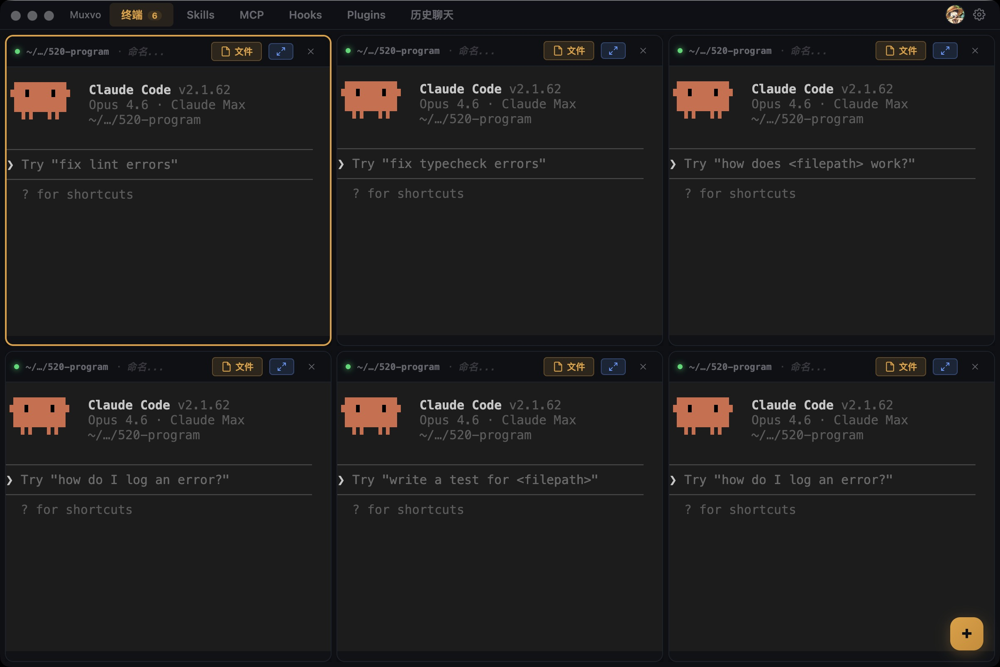

# Muxvo

[](https://muxvo.com)
[](https://github.com/muxvo/muxvo/actions/workflows/ci.yml)
[](https://opensource.org/licenses/MIT)
[](https://muxvo.com/download/Muxvo-arm64.dmg)

A desktop workbench for AI CLI tools — Claude Code, Codex, and Gemini CLI.

Manage terminal sessions, browse chat histories, edit configurations, and discover skills — all in one interface.

**[muxvo.com](https://muxvo.com)**



## Features

- **Terminal Management** — Create, resize, and tile multiple AI CLI sessions side by side
- **Chat History** — Browse and search conversations across Claude Code and Codex with multi-source aggregation
- **Focused Mode** — Maximize one terminal with sidebar thumbnails for quick switching
- **Config Editor** — Edit settings and CLAUDE.md files with atomic write protection
- **Skill Marketplace** — Discover, install, and manage skills with AI-powered scoring
- **Multi-Tool Support** — Unified interface for Claude Code, Codex, and Gemini CLI

## Download

**[muxvo.com/download/Muxvo-arm64.dmg](https://muxvo.com/download/Muxvo-arm64.dmg)** (macOS arm64)

Or from [GitHub Releases](https://github.com/muxvo/muxvo/releases).

## Development

### Prerequisites

- Node.js 20+
- npm 10+

### Setup

```bash
npm install
```

### Run in development mode

```bash
npx electron-vite dev
```

### Run tests

```bash
# All tests (3-layer architecture)
npm test

# By layer
npm run test:l1          # L1 unit/contract tests
npm run test:l2          # L2 integration/rule tests
npm run test:l3          # L3 end-to-end user journey tests
```

### Build for production

```bash
npx electron-vite build && npx electron-builder --mac --arm64
```

## Tech Stack

| Layer | Technology |
|-------|------------|
| Framework | Electron 34 |
| UI | React 19 |
| Language | TypeScript 5.9 |
| Terminal | XTerm.js |
| Editor | TipTap |
| Testing | Vitest |
| Build | electron-vite, electron-builder |

## Architecture

```
Main Process (src/main/)          Renderer Process (src/renderer/)
  ipc/        IPC handlers          components/   UI components
  services/   Core logic            contexts/     React contexts
                                    features/     Feature stores/views
                                    hooks/        Custom React hooks
                                    stores/       State management
```

IPC channels organized into 10 domains: `terminal` · `fs` · `chat` · `config` · `app` · `auth` · `marketplace` · `score` · `showcase` · `analytics`

## Feedback

Questions, suggestions, or bug reports: **drl330330@gmail.com**

## Contributing

See [CONTRIBUTING.md](CONTRIBUTING.md) for development guidelines.

## License

[MIT](LICENSE)
